# iogrid — Status Tracker

Every `#NNNN` is a clickable GitHub link. Regenerate via the *Refresh* note at the bottom; auto-refresh cron is a follow-up (see `bin/refresh-tracker.sh`).

|  |  |
|---|---|
| Last refreshed | `2026-05-19T06:30:00Z` |
| Repo visibility | **PUBLIC** (free CI on github-hosted runners) |
| Merged PRs | **43** since project bootstrap |
| Open PRs | 1 |
| Open issues | **64** (13 EPICs + 51 sub-issues) |
| EPIC completion |  11 / 24 = **46%** (closed/total) |

**Legend:**  done ·  work in progress ·  open ·  deferred ·  blocked on external action

---

## 1. Phase 0 success criterion — vCard LinkedIn enrichment unblocked

The single demonstrable Phase 0 milestone per [`docs/ROADMAP.md`](./ROADMAP.md): customer (Dynolabs vCard) routes LinkedIn fetches through iogrid bandwidth proxy, replaces Proxycurl dependency at zero per-lookup cost.

| # | Step | Status | Blocking issue |
|---|---|---|---|
| 1 | Customer signup + workspace + API key |  | — (PR [#164](https://github.com/iogrid/iogrid/pull/164) + [#165](https://github.com/iogrid/iogrid/pull/165)) |
| 2 | Provider daemon installed on founder's Mac |  | — (PR [#135](https://github.com/iogrid/iogrid/pull/135) + [#139](https://github.com/iogrid/iogrid/pull/139)) |
| 3 | SOCKS5 entry on `proxy.iogrid.org:443` live |  | — (PR [#132](https://github.com/iogrid/iogrid/pull/132)) |
| 4 | DNS + TLS for iogrid.org domains |  | — (PR [#114](https://github.com/iogrid/iogrid/pull/114)) |
| 5 | Anti-abuse pre-flight (PhishTank + OpenPhish + GSB) |  | — (PR [#127](https://github.com/iogrid/iogrid/pull/127) + [#171](https://github.com/iogrid/iogrid/pull/171)) |
| 6 | End-to-end test in kind smoke suite |  | — (PR [#150](https://github.com/iogrid/iogrid/pull/150) + [#165](https://github.com/iogrid/iogrid/pull/165)) |
| 7 | Live deployment to mothership k8s |  | Flux GitOps reconciles automatically; verifier walkthrough pending |
| 8 | First real LinkedIn fetch via iogrid proxy |  | Founder runs `examples/phase0-vcard-customer/client.go --vanity emrahbaysal` to validate |

---

## 2. EPIC dashboard (24 total)

| # | EPIC | Status | Notes |
|---|---|---|---|
| [#1](https://github.com/iogrid/iogrid/issues/1) | Provider daemon — Rust workspace + cross-platform binary |  | Scaffold + transport + routing + workloads merged; 15 sub-issues remain |
| [#2](https://github.com/iogrid/iogrid/issues/2) | Coordinator — Go microservices on k8s |  | All 9 microservices shipped; 12 sub-issues for ongoing iteration |
| [#3](https://github.com/iogrid/iogrid/issues/3) | Web management plane — Next.js 15 + shadcn/ui |  | 23 routes live; 12 sub-issues for polish |
| [#4](https://github.com/iogrid/iogrid/issues/4) | Auth + identity — Google OAuth + magic-link + auto-merge |  | Identity-svc, SIWS, Workspace all shipped |
| [#5](https://github.com/iogrid/iogrid/issues/5) | Install UX — grandma-proof single-command setup |  | install.sh + .pkg + .msi + .deb + onboarding all live (PR [#139](https://github.com/iogrid/iogrid/pull/139)) |
| [#6](https://github.com/iogrid/iogrid/issues/6) | Scheduling — caps + calendar + idle-detection |  | All three signals AND-combined per docs/TECH.md |
| [#7](https://github.com/iogrid/iogrid/issues/7) | Anti-abuse — pre-flight filters + audit log |  | PhotoDNA + PhishTank + OpenPhish + GSB + retention (PR [#171](https://github.com/iogrid/iogrid/pull/171)) |
| [#74](https://github.com/iogrid/iogrid/issues/74) | Customer-facing API + OpenAPI spec |  | TS+Python+Go+Java SDKs shipped (PR [#137](https://github.com/iogrid/iogrid/pull/137) + [#176](https://github.com/iogrid/iogrid/pull/176)) |
| [#75](https://github.com/iogrid/iogrid/issues/75) | Consumer VPN gateway |  | WireGuard server + Plus/Pro tiers + ad-block (PR [#134](https://github.com/iogrid/iogrid/pull/134) + [#136](https://github.com/iogrid/iogrid/pull/136)) |
| [#76](https://github.com/iogrid/iogrid/issues/76) | Observability + SLOs |  | OTel + 4 SLOs + 6 Grafana dashboards + status page (PR [#133](https://github.com/iogrid/iogrid/pull/133) + [#159](https://github.com/iogrid/iogrid/pull/159)) |
| [#77](https://github.com/iogrid/iogrid/issues/77) / [#106](https://github.com/iogrid/iogrid/issues/106) | Brand identity + marketing site |  | Logo + product pages + status page + transparency page (PR [#125](https://github.com/iogrid/iogrid/pull/125)) |
| [#78](https://github.com/iogrid/iogrid/issues/78) | Legal scaffolding |  | 8 lawyer-ready drafts + counsel RFP + Foundation comparison (PR [#156](https://github.com/iogrid/iogrid/pull/156) + [#174](https://github.com/iogrid/iogrid/pull/174)) |
| [#87](https://github.com/iogrid/iogrid/issues/87) | $GRID — Solana SPL token + emission + vesting + staking + burn |  | 5 Anchor programs shipped; whitepaper done; audit + Foundation pending |
| [#167](https://github.com/iogrid/iogrid/issues/167) | Off-ramp partnership with Sociable Cash |  | Adapter abstraction in PR [#177](https://github.com/iogrid/iogrid/pull/177); multi-tenant matrix doc'd ([MULTI_TENANT_MATRIX.md](./MULTI_TENANT_MATRIX.md)) |

---

## 3. Open-issue blocking graph

51 non-EPIC open issues grouped by lane:

```mermaid
flowchart LR
  classDef open       fill:#cf222e,stroke:#a40e26,color:#fff,stroke-width:2px
  classDef flight     fill:#bf8700,stroke:#9a6700,color:#fff,stroke-width:2px
  classDef done       fill:#2ea043,stroke:#1a7f37,color:#fff,stroke-width:2px
  classDef deferred   fill:#6e7781,stroke:#4f555c,color:#fff,stroke-width:2px
  classDef blocked    fill:#8250df,stroke:#5e1ed1,color:#fff,stroke-width:2px

  %% Lane 1 — Phase 0 demo
  PH0["Phase 0 — vCard demo"]:::flight --> I165["Phase 0 walkthrough (post-merge verify)"]:::open

  %% Lane 2 — TGE prerequisites
  TGE["$GRID TGE prerequisites"]:::open --> I97["#97 smart-contract audit (OtterSec)"]:::blocked
  TGE --> I122["#122 Cayman Foundation incorp"]:::blocked
  TGE --> I88["#88 Anchor dev tooling polish"]:::flight
  TGE --> I98["#98 billing-svc Solana real impl"]:::flight
  TGE --> I99["#99 SIWS wallet binding"]:::flight
  TGE --> I100["#100 web wallet adapter + staking UI"]:::done
  TGE --> I101["#101 MoonPay off-ramp embed"]:::flight
  TGE --> I102["#102 token whitepaper"]:::done
  TGE --> I103["#103 Foundation jurisdiction"]:::blocked
  TGE --> I104["#104 Reg-D pre-TGE raise (optional)"]:::deferred
  TGE --> I105["#105 quarterly transparency reports"]:::flight

  %% Lane 3 — Anti-abuse partnerships
  ABS["Anti-abuse partnerships"]:::blocked --> I66["#66 NCMEC PhotoDNA (partnership-gated)"]:::blocked
  ABS --> I67["#67 PhishTank+OpenPhish+GSB cache"]:::done
  ABS --> I68["#68 outbound port restrictions"]:::done
  ABS --> I69["#69 per-customer rate limits"]:::done
  ABS --> I70["#70 per-provider per-dest rate"]:::done
  ABS --> I71["#71 Docker image registry validation"]:::done
  ABS --> I72["#72 audit log retention + transparency"]:::done

  %% Lane 4 — Sociable Cash partnership
  CASH["Sociable Cash off-ramp"]:::flight --> I168["#168 Raydium CLMM canonical venue"]:::flight
  CASH --> I169["#169 web off-ramp redirect"]:::flight
  CASH --> I170["#170 gateway-bff Cash webhook"]:::flight
  CASH --> I172["#172 $GRID vs $CASH positioning"]:::flight

  %% Lane 5 — Counsel review
  COUNSEL["Counsel review (pre-Phase 1)"]:::blocked --> I155["#155 legal/* counsel review"]:::blocked

  %% Lane 6 — Infra polish
  INFRA["Infra hardening"]:::flight --> I142["#142 WiX 7 vs 4.0.6 toolchain"]:::open
  INFRA --> I158["#158 commonLabels deprecation"]:::open
  INFRA --> I80["#80 bun install via oven-sh tap"]:::open
  INFRA --> I81["#81 Docker.app PATH symlinks"]:::open
  INFRA --> I82["#82 autossh launchd"]:::done
  INFRA --> I79["#79 macOS 15 upgrade for Tart"]:::blocked

  %% Lane 7 — Daemon follow-ups
  DAEMON["Daemon follow-ups"]:::flight --> I12["#12 workload-docker real (bollard)"]:::done
  DAEMON --> I13["#13 workload-gpu (CUDA+MLX)"]:::flight
  DAEMON --> I14["#14 workload-ios Tart driver"]:::done
  DAEMON --> I59["#59 daemon auto-update"]:::done

  %% Lane 8 — Customer SDK polish
  SDK["Customer SDKs (publish-ready)"]:::flight --> I116["#116 OpenAPI auto-gen"]:::done
  SDK --> I117["#117 TypeScript SDK"]:::done
  SDK --> I118["#118 Python SDK"]:::done
  SDK --> I119["#119 Go SDK"]:::done
  SDK --> I120["#120 Java SDK"]:::done
  SDK --> I121["#121 API reference auto-publish"]:::done

  %% Lane 9 — Marketing polish
  MKT["Marketing site polish"]:::flight --> I107["#107 logo finalization"]:::done
  MKT --> I108["#108 landing copy"]:::done
  MKT --> I109["#109 product pages"]:::done
  MKT --> I110["#110 blog content"]:::deferred
  MKT --> I113["#113 SEO baseline"]:::done

  %% Lane 10 — Founder action items (BLOCKED until external action)
  FOUNDER["Founder action items"]:::blocked --> F1["Apollo.io API key (vCard)"]:::blocked
  FOUNDER --> F2["NCMEC PhotoDNA partnership"]:::blocked
  FOUNDER --> F3["Cayman Foundation incorp"]:::blocked
  FOUNDER --> F4["OtterSec/Halborn audit"]:::blocked
  FOUNDER --> F5["Counsel engagement"]:::blocked
  FOUNDER --> F6["npm / PyPI / Sonatype publisher reg"]:::blocked
```



---

## 4. Recently merged PRs (last 36h)

| Merged (UTC) | PR | Issues closed | Title |
|---|---|---|---|
| 2026-05-19T06:21 | [#176](https://github.com/iogrid/iogrid/pull/176) | #116 #117 #118 #119 #120 | feat(sdks): activate publish workflows — npm + PyPI + Maven Central via OIDC |
| 2026-05-19T06:19 | [#171](https://github.com/iogrid/iogrid/pull/171) | #66 #72 | feat(antiabuse): PhotoDNA + 90-day retention + quarterly transparency |
| 2026-05-19T06:09 | [#175](https://github.com/iogrid/iogrid/pull/175) | #59 | feat(daemon): auto-update worker — Sparkle-style with Ed25519 |
| 2026-05-19T05:44 | [#174](https://github.com/iogrid/iogrid/pull/174) | #155 #103 #122 | feat(counsel): RFP + checklist + jurisdiction comparison + incident playbook |
| 2026-05-19T05:40 | [#173](https://github.com/iogrid/iogrid/pull/173) | (refs #167) | docs: Sociable Cash multi-tenant capability matrix |
| 2026-05-19T05:16 | [#166](https://github.com/iogrid/iogrid/pull/166) | — | fix(ci): main-branch regressions — web typecheck + billing-svc Docker |
| 2026-05-19T05:16 | [#164](https://github.com/iogrid/iogrid/pull/164) | #146 | feat(workspace): identity-svc Workspace + Membership |
| 2026-05-19T04:47 | [#165](https://github.com/iogrid/iogrid/pull/165) | (Phase 0 demo) | feat(phase0): vCard LinkedIn-enrichment customer demo |
| 2026-05-19T04:28 | [#163](https://github.com/iogrid/iogrid/pull/163) | #88 #97 #102 | feat(token): whitepaper + Anchor tooling + audit prep + Cayman checklist |
| 2026-05-19T04:19 | [#161](https://github.com/iogrid/iogrid/pull/161) | #98 | feat(billing-svc): real Solana SPL transfers + Jupiter swaps + burn loop |
| 2026-05-19T04:15 | [#160](https://github.com/iogrid/iogrid/pull/160) | #100 | feat(web): Solana Wallet Adapter + balance + staking UI + burn dashboard |
| 2026-05-19T04:14 | [#162](https://github.com/iogrid/iogrid/pull/162) | #99 | feat(siws): Sign-In-With-Solana wallet binding in identity-svc |
| 2026-05-19T03:33 | [#159](https://github.com/iogrid/iogrid/pull/159) | #111 | feat(status): public status page + incident management + Grafana provisioning |
| 2026-05-19T03:33 | [#157](https://github.com/iogrid/iogrid/pull/157) | #145 #147 #148 | fix(e2e): remaining bugs — kind overlay + BLOCK_DOMAINS + JWT fixture |
| 2026-05-19T03:33 | [#156](https://github.com/iogrid/iogrid/pull/156) | #78 | feat(legal): provider+customer ToS, AUP, DPA, privacy, token disclaimer drafts |

(For full history of all 43 merged PRs: [merged-PR list](https://github.com/iogrid/iogrid/pulls?q=is%3Apr+is%3Amerged))

---

## 5. Open PRs (1)

| PR | State | CI | Notes |
|---|---|---|---|
| [#177](https://github.com/iogrid/iogrid/pull/177) |  | 26/27 green (Windows .msi unrelated) | feat(offramp): adapter abstraction — MoonPay default + Sociable Cash contract stub. Rebase agent active. |

---

## 6. Founder action items (external, unblocking)

| # | Action | What it unblocks | Cost / time |
|---|---|---|---|
| 1 | Engage Cayman counsel (Walkers / Maples) — see [legal/foundation/cayman-setup.md](../legal/foundation/cayman-setup.md) | Foundation incorporation → $GRID TGE | $30–80K, 8–12 weeks |
| 2 | Engage OtterSec or Halborn for smart-contract audit — see [contracts/audit/README.md](../contracts/audit/README.md) | Mainnet program deploy → TGE | $40–80K, 4–8 weeks |
| 3 | Engage crypto-tech counsel (Cooley / Fenwick / Davis Polk / Latham) — see [legal/counsel/rfp.md](../legal/counsel/rfp.md) | Phase 1 ToS + AUP + DPA finalization | $5–15K Phase 1, $80–200K Phase 2 |
| 4 | Apply for NCMEC PhotoDNA partnership — see [coordinator/services/antiabuse-svc/README.md](../coordinator/services/antiabuse-svc/README.md) | Real CSAM filter activation | Free + vetting; ~6–10 weeks |
| 5 | Reserve npm / PyPI / Sonatype publisher accounts | SDK publish workflows fire | Free + one-time |
| 6 | Apollo.io API key + paste into k8s secret `dynolabs-apollo` (Dynolabs vCard project) | Phase 0 vCard LinkedIn enrichment (already-built fallback exists via Clearbit Logo API) | $39/mo Apollo Basic |
| 7 | Decide on Reg-D / Reg-S pre-TGE strategic raise — see [docs/TOKENOMICS.md](./TOKENOMICS.md) | Optional $2M @ $200M FDV | Founder strategic choice |

---

## 7. Theater-incident log

Caught "fix shipped but actually broken" events:

| When (UTC) | Broken PR | Caught by | Resolving PR | Principle codified |
|---|---|---|---|---|
| 2026-05-19T01:32 | [#137](https://github.com/iogrid/iogrid/pull/137) SDK CI Python hatch + Java spotless | Founder noticed lockfile drift | [#137 follow-up](https://github.com/iogrid/iogrid/pull/137) | **#1** Verify pnpm overrides exist at workspace root, not sub-package |
| 2026-05-19T01:00 | [#161](https://github.com/iogrid/iogrid/pull/161) billing-svc go.mod missing `connectrpc.com/connect` | follow-up CI iteration | merge fix in same PR | **#2** Dockerfile must mirror repo's relative-path layout for go.mod replaces |
| 2026-05-19T05:13 | [#139](https://github.com/iogrid/iogrid/pull/139) rebased w/ crude `--ours/--theirs` resolution, dropped fields | Founder noticed CI red across 14 checks | [agent fix on same branch](https://github.com/iogrid/iogrid/commit/a26a627) | **#3** Never auto-resolve struct-merge conflicts blindly — combine fields |
| 2026-05-18 | Org-billing block hit all PRs | Founder noticed CI runner-startup errors | Repo flipped public (free unlimited CI) | **#4** Public-repo GitHub Actions is free; never run builds on bastion |

---

## 8. Project shape

```
iogrid/iogrid (monorepo, PUBLIC)
├── coordinator/       Go microservices (9 + shared) on k8s
├── daemon/            Rust workspace (12 crates) for provider PCs/Macs
├── web/               Next.js 15 management plane
├── marketing/         Public iogrid.org marketing site
├── docs-site/         Astro Starlight at docs.iogrid.org
├── contracts/         Anchor (Solana) — 5 token-economy programs
├── proto/             Buf-managed gRPC contracts (12 svcs, 52 RPCs)
├── sdks/              TypeScript / Python / Go / Java SDKs
├── installer/         install.sh + .pkg + .msi + .deb + onboarding
├── infra/k8s/         Flux-managed manifests (Postgres CNPG, NATS, Cilium)
├── examples/          Phase 0 vCard customer demo
├── e2e/               kind-based smoke harness
├── legal/             8 lawyer-ready drafts + counsel-engagement package
└── docs/              Architecture, roadmap, tokenomics, this tracker
```

Companion repo: [iogrid/iogrid-ops](https://github.com/iogrid/iogrid-ops) — Flux GitOps pulls.

---

## 9. Resources

- [README](../README.md) — project overview
- [docs/TECH.md](./TECH.md) — full technical architecture
- [docs/ROADMAP.md](./ROADMAP.md) — Phase 0 → 3 plan
- [docs/TOKENOMICS.md](./TOKENOMICS.md) — $GRID economics + DEX-first launch
- [docs/COMPETITORS.md](./COMPETITORS.md) — competitive landscape
- [docs/MULTI_TENANT_MATRIX.md](./MULTI_TENANT_MATRIX.md) — iogrid + Sociable Cash architecture
- [docs/LEGAL.md](./LEGAL.md) — anti-abuse design, defense fund, ToS requirements
- [legal/](../legal/) — 8 ToS / DPA / AUP / Privacy / Token disclaimer drafts
- [contracts/audit/](../contracts/audit/) — smart contract audit prep

---

*Generated `2026-05-19T06:30:00Z`. Manual refresh: edit this file + push. Auto-refresh cron pending (`bin/refresh-tracker.sh` follow-up).*
