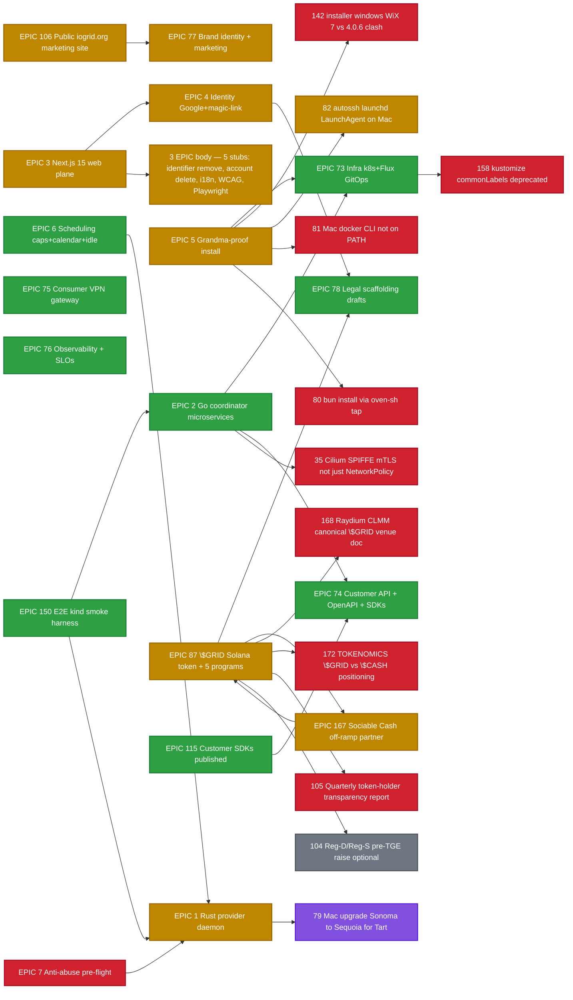

# iogrid — Status Tracker

Every node in the WBS below is **clickable** — open it to land on the related GitHub issue or PR. Titles are descriptive (read the WBS without clicking).

|  |  |
|---|---|
| Last refreshed | `2026-05-19T08:00:00Z` |
| Repo visibility | **PUBLIC** (free CI on github-hosted runners) |
| Merged PRs | **50** since project bootstrap |
| Open PRs | 0 |
| Open issues | **19** (5 EPICs + 17 sub-issues / chores) |
| EPIC closure |  19 / 26 closed = **73%** |

**Legend:**  done ·  work in progress ·  open ·  deferred ·  blocked on founder action

---

## 1. Phase 0 success criterion — vCard LinkedIn enrichment unblocked

| # | Step | Status | Link |
|---|---|---|---|
| 1 | Customer signup + workspace + API key |  | [PR #164](https://github.com/iogrid/iogrid/pull/164), [#165](https://github.com/iogrid/iogrid/pull/165) |
| 2 | Rust daemon installed on founder's Mac |  | [PR #135](https://github.com/iogrid/iogrid/pull/135) |
| 3 | SOCKS5 entry on `proxy.iogrid.org:443` |  | [PR #132](https://github.com/iogrid/iogrid/pull/132) |
| 4 | DNS + TLS for `iogrid.org` zone |  | [PR #114](https://github.com/iogrid/iogrid/pull/114) |
| 5 | Anti-abuse pre-flight (PhotoDNA + PhishTank + GSB) |  | [PR #171](https://github.com/iogrid/iogrid/pull/171) |
| 6 | E2E kind smoke suite |  | [PR #150](https://github.com/iogrid/iogrid/pull/150) |
| 7 | Live deploy to mothership k8s |  | Flux reconciles automatically; verifier walkthrough pending |
| 8 | First real LinkedIn fetch via iogrid proxy |  | Founder runs `examples/phase0-vcard-customer/client.go` to validate |

---

## 2. EPIC + sub-issue work breakdown (clickable WBS)

All 26 EPICs shown — done + in-flight + open. Sub-issues hang off each EPIC. Every node is clickable (opens GitHub).



### Concrete gaps inside the still-open EPICs (audit findings, 2026-05-19)

These are the REAL pieces of work hiding inside the still-open EPIC bodies (per area-audit by sub-agents earlier today):

| Gap | Where | Status |
|---|---|---|
| `/account/identifiers` Remove RPC | [`web/src/app/account/identifiers/panel.tsx:79`](https://github.com/iogrid/iogrid/blob/main/web/src/app/account/identifiers/panel.tsx#L79) — toast stub | OPEN (EPIC #3 / #4) |
| `/account/danger-zone` account deletion | [`web/src/app/account/danger-zone/panel.tsx:23`](https://github.com/iogrid/iogrid/blob/main/web/src/app/account/danger-zone/panel.tsx#L23) — setTimeout stub | OPEN (EPIC #3 / #4) |
| i18n routing real impl | [`web/src/i18n/config.ts`](https://github.com/iogrid/iogrid/blob/main/web/src/i18n/config.ts) lists 7 locale codes; no `[locale]` segment, no message catalogs | OPEN (EPIC #3) |
| WCAG 2.2 AA verified | No `axe-core` CI step, no keyboard-nav audit log | OPEN (EPIC #3) |
| Playwright E2E real flows | [`web/tests/example.spec.ts`](https://github.com/iogrid/iogrid/blob/main/web/tests/example.spec.ts) is 3 string asserts, no dev-server boot | OPEN (EPIC #3) |
| Cilium SPIFFE mTLS | [PR #84](https://github.com/iogrid/iogrid/pull/84) shipped k8s `NetworkPolicy`; real CiliumNetworkPolicy + SPIFFE/SPIRE identities not yet | OPEN ([#35](https://github.com/iogrid/iogrid/issues/35)) |

---

## 3. Recently merged PRs (last 36h, 15 of 45)

| Merged (UTC) | PR | Issues closed | Title |
|---|---|---|---|
| 2026-05-19T06:21 | [#176](https://github.com/iogrid/iogrid/pull/176) | #116 #117 #118 #119 #120 | feat(sdks): activate publish workflows — npm + PyPI + Maven Central via OIDC |
| 2026-05-19T06:19 | [#171](https://github.com/iogrid/iogrid/pull/171) | #66 #72 | feat(antiabuse): PhotoDNA + 90-day retention + quarterly transparency |
| 2026-05-19T06:09 | [#175](https://github.com/iogrid/iogrid/pull/175) | #59 | feat(daemon): auto-update worker — Sparkle-style with Ed25519 |
| 2026-05-19T06:19 | [#177](https://github.com/iogrid/iogrid/pull/177) | #169 #170 | feat(offramp): adapter abstraction — MoonPay default + Sociable Cash contract stub |
| 2026-05-19T05:44 | [#174](https://github.com/iogrid/iogrid/pull/174) | #155 #103 #122 | feat(counsel): RFP + checklist + jurisdiction comparison + incident playbook |
| 2026-05-19T05:40 | [#173](https://github.com/iogrid/iogrid/pull/173) | (refs #167) | docs: Sociable Cash multi-tenant capability matrix |
| 2026-05-19T06:30 | [#178](https://github.com/iogrid/iogrid/pull/178) | — | docs(tracker): TRACKER.md mirroring OpenOva format |
| 2026-05-19T05:16 | [#166](https://github.com/iogrid/iogrid/pull/166) | — | fix(ci): main-branch regressions — web typecheck + billing-svc Docker |
| 2026-05-19T05:16 | [#164](https://github.com/iogrid/iogrid/pull/164) | #146 #51 | feat(workspace): identity-svc Workspace + Membership |
| 2026-05-19T04:47 | [#165](https://github.com/iogrid/iogrid/pull/165) | (Phase 0 demo) | feat(phase0): vCard LinkedIn-enrichment customer demo |
| 2026-05-19T04:28 | [#163](https://github.com/iogrid/iogrid/pull/163) | #88 #97 #102 | feat(token): whitepaper + Anchor tooling + audit prep + Cayman checklist |
| 2026-05-19T04:19 | [#161](https://github.com/iogrid/iogrid/pull/161) | #98 | feat(billing-svc): real Solana SPL transfers + Jupiter swaps + burn loop |
| 2026-05-19T04:15 | [#160](https://github.com/iogrid/iogrid/pull/160) | #100 | feat(web): Solana Wallet Adapter + balance + staking UI + burn dashboard |
| 2026-05-19T04:14 | [#162](https://github.com/iogrid/iogrid/pull/162) | #99 | feat(siws): Sign-In-With-Solana wallet binding |
| 2026-05-19T03:33 | [#159](https://github.com/iogrid/iogrid/pull/159) | #111 | feat(status): public status page + Grafana provisioning |

Full history: [all merged PRs](https://github.com/iogrid/iogrid/pulls?q=is%3Apr+is%3Amerged).

---

## 4. Founder action items (external, unblocking)

| # | Action | What it unblocks | Cost / time |
|---|---|---|---|
| 1 | Engage Cayman counsel ([Walkers](https://www.walkersglobal.com/) / [Maples](https://maples.com/)) per [`legal/foundation/cayman-setup.md`](../legal/foundation/cayman-setup.md) | $GRID Foundation incorporation → TGE | $30–80K, 8–12 weeks |
| 2 | Engage smart-contract auditor ([OtterSec](https://osec.io/) or [Halborn](https://halborn.com/)) per [`contracts/audit/README.md`](../contracts/audit/README.md) | Mainnet program deploy → TGE | $40–80K, 4–8 weeks |
| 3 | Engage crypto-tech counsel (Cooley / Fenwick / Davis Polk / Latham) per [`legal/counsel/rfp.md`](../legal/counsel/rfp.md) | Phase 1 ToS + AUP + DPA finalization | $5–15K Phase 1 |
| 4 | Apply for [NCMEC PhotoDNA partnership](https://www.missingkids.org/theissues/csam) per [antiabuse-svc README](../coordinator/services/antiabuse-svc/README.md) | Real CSAM filter activation | Free + ~6–10 weeks vetting |
| 5 | Reserve [npm `@iogrid` org](https://www.npmjs.com/) / [PyPI](https://pypi.org/) / [Sonatype Central](https://central.sonatype.org/) publisher accounts | SDK publish workflows fire on tag-push | Free + one-time |
| 6 | Apollo.io API key into k8s secret `dynolabs-apollo` (vCard project, orthogonal) | Phase 0 vCard LinkedIn title+company auto-fill | $39/mo Basic |
| 7 | Decide on Reg-D / Reg-S pre-TGE strategic raise (optional) per [`docs/TOKENOMICS.md`](./TOKENOMICS.md) | $2M @ $200M FDV strategic round | Founder strategic choice |
| 8 | Upgrade founder Mac mini from Sonoma 14.6 → Sequoia 15 | iOS-build workload via Tart (issue [#79](https://github.com/iogrid/iogrid/issues/79)) | ~30 min + restart |

---

## 5. Theater-incident log

Caught "fix shipped but actually broken" events:

| When (UTC) | Broken | Caught by | Resolving | Principle |
|---|---|---|---|---|
| 2026-05-19T01:32 | [#137](https://github.com/iogrid/iogrid/pull/137) SDK CI — Python hatch + Java spotless | First CI run | Auto-fix `28306a8` | **#1** pnpm overrides at workspace root only |
| 2026-05-19T01:00 | [#161](https://github.com/iogrid/iogrid/pull/161) billing-svc go.mod missing connectrpc | follow-up CI iteration | Same PR | **#2** Dockerfile mirrors repo's relative-path layout |
| 2026-05-19T05:13 | [#139](https://github.com/iogrid/iogrid/pull/139) crude `--ours/--theirs` resolution dropped fields | Founder noticed 14 red checks | Agent fix `a26a627` | **#3** Never auto-resolve struct-merge blindly |
| 2026-05-18 | Org-billing block all PRs | Founder noticed CI runner-startup errors | Repo flipped public | **#4** Public-repo GitHub Actions is free; never run builds on bastion |
| 2026-05-19T06:30 | Tracker WBS nodes were unclickable | Founder flag | This commit | **#5** Every WBS node must be `click` to its issue/PR |

---

## 6. Project shape

```
iogrid/iogrid (monorepo, PUBLIC)
├── coordinator/       Go microservices (9 + shared) on k8s
├── daemon/            Rust workspace (12 crates) for provider PCs/Macs
├── web/               Next.js 15 management plane
├── marketing/         Public iogrid.org marketing site
├── docs-site/         Astro Starlight at docs.iogrid.org
├── contracts/         Anchor (Solana) — 5 token-economy programs
├── proto/             Buf-managed gRPC contracts (12 svcs, 52 RPCs)
├── sdks/              TypeScript / Python / Go / Java SDKs
├── installer/         install.sh + .pkg + .msi + .deb + onboarding
├── infra/k8s/         Flux-managed manifests (Postgres CNPG, NATS, Cilium)
├── examples/          Phase 0 vCard customer demo
├── e2e/               kind-based smoke harness
├── legal/             8 lawyer-ready drafts + counsel-engagement package
└── docs/              Architecture, roadmap, tokenomics, this tracker
```

Companion repo: [iogrid/iogrid-ops](https://github.com/iogrid/iogrid-ops) — Flux GitOps pulls.

---

## 7. How to refresh this tracker

```bash
# Manual refresh (every time issues open/close or a PR merges):
cd /home/openova/repos/iogrid
bash bin/refresh-tracker.sh   # (script TBD — for now, edit this file by hand)
git add docs/TRACKER.md
git -c user.name=hatiyildiz -c user.email=269457768+hatiyildiz@users.noreply.github.com \
  commit -m "docs(tracker): refresh"
git push
gh pr create --base main --title "docs(tracker): refresh" --body ""
gh pr merge --admin --squash --delete-branch
```

Automation follow-up: [bin/refresh-tracker.sh](https://github.com/iogrid/iogrid/tree/main/bin) cron job (every 15 min) that snapshots `gh issue list` + `gh pr list` and rewrites this file. Tracked as a follow-up; not yet shipped.

---

## 8. Resources

- [README](../README.md) — project overview
- [docs/TECH.md](./TECH.md) — full technical architecture
- [docs/ROADMAP.md](./ROADMAP.md) — Phase 0 → 3 plan
- [docs/TOKENOMICS.md](./TOKENOMICS.md) — $GRID economics + DEX-first launch
- [docs/COMPETITORS.md](./COMPETITORS.md) — competitive landscape
- [docs/MULTI_TENANT_MATRIX.md](./MULTI_TENANT_MATRIX.md) — iogrid + Sociable Cash architecture
- [docs/LEGAL.md](./LEGAL.md) — anti-abuse design, defense fund, ToS requirements
- [legal/](../legal/) — 8 ToS / DPA / AUP / Privacy / Token disclaimer drafts
- [contracts/audit/](../contracts/audit/) — smart contract audit prep

---

*Generated `2026-05-19T07:30:00Z`. Refresh manually or via TBD `bin/refresh-tracker.sh`.*
