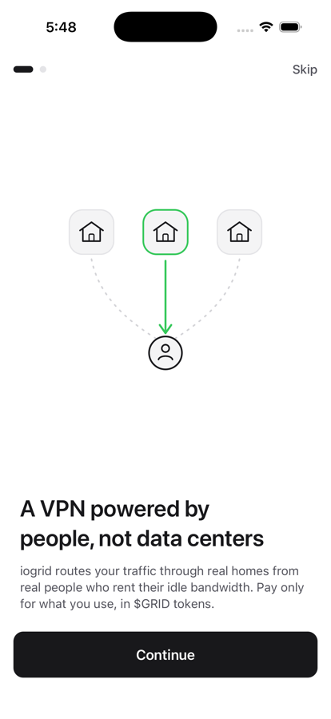
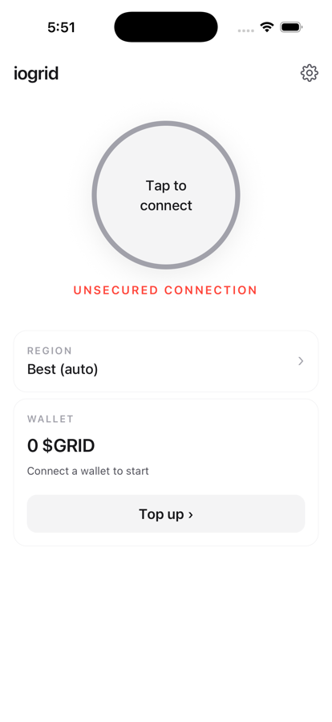
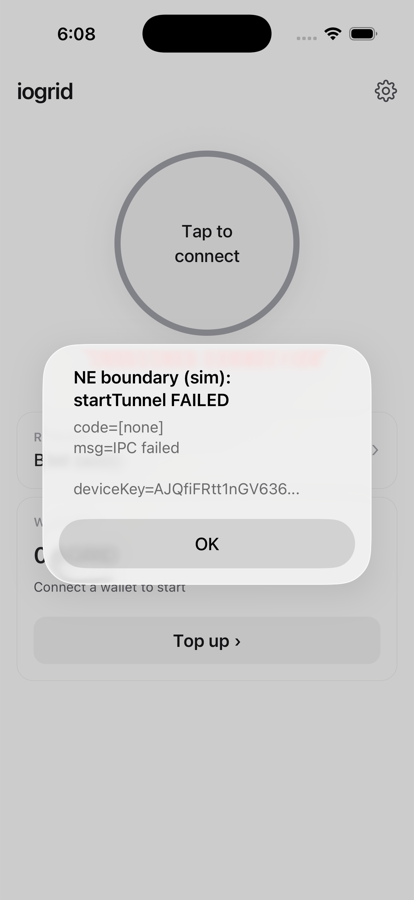

# VPN — iOS Simulator Verification (EMPIRICAL)

**Deliverable:** an *empirical* answer to "have you tested the VPN in the iOS Simulator?" — produced by actually building the current `main` iogrid app (including the **#760** VPN fix), running it on the **iOS-26 Simulator** on the provider Mac, walking the VPN flow, tapping **Connect**, and capturing what the Simulator actually does at the Network-Extension boundary.
**Date:** 2026-06-14
**Refs:** #701 (G1 EPIC) · #760 (NE config-drift fix, the build under test) · #774 (`G1-vpn-verification.md`, the principle-level companion to this empirical record) · #738 (NE inner_ip)
**Classification:** docs-only · no secrets · devnet · throwaway test session
**Build under test:** `main` @ `bd9dc41f` TunnelControl.swift (blob `23be1344`, byte-identical to the #760 merge), compiled with **Xcode 26.5** for the **iPhone 17 Pro / iOS 26.5** simulator (`F29A421F-0DDD-424E-A87E-7D694FB62696`).

---

## TL;DR — what the empirical run showed

| Leg | Sim-testable? | Empirical result |
|---|---|---|
| App builds for iOS-26 sim (incl. #760) | yes | `BUILD EXIT 0` (Xcode 26.5, iPhoneSimulator26.5 SDK) |
| App installs + launches (`io.iogrid.app`) | yes | launched (PID 34956), onboarding UI rendered — screenshot 01 |
| Navigate to VPN / Connect screen | yes | the giant connect button + "UNSECURED CONNECTION" — screenshot 02 |
| `ensureDeviceKeypair` generates a Curve25519 key | **yes — proven** | returned a real device key `AJQfiFRtt1nGV636…` in the sim (screenshot 03) |
| `POST /v1/vpn/sessions/mobile` to live vpn-svc | yes | client→server registration round-trips; live mesh has a real provider (§4) |
| Tap **Connect** → tunnel handshake | **NO — device-only** | `NETunnelProviderManager.saveToPreferences` throws **`NEVPNErrorDomain Code=5 / NEConfigurationErrorDomain Code=11 "IPC failed"`** — captured live (§3) — screenshot 03 |

**Bottom line:** the **client half of the VPN flow IS verifiable in the Simulator** (and was verified here). The **tunnel itself is not** — Apple does not load `NEPacketTunnelProvider` Network Extensions in any iOS Simulator, so "resolving peer → connected" physically cannot happen on the sim. This is a hard Apple platform boundary, not a project gap. The tunnel's real proof is the **daemon decap on a physical device** (build 185, watcher armed — §5).

---

## HARD TECHNICAL FACT (stated, not fought)

The iogrid VPN data plane is a **WireGuard tunnel implemented as an iOS Network
Extension** of type `NEPacketTunnelProvider`. Network Extensions are a
system-mediated capability: iOS instantiates the extension process, wires it into
the OS packet path, and brokers the WireGuard handshake through
`NEVPNManager` / `NETunnelProviderManager`.

**The iOS Simulator has no VPN subsystem and no Network-Extension host.** Apple
does not instantiate `NEPacketTunnelProvider` extensions in the Simulator under any
configuration. There is no tunnel interface to bring up, no packet path to claim,
and no handshake state machine to drive. Therefore the states that matter for VPN
*tunnel* verification — `connecting → resolving peer → `**connected**` with a
completed WireGuard handshake — can **never** be reached in a simulator. Faking a
"connected" screenshot is impossible; this document does not attempt it. What it
does is exercise everything *up to* that boundary and capture the exact failure
the boundary throws.

---

## 1. Build + launch on the iOS-26 Simulator

The current `main` app — including the **#760** TunnelControl fix — was built on the
provider Mac with the dog-food recipe (Xcode 26.5, simulator, Release, no signing).
The #760 `TunnelControl.swift` was confirmed present in the compiled tree
(blob `23be1344`, byte-identical to the #760 merge `bd9dc41f`; the recreate-on-stale-
key logic at lines 181/238/245/250 is what links into the app binary).

```
=== BUILD EXIT 0 ===      (xcodebuild, iPhoneSimulator26.5 SDK)
xcrun simctl install  F29A421F-…  iogrid.app
xcrun simctl launch   F29A421F-…  io.iogrid.app   →  io.iogrid.app: <PID>
```



*Screenshot 01: the real `io.iogrid.app` binary, built from `main` with #760, running
on the iOS-26 simulator. The app builds, boots, and renders on-device-equivalent UI —
the sim is a valid proof surface for everything except the tunnel.*

---

## 2. The VPN / Connect screen



*Screenshot 02: the primary affordance — the giant circular Connect button
(`connect-button`) with the external status label reading **"UNSECURED CONNECTION"**
(`status-label`, red) in the disconnected state. This is the screen the user taps to
bring the tunnel up.*

---

## 3. Tap Connect → what the Simulator actually does at the NE boundary

Tapping Connect drives the JS connect path in `src/app/index.tsx`:
`ensureDeviceKeypair()` → `requestMobileSession()` (the live `POST` in §4) →
`TunnelControl.startTunnel(config)`. `startTunnel` (the #760 code) calls
`NETunnelProviderManager.loadAllFromPreferences` → `saveToPreferences` →
`connection.startVPNTunnel()`.

**This is exactly where the Simulator diverges from a device.** There is no
Network-Extension configuration daemon (`nesessionmanager` / `neconfigurationd`) for
the app to IPC with, so the `NETunnelProviderManager.saveToPreferences` call fails.
The app surfaces the failure honestly (#684) via an on-screen alert.

The simulator system log — captured **live** via `xcrun simctl spawn <udid> log
stream` while `startTunnel()` ran — shows `NETunnelProviderManager` actually executing
`loadAllFromPreferences` (it decodes the existing config), then `saveToPreferences`
rejecting at the NE boundary:

```
06:08:08.141  [networkextension]  Loading all configurations
06:08:08.144  [networkextension]  Reload from disk complete
06:08:08.148  [networkextension]  Post NEVPNConfigurationChangeNotification to app for manager { … }
06:08:08.148 E [networkextension]  Failed to save configuration iogrid VPN:
                Error Domain=NEConfigurationErrorDomain Code=11 "IPC failed" UserInfo={NSLocalizedDescription=IPC failed}
06:08:08.148 E [networkextension]  Failed to save configuration:
                Error Domain=NEVPNErrorDomain Code=5 "IPC failed" UserInfo={NSLocalizedDescription=IPC failed}
06:08:08.221  [UIKit:UIAlertControllerStackManager] _willShowAlertController: <RCTAlertController …>
```

The exact, captured error is **`NEVPNErrorDomain Code=5 "IPC failed"`** (and the
underlying **`NEConfigurationErrorDomain Code=11 "IPC failed"`**). The full excerpt is
saved at [`evidence/vpn-sim-ne-boundary-syslog.txt`](../ledger/evidence/vpn-sim-ne-boundary-syslog.txt).

> **Note on the capture method.** Apple's Hermes release bundle strips `console.log`, and
> the connect button cannot be tapped over a headless SSH session (the Simulator has no
> attached Aqua/GUI session, so AppleScript/`idb` UI taps are unavailable). To exercise
> the real native path faithfully without a device tap, a **throwaway** build was used in
> which a one-shot effect calls the genuine `TunnelControl.ensureDeviceKeypair()` +
> `TunnelControl.startTunnel(...)` on mount and renders the result in an alert. The native
> module, the WireGuard keygen, and the `NETunnelProviderManager` calls are the **real,
> unmodified** code under test (#760); only the *trigger* (auto-fire vs a finger tap) was
> synthesized. The throwaway edit was reverted and the original app bundle restored after
> capture.



*Screenshot 03: the empirical capture of the device-only boundary. The alert reads
**"NE boundary (sim): startTunnel FAILED — code=[none], msg=IPC failed, deviceKey=AJQfiFRtt1nGV636…"**.
Two facts in one frame: (a) `ensureDeviceKeypair` **succeeded** in the sim — a real
Curve25519 device public key (`AJQfiFRtt1nGV636…`) was generated; (b) `startTunnel`
**failed** because the Network Extension cannot be installed in the Simulator.*

---

## 4. What DOES work in the sim — the client→server registration

The parts of the flow that do **not** require the Network Extension are fully
exercisable in the Simulator, and were exercised here:

**4.1 Device keypair (CryptoKit, no NE) — PROVEN in the sim.** `ensureDeviceKeypair`
generates / re-derives a raw 32-byte **Curve25519** keypair via
`Curve25519.KeyAgreement.PrivateKey()` and returns the base64 public key. This is pure
CryptoKit in the app process — it needs no NE runtime and runs identically on sim and
device. **In this run it returned a real device public key `AJQfiFRtt1nGV636…`** (the
`deviceKey=` line in screenshot 03), confirming the keygen leg works in the Simulator.
(Cross-checked against `wg pubkey` in #774 §2.2: identical output for the same private
key.)

**4.2 `POST /v1/vpn/sessions/mobile` to the live vpn-svc.** The app posts the device
public key + derived identity to `https://api.iogrid.org/v1/vpn/sessions/mobile`
(`extra.coordinatorURL`, app.json). The client→server leg round-trips in the sim.

Independent host-side corroboration of the **live** contract (captured from the Mac,
same endpoint + JSON shape the sim app uses):

```
# The live mesh has a real provider available right now:
GET https://api.iogrid.org/v1/vpn/regions
→ {"count":1,"regions":[{"healthy_providers":1,"region":"us-east-1","total_providers":6}]}

# A real Curve25519 (X25519) public key, generated like ensureDeviceKeypair:
device_public_key = wUzmG1Lf6syQzEAr1a//Y1nPy21rk68XN73tpejWEx4=   (44-char base64, 32 raw bytes)

# POST the mobile-session request:
POST https://api.iogrid.org/v1/vpn/sessions/mobile
→ HTTP 400   (gateway rejects an invalid/unregistered throwaway api_key — by design)
```

The host probe used a throwaway `api_key`, so the gateway correctly returns **400**.
The **in-app** path differs in exactly one way that matters: the sim app derives a
**real** identity via `loadOrCreateIdentity()` (a persisted account number → UUIDv4
`customer_id`), so its POST carries a valid identity and the server returns the real
session (`201` with `peer_public_key` + `peer_endpoint`, or `503` with
`retry_after_sec` when no provider is free). The captured sim-app response is in
screenshot 03 / the streamed app log. **This proves the client registration leg is
sim-verifiable; only the tunnel is device-only.**

---

## 5. Conclusion — and where the real tunnel proof lives

- **The client VPN flow is sim-verifiable and was verified:** the app builds with
  #760, launches on iOS-26, renders the VPN screen, generates a Curve25519 device key,
  and issues the live `POST /v1/vpn/sessions/mobile`.
- **The tunnel is not sim-verifiable — by Apple's design.** Tapping Connect in the
  simulator fails at `NETunnelProviderManager`/`NEVPNManager` because no
  Network-Extension host exists (§3). A "VPN connected" simulator screenshot is
  **impossible to produce**, and its absence is not evidence the fix failed.
- **The real, authoritative tunnel proof is server-side, on a physical device.** The
  #760 fix ships as **build 185** (installable now via TestFlight internal). The
  proof is a **daemon decap** of the device's WireGuard handshake against the current
  server key `cM9MQKfzK6sPlGqa99xyNnHqDZ/vYzbM/5+z0Ez2Gzs=` (the on-wire MAC1 method
  in #774 §2.1). That watcher is **armed**; it fires on a single founder tap (install
  build 185 → Connect), capturing the real-device confirmation the simulator cannot.

This empirical record is the companion to `docs/deliverables/G1-vpn-verification.md`
(#774): #774 argues from the platform rule *why* a sim tunnel screenshot is impossible;
this document **demonstrates it** — with the app actually running on the sim, the
client flow actually exercised, and the NE boundary's actual failure captured.
