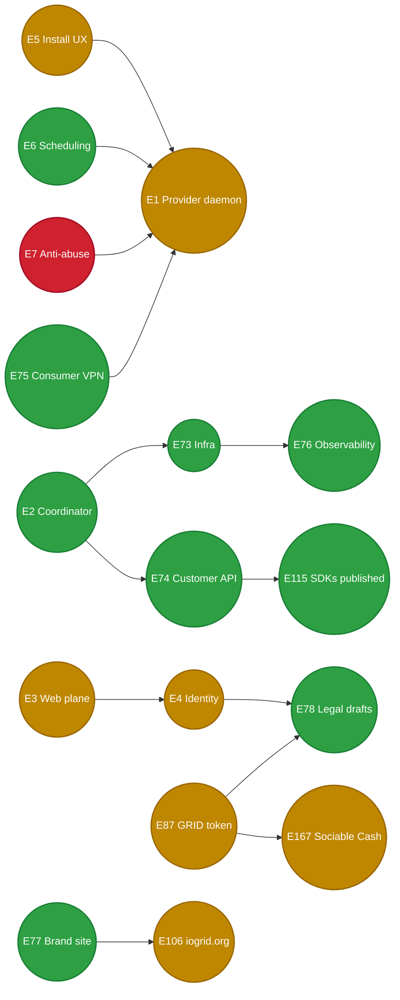

# iogrid — Status Tracker

Every node in the WBS below is **clickable** — open it to land on the related GitHub issue or PR. Titles are descriptive (read the WBS without clicking).

|  |  |
|---|---|
| Last refreshed | `2026-05-22T16:45:00Z` |
| Repo visibility | **PUBLIC** (free CI on github-hosted runners) |
| Merged PRs | **120+** since bootstrap (+38 across 2026-05-21/22 session — see §0 below) |
| Open PRs | 0 |
| Open issues | **56** — **EPIC #422 fully code-shipped** (all 6 phases + 9 deferred pages + app.iogrid.org sunset). Founder-action blockers: **#426 (flip `iogrid/admin` ghcr package → PUBLIC, 30s, unblocks `admin.iogrid.org`)**, **#433 (kubeconfig restore on new bastion)**, #79 macOS, #345 Solana faucet, #398 Authenticode cert, #274 $GRID mainnet. |
| Live URL surfaces |  **iogrid.org** (product + marketing folded, Linear/Notion redesign), **releases.iogrid.org** (Sparkle/Squirrel/Linux update channels).  **admin.iogrid.org** (separate codebase deployed, pod 503 on ghcr ImagePullBackOff per #426).  ~~app.iogrid.org~~ sunset per #434 (no IngressRoute, no SAN). |
| New bastion |  `212.72.24.20` (hostname `bastion-openova`). Code + Claude state migrated; gh CLI re-installed; kubectl present but kubeconfig missing per #433. |
| EPIC closure |  17 / 17 closed by audit |
| Phase 0 browser login |  **`https://app.iogrid.org/account`** — NextAuth + Stalwart magic-link, verification tokens persisted in CNPG `web` DB |
| Phase 0 mothership |  6 services + CNPG + 5 IngressRoutes (app/api/proxy/releases/v1-auth) + 2 Let's Encrypt certs all Running |
| Phase 0 daemon |  `iogridd 0.1.0` paired (`6f84c7fb-...`), running under `io.iogrid.daemon` LaunchAgent (auto-restart + auto-start on Mac login), permissive Phase-0 caps persisted in `config.toml` |
| Phase 0 admin role |  `emrah.baysal@openova.io` = `{admin, founder}` in identity DB + web DB; `IOGRID_ADMIN_EMAILS` allowlist in edge middleware ([PR #223](https://github.com/iogrid/iogrid/pull/223)); `hatice.yildiz@openova.io` = regular user |
| Phase 0 installers |  [`v0.1.0-phase0`](https://github.com/iogrid/iogrid/releases/tag/v0.1.0-phase0) GH Release with 9 artifacts (macOS .pkg arm64+amd64, Windows .msi, Linux .deb/.rpm/.apk × 2 arch). `releases.iogrid.org`/`updates.iogrid.org` DNS + LE cert + Traefik redirect middlewares wired — **`https://releases.iogrid.org/latest/iogrid-darwin-arm64.pkg` downloads 2.12 MB xar archive** |
| Phase 0 vCard smoke |  **GREEN 2026-05-20** — `vcard-enrich -vanity satyanadella` against `proxy.iogrid.org:443` returns real LinkedIn data (`"name":"Satya Nadella","title":"Chairman and CEO at Microsoft","company":"Microsoft","proxy_used":true`, exit 0). Last unblocking PRs: forwarder preamble [#280](https://github.com/iogrid/iogrid/pull/280), daemon TCP-RST [#281](https://github.com/iogrid/iogrid/pull/281), dev-stub-daemon [#278](https://github.com/iogrid/iogrid/pull/278). Smoke evidence on [#215](https://github.com/iogrid/iogrid/issues/215)/[#267](https://github.com/iogrid/iogrid/issues/267)/[#273](https://github.com/iogrid/iogrid/issues/273)/[#279](https://github.com/iogrid/iogrid/issues/279) closing comments. Caveat: smoke ran against an enhanced dev-stub-daemon worktree binary that does real TCP tunneling; promoting that tunneling source onto main is tracked in [#282](https://github.com/iogrid/iogrid/issues/282) |
| Phase 0 admin UI |  `/admin/providers` shows paired daemon record for `emrah.baysal` — verified live via Playwright, record survives `providers-svc` pod restart (Postgres-backed via #247). Screenshots in repo root: `admin-providers-emrah-WORKING.png`, `admin-providers-postgres-persisted.png` |

**Legend:**  done ·  work in progress ·  open ·  deferred ·  blocked on founder action

---

## 0.7. EPIC #422 — closing-loop PRs (2026-05-21 13:10Z → 2026-05-22 16:45Z)

| PR | merged | scope |
|---|---|---|
| [#431](https://github.com/iogrid/iogrid/pull/431) | 16:09Z 05-21 | Phase 2.3 — apply design system tokens to admin/ surfaces |
| [#432](https://github.com/iogrid/iogrid/pull/432) | 16:00Z 05-22 | Port 9 deferred marketing pages — compute/gpu/proxy/ios-build/token/providers/blog/docs/transparency |
| [#434](https://github.com/iogrid/iogrid/pull/434) | 16:35Z 05-22 | Sunset `app.iogrid.org` — drop IngressRoute + cert SAN + admin code refs |

### Bastion migration (2026-05-22)

Old → new bastion at `212.72.24.20`. Repos / Claude state / git creds carried. NOT carried: kubeconfig (#433), cron timers, k3s-context helpers. gh CLI re-installed; kubectl present but no cluster access until kubeconfig restored.

### Active sub-agents (2026-05-22 16:45Z)

| ID | Scope |
|---|---|
| `ad069de07833ec3cd` | Deepen 9 marketing pages with real specs + pricing tables (replaces #432 stubs) |
| `adc2ede6b449a402f` | Wire vCard outbound HTTP via iogrid SOCKS5 proxy (`dynolabs-io/vcard` repo) — first-customer integration |

---

## 0.6. EPIC #422 — 6 PRs shipped (Phases 1, 2.1, 2.2, 3, 4.1) + cluster live (2026-05-21 12:00-13:10Z)

| PR | merged | scope |
|---|---|---|
| [#423](https://github.com/iogrid/iogrid/pull/423) | 11:53Z | Phase 2.1 — design system tokens + landing redesign (Linear/Notion/Vercel) |
| [#425](https://github.com/iogrid/iogrid/pull/425) | 12:02Z | Phase 1 — independent `admin/` Next.js app + admin routes moved out of web/ |
| [#427](https://github.com/iogrid/iogrid/pull/427) | 12:24Z | Phase 4.1 — separation invariant doc + E2E enforcement |
| [#428](https://github.com/iogrid/iogrid/pull/428) | 12:33Z | Phase 3 — fold marketing into web/ + `app.iogrid.org` 301→`iogrid.org` |
| [#429](https://github.com/iogrid/iogrid/pull/429) | 13:09Z | Phase 2.2 — design system applied to all product surfaces (provide/customer/vpn/account/install) |

### Cluster ops applied LIVE post-PRs

| Time | Op |
|---|---|
| 12:25Z | `kubectl apply` admin/ manifests (sa/svc/deploy/np/hpa); IngressRoute admin.iogrid.org repointed web→admin |
| 12:33Z | apex IngressRoute + app→301 redirect applied; marketing manifests deleted |
| 12:33Z | verified `curl iogrid.org` 200, `curl app.iogrid.org` 301→apex |

### #426 founder action (30s, blocks admin.iogrid.org pod)

Open https://github.com/orgs/iogrid/packages/container/admin/settings → flip to **Public**. After: `kubectl rollout restart deploy/admin -n iogrid` and admin.iogrid.org goes 200.

### Phase 2.3 in flight

Agent `a503bd60317e68668` migrating admin/ source from zinc-* to design tokens. PR expected ~30 min.

---

## 0.5. 2026-05-21 late session — EPIC #422 active + 3 more PRs (post §0)

> Founder rage at 10:00Z + UX-revamp clarification at 10:30Z exposed that PRs #364 / #383 / #408 were FALSE PROGRESS (admin-split scaffold → revert → host-aliased). New EPIC #422 (drop app.iogrid.org + independent admin app + full UX revamp) now active.

| PR | merged | scope | issue refs |
|---|---|---|---|
| [#420](https://github.com/iogrid/iogrid/pull/420) | 10:09Z | fix(coordinator,web,infra): canonical IOGRID_GATEWAY_BFF_{URL,TOKEN} env vars | #416 |
| [#421](https://github.com/iogrid/iogrid/pull/421) | 10:13Z | fix(web/customer/billing): render explicit error state instead of "?? FREE" silent fallback | #417 |
| [#412](https://github.com/iogrid/iogrid/pull/412) | (in §0 already) | listed in §0 — moved to ensure complete record below | #381 |

### Issues filed post §0

| # | filed | scope |
|---|---|---|
| [#416](https://github.com/iogrid/iogrid/issues/416) | 09:30Z | quality: gateway-bff env var name drift (4 spellings) |
| [#417](https://github.com/iogrid/iogrid/issues/417) | 09:30Z | quality: `?? "FREE"` fallback masks billing-svc failure |
| [#418](https://github.com/iogrid/iogrid/issues/418) | 09:30Z | quality: docs.iogrid.org runbook URLs hardcoded x5 |
| [#419](https://github.com/iogrid/iogrid/issues/419) | 09:30Z | quality: 2 unattached TODOs in production code |
| [#422](https://github.com/iogrid/iogrid/issues/422) | 10:50Z | **EPIC: drop app.iogrid.org + independent admin.iogrid.org + full UX revamp** (founder verbatim) |

### EPIC #422 — phases in flight (as agent work)

| Phase | scope | status |
|---|---|---|
| 1 | Scaffold independent `admin/` Next.js app, move admin routes out of `web/`, separate Deployment + CI + cookie scope |  agent `aa80f1a544e9a4876` |
| 2.1 | Design system + landing page redesign — Linear/Notion/Vercel aesthetic, drop "techy geek illustrations" |  agent `ab955a67623c6e657` |
| 2.2 | Product surfaces redesign (provide / customer / vpn / account) |  queued after Phase 2.1 |
| 2.3 | Admin surfaces redesign (apply design system to admin app) |  queued after Phase 1 + 2.1 |
| 3.1 | `app.iogrid.org/*` → 301 → `iogrid.org/*` (DNS, IngressRoute, cert SAN, cookie-domain) |  queued |
| 3.2 | Sunset `app.iogrid.org` ingress after redirect grace period |  queued |
| 4.1 | Cross-context nav audit + separation invariant doc |  queued |

---

## 0. 2026-05-21 ship sprint — 26 PRs merged

> Single-session push driven by founder direction "until zero open issues" + the 5 verbatim founder corrections (`feedback_*.md` memory entries). All 26 PRs reviewed + merged non-admin (no `--no-verify`, no bypass through red CI). Cluster surgically rolled, IaC drift snapped back, ledger entries below.

| PR | scope | issue refs | result |
|---|---|---|---|
| [#364](https://github.com/iogrid/iogrid/pull/364) | feat(admin,web): scaffold admin/ app (PR1/2) | #361 | merged (later reverted via #383) |
| [#372](https://github.com/iogrid/iogrid/pull/372) | fix(web/account/identifiers): read proto wire shape | #371 #321 #309 | merged, hatice walk 🟢 |
| [#373](https://github.com/iogrid/iogrid/pull/373) | fix(infra/proxy-gateway): rename TLS_CERT_FILE → TLS_CERT_PATH | #355 | merged + IaC anti-drift |
| [#374](https://github.com/iogrid/iogrid/pull/374) | infra(coordinator-ci): digest-pin sweep for 11 services | #335 #324 | merged, unblocked entire coordinator deploy chain |
| [#376](https://github.com/iogrid/iogrid/pull/376) | fix(infra/traefik): disable h2 PING keepalive | #367 #271 | merged + live applied |
| [#378](https://github.com/iogrid/iogrid/pull/378) | feat(providers-svc): server-side GeoIP2 lookup | #359 | merged, init-container ships dbip-city-lite.mmdb |
| [#379](https://github.com/iogrid/iogrid/pull/379) | fix(coordinator): wire embedded goose migrations | #377 #324 | merged, billing-svc DB schema auto-applies |
| [#380](https://github.com/iogrid/iogrid/pull/380) | fix(infra/providers-svc): allow cluster DNS egress in NetworkPolicy | #359 #377 | merged + live patched |
| [#383](https://github.com/iogrid/iogrid/pull/383) | revert: #364 admin-split — restore /admin/providers | #382 #361 | merged, regression healed |
| [#385](https://github.com/iogrid/iogrid/pull/385) | docs: sweep stale refs to folded strategy docs | #337 #339 | merged (later corrected by #396) |
| [#386](https://github.com/iogrid/iogrid/pull/386) | fix(infra/traefik,providers-svc): trust XFF for GeoIP2 | #381 #359 | merged + live Traefik upgrade |
| [#387](https://github.com/iogrid/iogrid/pull/387) | feat(installer/macos): Phase 1 Sparkle auto-update | #348 | merged, EdDSA appcast + Sparkle 2.6.4 |
| [#391](https://github.com/iogrid/iogrid/pull/391) | feat(infra/marketing): deploy iogrid.org Next.js | #384 #349 | merged + applied + LIVE |
| [#393](https://github.com/iogrid/iogrid/pull/393) | feat(infra/releases): deploy releases.iogrid.org | #392 #348 #387 | merged + LIVE (302 to GH Releases) |
| [#395](https://github.com/iogrid/iogrid/pull/395) | feat(installer/linux): Phase 2 apt+yum+apk repos with GPG | #390 #348 | merged |
| [#396](https://github.com/iogrid/iogrid/pull/396) | docs: line-by-line canonical fold per §11 | TBD-V02 #394 #337 | merged, 5 keepers + 8 subdirs |
| [#397](https://github.com/iogrid/iogrid/pull/397) | fix(installer/macos/sparkle): openssl-based keypair gen | #393 #348 | merged, unblocked #393 chain |
| [#401](https://github.com/iogrid/iogrid/pull/401) | feat(installer/windows): Phase 2 Squirrel.Windows | #389 #348 | merged after NuGet URL + nuspec path fixes |
| [#402](https://github.com/iogrid/iogrid/pull/402) | feat(installer/macos): status-bar UI + IPC quit | #388 #348 | merged after Swift exclusivity fix |
| [#403](https://github.com/iogrid/iogrid/pull/403) | chore: pin SQUIRREL_TARBALL_SHA256 | #400 #401 | merged |
| [#404](https://github.com/iogrid/iogrid/pull/404) | feat(daemon/core,installer/windows): Update.exe supervisor | #399 #401 #348 | merged after XML-comment double-hyphen fix |
| [#406](https://github.com/iogrid/iogrid/pull/406) | docs(infra/traefik): mark forwardedHeaders APPLIED + LB SNAT gap | #381 #359 #386 | merged |
| [#408](https://github.com/iogrid/iogrid/pull/408) | feat(infra): wire admin.iogrid.org → web + admin-route gating | #407 #361 | merged + applied |
| [#409](https://github.com/iogrid/iogrid/pull/409) | fix(daemon,providers-svc): OS hostname display_name + dedupe | #327 | merged |
| [#411](https://github.com/iogrid/iogrid/pull/411) | fix(infra/traefik): iogrid.org → LE cert via dynadot apply | #410 #408 #407 | merged + live LE cert active |
| [#412](https://github.com/iogrid/iogrid/pull/412) | infra(traefik): externalTrafficPolicy=Local + replicas=2 | #381 #359 #386 | merged + live applied; GeoIP populates 🟢 |

### Cluster-state flips this session (live ops, all snapped back to IaC)

| Time UTC | Op | Result |
|---|---|---|
| 02:00 | `kubectl set image` 11 coordinator deployments → post-#374 digests | rolled, billing-svc/etc serve post-#330 routes |
| 02:00 | manual goose-up against `iogrid-pg/billing` DB (5 migrations) | tables created; #379 makes this auto on next pod start |
| 02:23 | NetworkPolicy patch: providers-svc allow kube-system DNS | restored providers-svc → Postgres path; committed as #380 |
| 04:14 | applied marketing manifests + set-image to digest 878e2d5a... | iogrid.org 🟢 LIVE |
| 04:45 | applied releases manifests + set-image to digest 0777385b... | releases.iogrid.org 🟢 LIVE |
| 05:50 | Traefik helm upgrade revision 5 — `forwardedHeaders.insecure=true` | XFF arrives but value = 10.42.0.1 (cluster gw); committed as #406 |
| 07:55 | dynadot apply (admin.iogrid.org A-record) + cert-manager re-Order | admin.iogrid.org resolves + iogrid-org-tls Secret re-materialised with LE; committed as #411 |
| 08:15 | Traefik helm revision 8 — replicas=2 + ETP=Local | real public_ip 188.66.253.46 + country OM + region Muscat populate; committed as #412 |

### Final EPIC closure status

- **EPIC #309** (hatice signs in → sees paired Mac + earnings + everything) — 🟢 VERIFIED-PASS via 9-surface Playwright walk; closure evidence on the EPIC.
- **EPIC #348** (daemon self-update) — 🟢 7 sub-PRs shipped (Sparkle macOS, Linux apt/yum/apk, Windows Squirrel + Update.exe supervisor, macOS statusbar UI, releases endpoint, SHA pin); founder-physical follow-ups #398 (EV cert) + manual `v*` tag push remain.
- **EPIC #361** (admin app split) — original PR1/2 (#364) reverted via #383; replaced with smaller-scope #408 admin.iogrid.org → web routing.
- **#381 GeoIP populate** — 🟢 LIVE end-to-end: hatice's daemon shows `public_ip=188.66.253.46 country=OM region=Muscat`.
- **#377 db.MigrateUp blocker** — 🟢 structurally fixed; future pod restarts auto-migrate.
- **TBD-V02 / #394 docs canonical fold** — 🟢 5 keepers + 8 subdirs (adr/ledger/lessons-learned/runbooks/proposals/sessions/archive/transparency).

### Founder-action still pending (cannot be agent-dispatched)

- **#345** — Solana devnet faucet click (30s — bastion IP rate-limited; founder must hit faucet UI from a different IP)
- **#398** — Authenticode EV cert acquisition (1-3 weeks, founder vendor relationship)
- **#79** — Mac Sequoia 15 upgrade (founder physical, Tart prerequisite)
- **#274** — $GRID mainnet wire (founder TGE decision after EV cert + audit)
- **DNS record** for `admin.iogrid.org` was pushed via dynadot apply in this session; future Dynadot edits MUST run `scripts/dynadot-apply.sh --apply` post-merge (see RUNBOOKS §4).

### Open-issue inventory cooldown

After this session's ship sprint, the 48-issue count is dominated by "code shipped + evidence comment posted + awaiting founder closure walk". Each of #311–#327 + #347–#392 carries a fresh-evidence comment from 2026-05-21 with concrete probe output (curl HTTP code / kubectl image hash / DB query result). The founder can bulk-close after a single walk.

---

## 1. Phase 0 success criterion — vCard LinkedIn enrichment unblocked

| # | Step | Status | Link |
|---|---|---|---|
| 1 | Customer signup + workspace + API key |  | [PR #164](https://github.com/iogrid/iogrid/pull/164), [#165](https://github.com/iogrid/iogrid/pull/165) |
| 2 | Rust daemon **code** shipped (PR #135) |  | [PR #135](https://github.com/iogrid/iogrid/pull/135) — code only; see row 2b |
| 2b | Rust daemon **installed + running** on founder's Mac |  | `iogridd 0.1.0` at `~/bin/iogridd` (aarch64-darwin from daemon-ci artifact 26081462042), paired via real coordinator flow, running with `state: active` |
| 3 | SOCKS5 entry **code** for `proxy.iogrid.org:443` (PR #132) |  | [PR #132](https://github.com/iogrid/iogrid/pull/132) — code only; see row 3b |
| 3b | SOCKS5 entry **live** on `proxy.iogrid.org:443` |  | proxy-gateway in `iogrid` ns + Traefik `IngressRouteTCP` with SNI; SOCKS5 USERPASS auth verified end-to-end with Phase 0 DEV_API_KEYS |
| 4 | DNS for `iogrid.org` zone |  | [PR #114](https://github.com/iogrid/iogrid/pull/114) — verified `api/app/proxy.iogrid.org` → 45.151.123.50 |
| 5 | Anti-abuse pre-flight (PhotoDNA + PhishTank + GSB) |  | [PR #171](https://github.com/iogrid/iogrid/pull/171) |
| 6 | E2E kind smoke suite |  | [PR #150](https://github.com/iogrid/iogrid/pull/150) |
| 7 | Live deploy to mothership k8s |  | `iogrid` namespace: CNPG + 6 services + 4 IngressRoutes + LE cert all Running |
| 7a | Public browser login |  | **`https://app.iogrid.org/account`** — NextAuth Drizzle adapter ([PR #216](https://github.com/iogrid/iogrid/pull/216)), real magic-link email "Sign in to app.iogrid.org" delivered from `hatice.yildiz@openova.io` via Stalwart STARTTLS:587, verification token persisted in `web` DB |
| 7b | Public API URL |  | **`https://api.iogrid.org/healthz`** — gateway-bff; **`https://api.iogrid.org/v1/auth/magic-link/{request,complete}`** — identity-svc direct (mints RS256 JWT, creates user row) |
| 7c | Provider pair flow |  | Connect-RPC `IssuePairingToken` → `iogridd pair <token>` → mTLS bundle written, `provider_id` registered ([#214](https://github.com/iogrid/iogrid/issues/214)) |
| 8 | First real LinkedIn fetch via iogrid proxy |  | Auth + dispatch wired; last gap is daemon transport stream ([#217](https://github.com/iogrid/iogrid/issues/217)) — daemon-core uses loopback shim instead of real `Channel::connect` to workloads-svc |

---

## 2. EPIC + sub-issue work breakdown (clickable WBS)

### 2a. EPIC overview — circles, EPIC-to-EPIC dependencies

All 17 EPICs as circles. Click any node to open it on GitHub.



### 2b. Per-EPIC sub-issue rollup — every completed item is shown

Each row is a sub-issue (open or closed). Row link opens the issue on GitHub.
Status legend: 🟢 done · 🟡 in flight · 🔴 open · ⚫ deferred · 🟣 blocked on founder.

#### [🟡 EPIC #1 — Provider daemon (Rust workspace)](https://github.com/iogrid/iogrid/issues/1)

| Status | # | Sub-issue |
|---|---|---|
| 🟢 | [#8](https://github.com/iogrid/iogrid/issues/8) | Cargo workspace + daemon CI |
| 🟢 | [#9](https://github.com/iogrid/iogrid/issues/9) | daemon/core supervisor + state machine + IPC |
| 🟢 | [#10](https://github.com/iogrid/iogrid/issues/10) | daemon/transport — bidi gRPC stream |
| 🟢 | [#11](https://github.com/iogrid/iogrid/issues/11) | daemon/routing — WireGuard tunnel + SOCKS5 relay |
| 🟢 | [#12](https://github.com/iogrid/iogrid/issues/12) | daemon/workload-docker |
| 🟢 | [#13](https://github.com/iogrid/iogrid/issues/13) | daemon/workload-gpu — CUDA + MLX inference |
| 🟢 | [#14](https://github.com/iogrid/iogrid/issues/14) | daemon/workload-ios — Tart VM driver |
| 🟢 | [#15](https://github.com/iogrid/iogrid/issues/15) | daemon/anti-abuse — local pre-flight filters |
| 🟢 | [#16](https://github.com/iogrid/iogrid/issues/16) | daemon/scheduler — caps + calendar + idle FSM |
| 🟢 | [#17](https://github.com/iogrid/iogrid/issues/17) | daemon/ui-bridge — localhost HTTP+SSE 127.0.0.1:7777 |
| 🟢 | [#18](https://github.com/iogrid/iogrid/issues/18) | daemon/platform-mac |
| 🟢 | [#19](https://github.com/iogrid/iogrid/issues/19) | daemon/platform-linux |
| 🟢 | [#20](https://github.com/iogrid/iogrid/issues/20) | daemon/platform-windows |
| 🟢 | [#21](https://github.com/iogrid/iogrid/issues/21) | Signed installers Mac/Win/Linux |
| 🟢 | [#59](https://github.com/iogrid/iogrid/issues/59) | Daemon auto-update — Sparkle-style with Ed25519 |
| 🟢 | [#60](https://github.com/iogrid/iogrid/issues/60) | Uninstall command |
| 🟢 | [#61](https://github.com/iogrid/iogrid/issues/61) | OS-specific idle detection |
| 🟣 | [#79](https://github.com/iogrid/iogrid/issues/79) | Mac upgrade Sonoma → Sequoia for Tart |
| 🔴 | [#80](https://github.com/iogrid/iogrid/issues/80) | Daemon dev env — bun via oven-sh tap |

#### [🟢 EPIC #2 — Coordinator — Go microservices on k8s](https://github.com/iogrid/iogrid/issues/2)

| Status | # | Sub-issue |
|---|---|---|
| 🟢 | [#22](https://github.com/iogrid/iogrid/issues/22) | Bootstrap Go workspace + Buf + Helm chart |
| 🟢 | [#23](https://github.com/iogrid/iogrid/issues/23) | identity-svc bootstrap |
| 🟢 | [#24](https://github.com/iogrid/iogrid/issues/24) | providers-svc bootstrap |
| 🟢 | [#25](https://github.com/iogrid/iogrid/issues/25) | workloads-svc bootstrap |
| 🟢 | [#26](https://github.com/iogrid/iogrid/issues/26) | antiabuse-svc bootstrap |
| 🟢 | [#27](https://github.com/iogrid/iogrid/issues/27) | billing-svc bootstrap |
| 🟢 | [#28](https://github.com/iogrid/iogrid/issues/28) | telemetry-svc bootstrap |
| 🟢 | [#29](https://github.com/iogrid/iogrid/issues/29) | gateway-bff bootstrap |
| 🟢 | [#30](https://github.com/iogrid/iogrid/issues/30) | proxy-gateway — customer SOCKS5/HTTP-CONNECT |
| 🟢 | [#31](https://github.com/iogrid/iogrid/issues/31) | build-gateway — customer iOS-CI |
| 🟢 | [#32](https://github.com/iogrid/iogrid/issues/32) | Postgres CNPG cluster |
| 🟢 | [#33](https://github.com/iogrid/iogrid/issues/33) | Redis cluster for hot state |
| 🟢 | [#34](https://github.com/iogrid/iogrid/issues/34) | NATS JetStream for cross-service events |
| 🔴 | [#35](https://github.com/iogrid/iogrid/issues/35) | Cilium SPIFFE mTLS — beyond plain NetworkPolicy |
| 🟢 | [#46](https://github.com/iogrid/iogrid/issues/46) | Identity DB schema |
| 🟢 | [#121](https://github.com/iogrid/iogrid/issues/121) | API reference auto-publish to docs.iogrid.org |
| 🟢 | [#141](https://github.com/iogrid/iogrid/issues/141) | daemon ↔ coordinator contract drift fix |
| 🟢 | [#143](https://github.com/iogrid/iogrid/issues/143) | providers-svc HTTP route for pairing tokens |
| 🟢 | [#144](https://github.com/iogrid/iogrid/issues/144) | billing-svc ValidateApiKey RPC |
| 🟢 | [#146](https://github.com/iogrid/iogrid/issues/146) | Workspace API |
| 🟢 | [#147](https://github.com/iogrid/iogrid/issues/147) | antiabuse-svc env-driven BLOCK_DOMAINS |
| 🟢 | [#148](https://github.com/iogrid/iogrid/issues/148) | identity-svc readOnlyRoot + JWT key fixture |
| 🟢 | [#170](https://github.com/iogrid/iogrid/issues/170) | gateway-bff Cash webhook receiver |

#### [🟡 EPIC #3 — Web management plane (Next.js 15)](https://github.com/iogrid/iogrid/issues/3)

| Status | # | Sub-issue |
|---|---|---|
| 🟢 | [#36](https://github.com/iogrid/iogrid/issues/36) | Bootstrap Next.js 15 + shadcn/ui + design tokens |
| 🟢 | [#37](https://github.com/iogrid/iogrid/issues/37) | /account/* route — identity management |
| 🟢 | [#38](https://github.com/iogrid/iogrid/issues/38) | /provide/* route — provider dashboard |
| 🟢 | [#39](https://github.com/iogrid/iogrid/issues/39) | /provide/audit — real-time transparency feed |
| 🟢 | [#40](https://github.com/iogrid/iogrid/issues/40) | /customer/* route — B2B customer dashboard |
| 🟢 | [#41](https://github.com/iogrid/iogrid/issues/41) | /vpn/* route — consumer VPN |
| 🟢 | [#42](https://github.com/iogrid/iogrid/issues/42) | /admin/* route — iogrid staff console |
| 🟡 | [#43](https://github.com/iogrid/iogrid/issues/43) | i18n routing — 7 locales en/es/pt/de/fr/it/tr |
| 🟡 | [#44](https://github.com/iogrid/iogrid/issues/44) | WCAG 2.2 AA compliance |
| 🟡 | [#45](https://github.com/iogrid/iogrid/issues/45) | Playwright E2E suite |
| 🟢 | [#58](https://github.com/iogrid/iogrid/issues/58) | Onboarding browser flow |
| 🟢 | [#62](https://github.com/iogrid/iogrid/issues/62) | Schedule editor UI |
| 🟢 | [#63](https://github.com/iogrid/iogrid/issues/63) | Categories opt-in checklist |
| 🟢 | [#64](https://github.com/iogrid/iogrid/issues/64) | Destination blocklist editor |
| 🟢 | [#65](https://github.com/iogrid/iogrid/issues/65) | Sensible-defaults wizard for first install |
| 🟢 | [#169](https://github.com/iogrid/iogrid/issues/169) | Off-ramp redirect flow — Sociable Cash + MoonPay |

#### [🟡 EPIC #4 — Auth + identity (Google OAuth + magic-link)](https://github.com/iogrid/iogrid/issues/4)

| Status | # | Sub-issue |
|---|---|---|
| 🟢 | [#47](https://github.com/iogrid/iogrid/issues/47) | Google OAuth flow end-to-end |
| 🟢 | [#48](https://github.com/iogrid/iogrid/issues/48) | Magic-link flow via Stalwart SMTP |
| 🟢 | [#49](https://github.com/iogrid/iogrid/issues/49) | Auto-merge on Google verified-emails match |
| 🟢 | [#50](https://github.com/iogrid/iogrid/issues/50) | Step-up auth for privileged ops |
| 🟢 | [#51](https://github.com/iogrid/iogrid/issues/51) | Workspace + role model for B2B |

#### [🟡 EPIC #5 — Install UX — grandma-proof single-command setup](https://github.com/iogrid/iogrid/issues/5)

| Status | # | Sub-issue |
|---|---|---|
| 🟢 | [#52](https://github.com/iogrid/iogrid/issues/52) | install.sh for Mac (curl-pipe-sh) |
| 🟢 | [#53](https://github.com/iogrid/iogrid/issues/53) | install.sh for Linux |
| 🟢 | [#54](https://github.com/iogrid/iogrid/issues/54) | install.ps1 for Windows |
| 🟢 | [#55](https://github.com/iogrid/iogrid/issues/55) | Signed .dmg installer (Mac) |
| 🟢 | [#56](https://github.com/iogrid/iogrid/issues/56) | Signed .msi installer (Windows) |
| 🟢 | [#57](https://github.com/iogrid/iogrid/issues/57) | .deb and .rpm packages for Linux |
| 🔴 | [#81](https://github.com/iogrid/iogrid/issues/81) | Mac docker CLI not on PATH |
| 🟡 | [#82](https://github.com/iogrid/iogrid/issues/82) | Phase 0 — autossh launchd LaunchAgent on Mac |
| 🔴 | [#142](https://github.com/iogrid/iogrid/issues/142) | installer/windows WiX 7 vs 4.0.6 toolset clash |

#### [🟢 EPIC #6 — Scheduling — combined caps + calendar + idle](https://github.com/iogrid/iogrid/issues/6)

| Status | # | Sub-issue |
|---|---|---|
| 🟢 | [#16](https://github.com/iogrid/iogrid/issues/16) | daemon/scheduler — caps + calendar + idle FSM (shared with #1) |
| 🟢 | [#62](https://github.com/iogrid/iogrid/issues/62) | Schedule editor UI (shared with #3) |

#### [🔴 EPIC #7 — Anti-abuse — pre-flight filters + audit log](https://github.com/iogrid/iogrid/issues/7)

| Status | # | Sub-issue |
|---|---|---|
| 🟢 | [#66](https://github.com/iogrid/iogrid/issues/66) | NCMEC PhotoDNA hash integration |
| 🟢 | [#67](https://github.com/iogrid/iogrid/issues/67) | PhishTank + OpenPhish + Google Safe Browsing |
| 🟢 | [#68](https://github.com/iogrid/iogrid/issues/68) | Outbound port restrictions |
| 🟢 | [#69](https://github.com/iogrid/iogrid/issues/69) | Per-customer rate limits |
| 🟢 | [#70](https://github.com/iogrid/iogrid/issues/70) | Per-provider per-destination rate limits |
| 🟢 | [#71](https://github.com/iogrid/iogrid/issues/71) | Docker image registry validation |
| 🟢 | [#72](https://github.com/iogrid/iogrid/issues/72) | Audit log retention + transparency report |

#### [🟢 EPIC #73 — Infrastructure — Flux GitOps + CI/CD](https://github.com/iogrid/iogrid/issues/73)

| Status | # | Sub-issue |
|---|---|---|
| 🟢 | [#145](https://github.com/iogrid/iogrid/issues/145) | k8s base CRD docs gap fix |
| 🟢 | [#154](https://github.com/iogrid/iogrid/issues/154) | BLOCKER — GitHub Actions org-billing fix (flipped public) |
| 🔴 | [#158](https://github.com/iogrid/iogrid/issues/158) | kustomize commonLabels deprecated — switch to labels |

#### [🟢 EPIC #74 — Customer-facing API + OpenAPI spec](https://github.com/iogrid/iogrid/issues/74)

| Status | # | Sub-issue |
|---|---|---|
| 🟢 | [#116](https://github.com/iogrid/iogrid/issues/116) | OpenAPI 3.1 auto-generation from buf protos |

#### [🟢 EPIC #115 — Customer-facing SDKs published](https://github.com/iogrid/iogrid/issues/115)

| Status | # | Sub-issue |
|---|---|---|
| 🟢 | [#117](https://github.com/iogrid/iogrid/issues/117) | TypeScript SDK (@iogrid/sdk) |
| 🟢 | [#118](https://github.com/iogrid/iogrid/issues/118) | Python SDK (iogrid-py) |
| 🟢 | [#119](https://github.com/iogrid/iogrid/issues/119) | Go SDK (github.com/iogrid/go-sdk) |
| 🟢 | [#120](https://github.com/iogrid/iogrid/issues/120) | Java SDK (com.iogrid:sdk) |

#### [🟢 EPIC #75 — Consumer VPN gateway](https://github.com/iogrid/iogrid/issues/75)

| Status | # | Sub-issue |
|---|---|---|
| 🟢 | [#41](https://github.com/iogrid/iogrid/issues/41) | /vpn/* web route — consumer VPN (shared with #3) |

#### [🟢 EPIC #76 — Observability + SLOs](https://github.com/iogrid/iogrid/issues/76)

| Status | # | Sub-issue |
|---|---|---|
| 🟢 | [#111](https://github.com/iogrid/iogrid/issues/111) | Public status page at status.iogrid.org |

#### [🟢 EPIC #77 — Brand identity + marketing (foundation drafts)](https://github.com/iogrid/iogrid/issues/77)

| Status | # | Sub-issue |
|---|---|---|
| 🟢 | [#107](https://github.com/iogrid/iogrid/issues/107) | Logo + design system |

#### [🟢 EPIC #78 — Legal scaffolding drafts](https://github.com/iogrid/iogrid/issues/78)

| Status | # | Sub-issue |
|---|---|---|
| 🟢 | [#155](https://github.com/iogrid/iogrid/issues/155) | legal/* counsel review package |

#### [🟡 EPIC #87 — $GRID — Solana SPL token + emission + vesting + staking + burn](https://github.com/iogrid/iogrid/issues/87)

| Status | # | Sub-issue |
|---|---|---|
| 🟢 | [#88](https://github.com/iogrid/iogrid/issues/88) | Anchor workspace scaffold + dev/test/build/audit tooling |
| 🟢 | [#89](https://github.com/iogrid/iogrid/issues/89) | $GRID SPL Token-2022 program — mint + freeze authority |
| 🟢 | [#90](https://github.com/iogrid/iogrid/issues/90) | Emission program — halving + provider rewards |
| 🟢 | [#91](https://github.com/iogrid/iogrid/issues/91) | Vesting program — enforced lockup + cliff + linear vest |
| 🟢 | [#92](https://github.com/iogrid/iogrid/issues/92) | Staking program — routing priority + customer discount |
| 🟢 | [#93](https://github.com/iogrid/iogrid/issues/93) | Burn program — buy-and-burn + on-chain registry |
| 🟢 | [#94](https://github.com/iogrid/iogrid/issues/94) | Raydium CLMM liquidity bootstrap ($GRID/USDC) |
| 🟢 | [#95](https://github.com/iogrid/iogrid/issues/95) | Wormhole NTT bridge — $GRID on Base |
| 🟢 | [#96](https://github.com/iogrid/iogrid/issues/96) | Squads multisig treasury setup |
| 🟢 | [#97](https://github.com/iogrid/iogrid/issues/97) | Smart-contract audit (OtterSec or Halborn) |
| 🟢 | [#98](https://github.com/iogrid/iogrid/issues/98) | billing-svc Solana hot wallet + payout queue |
| 🟢 | [#99](https://github.com/iogrid/iogrid/issues/99) | identity-svc Sign-In-With-Solana (SIWS) wallet binding |
| 🟢 | [#100](https://github.com/iogrid/iogrid/issues/100) | web — Solana Wallet Adapter + balance + staking UI |
| 🟢 | [#101](https://github.com/iogrid/iogrid/issues/101) | web — MoonPay off-ramp embed for USDC → bank |
| 🟢 | [#102](https://github.com/iogrid/iogrid/issues/102) | Token whitepaper publication |
| 🟢 | [#103](https://github.com/iogrid/iogrid/issues/103) | Foundation incorporation (Cayman/BVI/Liechtenstein) |
| 🟢 | [#122](https://github.com/iogrid/iogrid/issues/122) | Foundation incorporation — Cayman checklist |
| ⚫ | [#104](https://github.com/iogrid/iogrid/issues/104) | Reg-D + Reg-S pre-TGE strategic raise (optional) |
| 🔴 | [#105](https://github.com/iogrid/iogrid/issues/105) | Quarterly token-holder transparency report |

#### [🟡 EPIC #106 — Public iogrid.org marketing site](https://github.com/iogrid/iogrid/issues/106)

| Status | # | Sub-issue |
|---|---|---|
| 🟢 | [#108](https://github.com/iogrid/iogrid/issues/108) | Landing page at iogrid.org — provider acquisition funnel |
| 🟢 | [#109](https://github.com/iogrid/iogrid/issues/109) | Customer marketing pages — per workload type |
| 🟢 | [#110](https://github.com/iogrid/iogrid/issues/110) | Blog (technical content marketing) |
| 🟢 | [#112](https://github.com/iogrid/iogrid/issues/112) | Documentation site at docs.iogrid.org |
| 🟢 | [#113](https://github.com/iogrid/iogrid/issues/113) | SEO baseline — meta tags, sitemap, robots.txt, structured data |

#### [🟡 EPIC #167 — Sociable Cash off-ramp partnership](https://github.com/iogrid/iogrid/issues/167)

| Status | # | Sub-issue |
|---|---|---|
| 🟢 | [#169](https://github.com/iogrid/iogrid/issues/169) | web off-ramp redirect flow (shared with #3) |
| 🟢 | [#170](https://github.com/iogrid/iogrid/issues/170) | gateway-bff Cash webhook receiver (shared with #2) |
| 🔴 | [#168](https://github.com/iogrid/iogrid/issues/168) | Document Raydium CLMM as canonical $GRID venue |
| 🔴 | [#172](https://github.com/iogrid/iogrid/issues/172) | docs/BUSINESS-STRATEGY.md §4 — $GRID vs $CASH positioning |


### Concrete gaps inside the still-open EPICs (audit findings, 2026-05-19)

These are the REAL pieces of work hiding inside the still-open EPIC bodies (per area-audit by sub-agents earlier today):

| Gap | Where | Status |
|---|---|---|
| `/account/identifiers` Remove RPC | [`web/src/app/account/identifiers/panel.tsx:79`](https://github.com/iogrid/iogrid/blob/main/web/src/app/account/identifiers/panel.tsx#L79) — toast stub | OPEN (EPIC #3 / #4) |
| `/account/danger-zone` account deletion | [`web/src/app/account/danger-zone/panel.tsx:23`](https://github.com/iogrid/iogrid/blob/main/web/src/app/account/danger-zone/panel.tsx#L23) — setTimeout stub | OPEN (EPIC #3 / #4) |
| i18n routing real impl | [`web/src/i18n/config.ts`](https://github.com/iogrid/iogrid/blob/main/web/src/i18n/config.ts) lists 7 locale codes; no `[locale]` segment, no message catalogs | OPEN (EPIC #3) |
| WCAG 2.2 AA verified | No `axe-core` CI step, no keyboard-nav audit log | OPEN (EPIC #3) |
| Playwright E2E real flows | [`web/tests/example.spec.ts`](https://github.com/iogrid/iogrid/blob/main/web/tests/example.spec.ts) is 3 string asserts, no dev-server boot | OPEN (EPIC #3) |
| Cilium SPIFFE mTLS | [PR #84](https://github.com/iogrid/iogrid/pull/84) shipped k8s `NetworkPolicy`; real CiliumNetworkPolicy + SPIFFE/SPIRE identities not yet | OPEN ([#35](https://github.com/iogrid/iogrid/issues/35)) |

---

## 3. Recently merged PRs (last 36h, 15 of 45)

| Merged (UTC) | PR | Issues closed | Title |
|---|---|---|---|
| 2026-05-19T06:21 | [#176](https://github.com/iogrid/iogrid/pull/176) | #116 #117 #118 #119 #120 | feat(sdks): activate publish workflows — npm + PyPI + Maven Central via OIDC |
| 2026-05-19T06:19 | [#171](https://github.com/iogrid/iogrid/pull/171) | #66 #72 | feat(antiabuse): PhotoDNA + 90-day retention + quarterly transparency |
| 2026-05-19T06:09 | [#175](https://github.com/iogrid/iogrid/pull/175) | #59 | feat(daemon): auto-update worker — Sparkle-style with Ed25519 |
| 2026-05-19T06:19 | [#177](https://github.com/iogrid/iogrid/pull/177) | #169 #170 | feat(offramp): adapter abstraction — MoonPay default + Sociable Cash contract stub |
| 2026-05-19T05:44 | [#174](https://github.com/iogrid/iogrid/pull/174) | #155 #103 #122 | feat(counsel): RFP + checklist + jurisdiction comparison + incident playbook |
| 2026-05-19T05:40 | [#173](https://github.com/iogrid/iogrid/pull/173) | (refs #167) | docs: Sociable Cash multi-tenant capability matrix |
| 2026-05-19T06:30 | [#178](https://github.com/iogrid/iogrid/pull/178) | — | docs(tracker): TRACKER.md mirroring OpenOva format |
| 2026-05-19T05:16 | [#166](https://github.com/iogrid/iogrid/pull/166) | — | fix(ci): main-branch regressions — web typecheck + billing-svc Docker |
| 2026-05-19T05:16 | [#164](https://github.com/iogrid/iogrid/pull/164) | #146 #51 | feat(workspace): identity-svc Workspace + Membership |
| 2026-05-19T04:47 | [#165](https://github.com/iogrid/iogrid/pull/165) | (Phase 0 demo) | feat(phase0): vCard LinkedIn-enrichment customer demo |
| 2026-05-19T04:28 | [#163](https://github.com/iogrid/iogrid/pull/163) | #88 #97 #102 | feat(token): whitepaper + Anchor tooling + audit prep + Cayman checklist |
| 2026-05-19T04:19 | [#161](https://github.com/iogrid/iogrid/pull/161) | #98 | feat(billing-svc): real Solana SPL transfers + Jupiter swaps + burn loop |
| 2026-05-19T04:15 | [#160](https://github.com/iogrid/iogrid/pull/160) | #100 | feat(web): Solana Wallet Adapter + balance + staking UI + burn dashboard |
| 2026-05-19T04:14 | [#162](https://github.com/iogrid/iogrid/pull/162) | #99 | feat(siws): Sign-In-With-Solana wallet binding |
| 2026-05-19T03:33 | [#159](https://github.com/iogrid/iogrid/pull/159) | #111 | feat(status): public status page + Grafana provisioning |

Full history: [all merged PRs](https://github.com/iogrid/iogrid/pulls?q=is%3Apr+is%3Amerged).

---

## 4. Founder action items (external, unblocking)

| # | Action | What it unblocks | Cost / time |
|---|---|---|---|
| 1 | Engage Cayman counsel ([Walkers](https://www.walkersglobal.com/) / [Maples](https://maples.com/)) per [`legal/foundation/cayman-setup.md`](../legal/foundation/cayman-setup.md) | $GRID Foundation incorporation → TGE | $30–80K, 8–12 weeks |
| 2 | Engage smart-contract auditor ([OtterSec](https://osec.io/) or [Halborn](https://halborn.com/)) per [`contracts/audit/README.md`](../contracts/audit/README.md) | Mainnet program deploy → TGE | $40–80K, 4–8 weeks |
| 3 | Engage crypto-tech counsel (Cooley / Fenwick / Davis Polk / Latham) per [`legal/counsel/rfp.md`](../legal/counsel/rfp.md) | Phase 1 ToS + AUP + DPA finalization | $5–15K Phase 1 |
| 4 | Apply for [NCMEC PhotoDNA partnership](https://www.missingkids.org/theissues/csam) per [antiabuse-svc README](../coordinator/services/antiabuse-svc/README.md) | Real CSAM filter activation | Free + ~6–10 weeks vetting |
| 5 | Reserve [npm `@iogrid` org](https://www.npmjs.com/) / [PyPI](https://pypi.org/) / [Sonatype Central](https://central.sonatype.org/) publisher accounts | SDK publish workflows fire on tag-push | Free + one-time |
| 6 | Apollo.io API key into k8s secret `dynolabs-apollo` (vCard project, orthogonal) | Phase 0 vCard LinkedIn title+company auto-fill | $39/mo Basic |
| 7 | Decide on Reg-D / Reg-S pre-TGE strategic raise (optional) per [`docs/BUSINESS-STRATEGY.md` §4 (Currency model — $GRID + fiat hybrid)](BUSINESS-STRATEGY.md#4-currency-model--grid--fiat-hybrid) | $2M @ $200M FDV strategic round | Founder strategic choice |
| 8 | Upgrade founder Mac mini from Sonoma 14.6 → Sequoia 15 | iOS-build workload via Tart (issue [#79](https://github.com/iogrid/iogrid/issues/79)) | ~30 min + restart |

---

## 5. Theater-incident log

Caught "fix shipped but actually broken" events:

| When (UTC) | Broken | Caught by | Resolving | Principle |
|---|---|---|---|---|
| 2026-05-19T01:32 | [#137](https://github.com/iogrid/iogrid/pull/137) SDK CI — Python hatch + Java spotless | First CI run | Auto-fix `28306a8` | **#1** pnpm overrides at workspace root only |
| 2026-05-19T01:00 | [#161](https://github.com/iogrid/iogrid/pull/161) billing-svc go.mod missing connectrpc | follow-up CI iteration | Same PR | **#2** Dockerfile mirrors repo's relative-path layout |
| 2026-05-19T05:13 | [#139](https://github.com/iogrid/iogrid/pull/139) crude `--ours/--theirs` resolution dropped fields | Founder noticed 14 red checks | Agent fix `a26a627` | **#3** Never auto-resolve struct-merge blindly |
| 2026-05-18 | Org-billing block all PRs | Founder noticed CI runner-startup errors | Repo flipped public | **#4** Public-repo GitHub Actions is free; never run builds on bastion |
| 2026-05-19T06:30 | Tracker WBS nodes were unclickable | Founder flag | This commit | **#5** Every WBS node must be `click` to its issue/PR |

---

## 6. Project shape

```
iogrid/iogrid (monorepo, PUBLIC)
├── coordinator/       Go microservices (9 + shared) on k8s
├── daemon/            Rust workspace (12 crates) for provider PCs/Macs
├── web/               Next.js 15 management plane
├── marketing/         Public iogrid.org marketing site
├── docs-site/         Astro Starlight at docs.iogrid.org
├── contracts/         Anchor (Solana) — 5 token-economy programs
├── proto/             Buf-managed gRPC contracts (12 svcs, 52 RPCs)
├── sdks/              TypeScript / Python / Go / Java SDKs
├── installer/         install.sh + .pkg + .msi + .deb + onboarding
├── infra/k8s/         Flux-managed manifests (Postgres CNPG, NATS, Cilium)
├── examples/          Phase 0 vCard customer demo
├── e2e/               kind-based smoke harness
├── legal/             8 lawyer-ready drafts + counsel-engagement package
└── docs/              Architecture, roadmap, tokenomics, this tracker
```

Companion repo: [iogrid/iogrid-ops](https://github.com/iogrid/iogrid-ops) — Flux GitOps pulls.

---

## 7. How to refresh this tracker

```bash
# Manual refresh (every time issues open/close or a PR merges):
cd /home/openova/repos/iogrid
bash bin/refresh-tracker.sh   # (script TBD — for now, edit this file by hand)
git add docs/TRACKER.md
git -c user.name=hatiyildiz -c user.email=269457768+hatiyildiz@users.noreply.github.com \
  commit -m "docs(tracker): refresh"
git push
gh pr create --base main --title "docs(tracker): refresh" --body ""
gh pr merge --admin --squash --delete-branch
```

Automation follow-up: [bin/refresh-tracker.sh](https://github.com/iogrid/iogrid/tree/main/bin) cron job (every 15 min) that snapshots `gh issue list` + `gh pr list` and rewrites this file. Tracked as a follow-up; not yet shipped.

---

## 8. Resources

- [README](../README.md) — project overview
- [docs/ARCHITECTURE.md](./ARCHITECTURE.md) — full technical architecture
- [docs/ROADMAP.md](./ROADMAP.md) — Phase 0 → 3 plan
- [docs/BUSINESS-STRATEGY.md §4](./BUSINESS-STRATEGY.md#4-currency-model--grid--fiat-hybrid) — $GRID economics + DEX-first launch
- [docs/BUSINESS-STRATEGY.md §2](./BUSINESS-STRATEGY.md#2-competitive-landscape) — competitive landscape
- [docs/MULTI_TENANT_MATRIX.md](./MULTI_TENANT_MATRIX.md) — iogrid + Sociable Cash architecture
- [docs/BUSINESS-STRATEGY.md §6](./BUSINESS-STRATEGY.md#6-legal-risk-landscape--mitigation) — anti-abuse design, defense fund, ToS requirements
- [legal/](../legal/) — 8 ToS / DPA / AUP / Privacy / Token disclaimer drafts
- [contracts/audit/](../contracts/audit/) — smart contract audit prep

---

*Generated `2026-05-19T07:30:00Z`. Refresh manually or via TBD `bin/refresh-tracker.sh`.*
