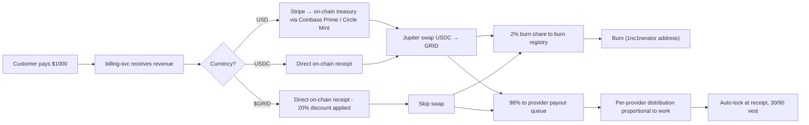
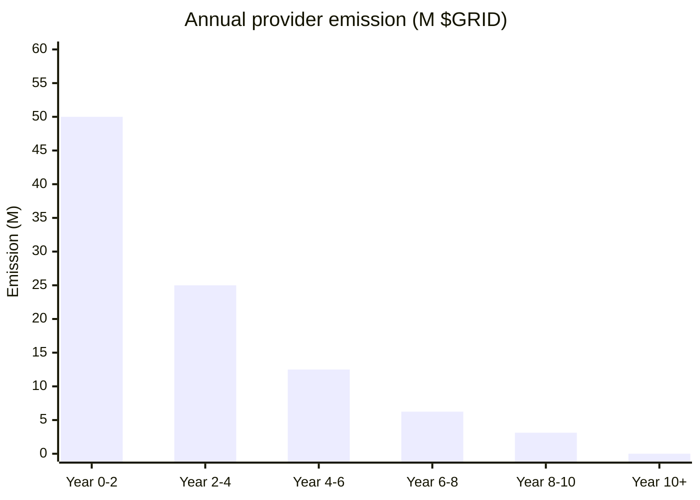
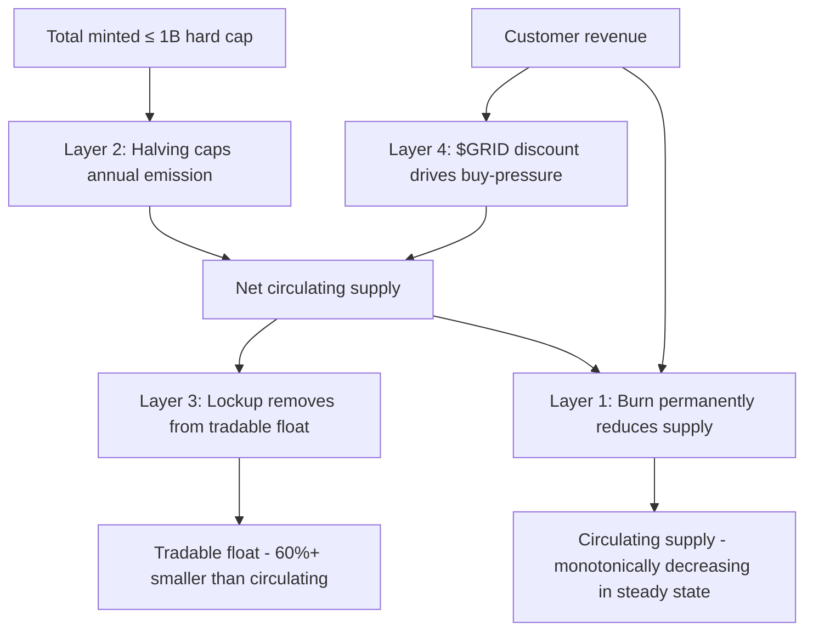
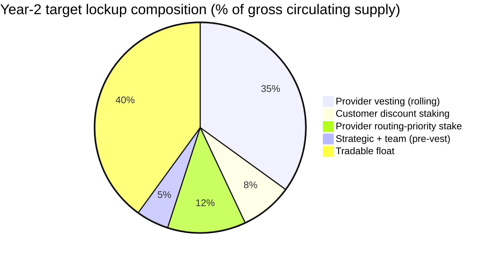
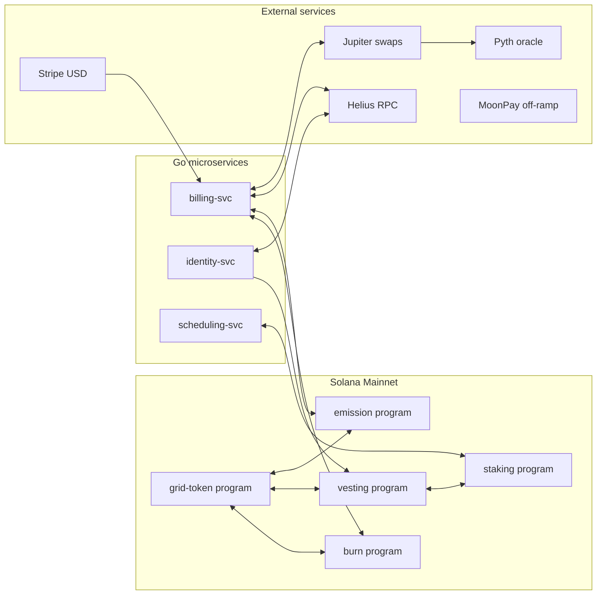
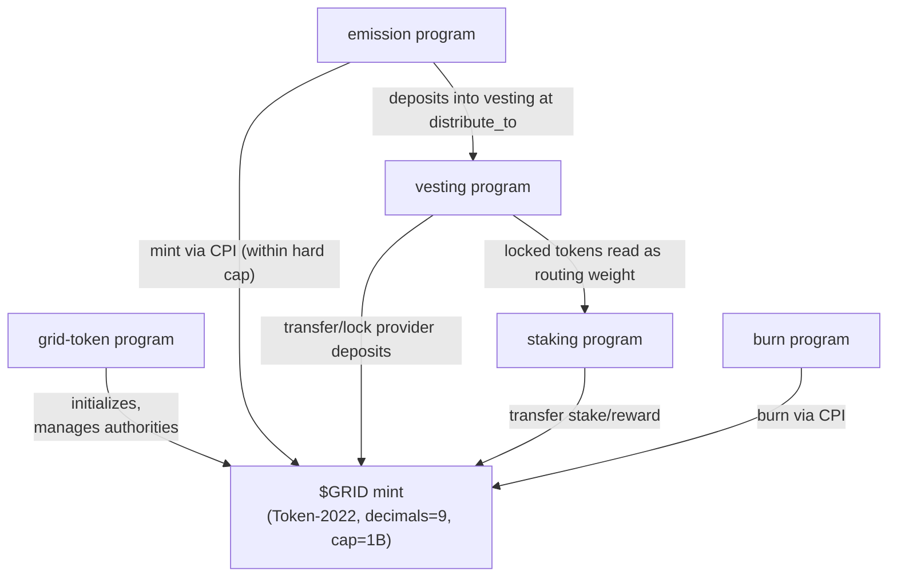

# $GRID Token Whitepaper

**Version:** 0.1 (pre-TGE draft, pre-counsel-review)
**Effective date:** *[COUNSEL: insert upon finalization]*
**Issuing entity:** iogrid Foundation *(intended — Cayman Foundation per `docs/TOKENOMICS.md` §"Legal risk + mitigation strategy"; not yet incorporated as of this draft)*
**Primary network:** Solana (Token-2022 SPL)
**Symbol:** `$GRID`
**Hard cap:** 1,000,000,000 (1B), 9 decimals

---

> **NOT AN OFFER OR SOLICITATION.** This document describes the design of the $GRID network token. It is not an offer to sell, or a solicitation of an offer to buy, any security or financial instrument. $GRID is a utility token of the iogrid network and is not, in our intent, a security. **None of the mechanism descriptions in this document constitute a promise that $GRID will appreciate in value.** $GRID can lose all of its value. Read the [Risk factors](#13-risk-factors) section and the [`legal/token-disclaimer.md`](../legal/token-disclaimer.md) document before earning, holding, or acquiring $GRID. US persons (as defined under Regulation S) may not acquire $GRID at launch. *[COUNSEL: confirm banner placement and exact wording before publication.]*

---

## Table of contents

1. [Executive summary](#1-executive-summary)
2. [The iogrid network in brief](#2-the-iogrid-network-in-brief)
3. [Network economics](#3-network-economics)
4. [Token utility](#4-token-utility)
5. [Supply schedule and emission curve](#5-supply-schedule-and-emission-curve)
6. [Deflationary mechanism](#6-deflationary-mechanism)
7. [Enforced lockup mechanic](#7-enforced-lockup-mechanic)
8. [Network architecture: Solana primary, Base bridge](#8-network-architecture-solana-primary-base-bridge)
9. [DEX-first launch sequence](#9-dex-first-launch-sequence)
10. [Smart contract architecture](#10-smart-contract-architecture)
11. [Foundation structure](#11-foundation-structure)
12. [Legal posture](#12-legal-posture)
13. [Risk factors](#13-risk-factors)
14. [Roadmap to TGE](#14-roadmap-to-tge)
15. [Glossary](#15-glossary)

---

## 1. Executive summary

`iogrid` is a decentralized work-marketplace that pays providers for contributing compute, bandwidth, GPU, and iOS-build capacity to customers who consume those resources programmatically. The network's native unit of work is the `$GRID` token, an SPL token on Solana with a fixed maximum supply, a halving emission schedule, and a mandatory provider-earnings lockup that ties provider compensation to long-term network health.

Three economic pillars shape the design:

1. **Provider rewards pool (50% of supply, 500M $GRID)** released linearly over 10 years on a Bitcoin-style halving schedule. Every distribution is auto-locked at the moment of receipt, with a base 30-day cliff plus 60-day linear vest. Tier upgrades extend the lockup in exchange for a rewards multiplier (up to 2.0× at the Maximum tier).
2. **Revenue-driven buyback-and-burn (≥2% of monthly revenue)** swaps customer revenue to $GRID on Jupiter and burns it. Burns are public, on-chain, and verifiable at `burn.iogrid.org`.
3. **DEX-first liquidity (Raydium CLMM)** seeded on TGE Day 0 with 5M $GRID + $250K USDC paired in a concentrated $0.05–$5.00 range. LP tokens are locked in a 4-year Streamflow vesting contract so the pool cannot be rugged.

The token economics are enforced on-chain by five Anchor programs (`grid-token`, `emission`, `vesting`, `staking`, `burn`). Off-chain coordinator services (`billing-svc`, `identity-svc`) execute daily payout swaps, manage providers' wallet-binding flow, and emit quarterly tax reports.

**This document is the canonical reference for the $GRID design.** It does not commit any party to deliver any specific outcome and does not constitute an investment offer.

---

## 2. The iogrid network in brief

iogrid pairs Customers (developers, CI systems, AI-training pipelines, VPN consumers) with Providers (operators of consumer hardware — Mac minis, Linux workstations, GPU rigs, home routers, mobile devices) through a coordinator-mediated matching layer. The provider-side daemon is written in Rust, the coordinator microservices in Go, and the management plane in Next.js. The token layer adds a sixth surface: Solana programs in Anchor.

Workload categories at launch (Phase 1):

- **iOS / macOS builds** for app developers without a Mac fleet
- **Docker / container workloads** for CI bursts and ML pre-processing
- **GPU-leased compute** for training and inference
- **Bandwidth share** (Honeygain-comparable mesh for residential IP reputation)
- **Consumer VPN** (free for end-users in exchange for bandwidth contribution from their device)

The network's go-to-market is the alignment story: providers are paid in $GRID, the value of which is designed to grow with network throughput and the deflationary burn mechanism. This is not a passive yield product — providers earn $GRID by performing real work, and the lockup ensures they participate in the upside (and downside) of the network rather than dump tokens at receipt.

---

## 3. Network economics

### 3.1 Revenue flow

Each customer payment, whether settled in USD via Stripe, USDC on-chain, or $GRID directly, flows through the following pipeline:



For a representative $1,000 USD customer payment:

| Step | Action | Amount | Destination |
|------|--------|--------|-------------|
| 1 | Stripe charge | $1,000 USD | iogrid Foundation operating account |
| 2 | Off-ramp to USDC | $1,000 USDC | Foundation on-chain treasury |
| 3 | Jupiter swap to $GRID (TWAP 1h) | ~50,000 $GRID @ $0.02 | Foundation hot wallet (2-of-3 multisig) |
| 4 | Buyback-and-burn carve | 1,000 $GRID (2%) | Burn registry → incinerator |
| 5 | Provider distribution | 49,000 $GRID | `emission::distribute_to` per work weights |
| 6 | Auto-lock at receipt | 49,000 $GRID | `vesting::record_deposit` per provider |

### 3.2 Provider payout flow

Providers register a Solana wallet during onboarding (SIWS — Sign-In-With-Solana — bound by `identity-svc`). The coordinator never custodies provider tokens; distributions are paid directly into the `ProviderVesting` PDA owned by the provider's wallet key.

Every distribution starts a fresh lockup clock. With continuous earning, a provider always has a mix of fully-vested, mid-vesting, and pre-cliff balances. Steady-state, roughly one-third of any month's earnings are sellable; two-thirds are locked across rolling vesting positions.

### 3.3 Customer payment options and discounts

| Method | Discount | Settlement |
|--------|----------|------------|
| Stripe USD | 0% (list price) | Instant |
| Stripe USDC | 0% (list price) | Instant |
| On-chain USDC (Solana) | 5% off | <1 second |
| On-chain $GRID | 20% off | <1 second |

The $GRID discount is intended as a volume / loyalty discount tied to use of the network's native unit, not as an inducement to invest. See [Risk factor 4.16 in the token disclaimer](../legal/token-disclaimer.md) for the regulatory characterization concern.

### 3.4 Tax compliance

$GRID earned by US-or-other-treaty providers is taxable as ordinary income at fair market value on receipt; subsequent disposal is taxable as capital gain or loss. The `billing-svc` emits quarterly 1099-MISC-equivalent reports based on the spot price at distribution. Providers remain responsible for their own filings and any capital-gains determinations. **The lockup does not defer the tax event** — receipt is the trigger, not unlock.

---

## 4. Token utility

$GRID is the iogrid network's unit of work. The token's utility consists of:

1. **Provider compensation** — every provider payout (after the 2% burn carve) is distributed in $GRID, auto-locked under the vesting program.
2. **Customer payment medium with discount** — customers paying in $GRID save 20% off list price.
3. **Routing-priority stake** — providers can stake $GRID (or count their locked tokens automatically) to receive higher routing weight from the coordinator's scheduler.
4. **Customer-side volume staking** — customers can stake $GRID for up to 25% off list price, with a minimum 30-day lock.
5. **Governance (Phase 3+)** — once the Foundation migrates its multisig to DAO control, token holders may vote on protocol parameters (burn rate above the 2% floor, emission curve adjustments inside the halving schedule, treasury grant allocations). Governance is over the protocol, not over any corporate entity.

**$GRID is not designed or marketed as an investment product.** Mechanism descriptions in this document are not promises of price appreciation. See the [legal disclaimer](../legal/token-disclaimer.md) and the [Risk factors](#13-risk-factors) section.

---

## 5. Supply schedule and emission curve

### 5.1 Allocation

```
┌─ 50% — Provider rewards pool ────────── 500,000,000 $GRID
│       Vested linearly over 10 years, halving every 2 years
│       Distributed continuously per workload contributed
│
├─ 15% — Team ──────────────────────────── 150,000,000 $GRID
│       4-year linear vest, 1-year cliff
│       Founder + core engineering + ops
│
├─ 10% — Treasury / Governance ─────────── 100,000,000 $GRID
│       Foundation multisig-controlled
│       Funds: legal, audits, infrastructure, community grants
│
├─ 10% — Strategic investors (if any) ──── 100,000,000 $GRID
│       12-month cliff, 24-month linear vest after TGE
│
├─ 10% — Community / ecosystem ─────────── 100,000,000 $GRID
│       Airdrops, bug bounties, integration grants
│
└─  5% — Initial DEX liquidity ──────────── 50,000,000 $GRID
        Seed Raydium CLMM, paired with USDC
        LP tokens locked in 4-year Streamflow vest
```

Allocation proportions are configurable until mainnet TGE; they are locked on TGE.

### 5.2 Halving curve (provider rewards pool)

The 500M provider rewards pool is released on a Bitcoin-style halving schedule:

| Period | Year | Annual emission | Cumulative emitted |
|--------|------|-----------------|--------------------|
| 1 | 0–2 | 50,000,000 | 100,000,000 (10%) |
| 2 | 2–4 | 25,000,000 | 150,000,000 (15%) |
| 3 | 4–6 | 12,500,000 | 175,000,000 (17.5%) |
| 4 | 6–8 | 6,250,000 | 187,500,000 (18.75%) |
| 5 | 8–10 | 3,125,000 | 193,750,000 (~19.4%) |
| 6+ | 10+ | 0 | 193,750,000 (~19.4%) capped, only burns reduce supply |

The halving curve is enforced by the `emission` program (`programs/emission/src/lib.rs`, `budget_for_window` function). The hard cap of 1B is enforced by the `grid-token` program (`GRID_HARD_CAP` const). No governance can override either limit. *[NOTE: the 500M pool exhausts at ~38% of the halving series; the remainder of the geometric sum tails off but the `emission` program's `budget_for_window` returns 0 once cumulative-mint hits the per-program quota.]*



### 5.3 Cumulative circulating supply (steady-state)

Steady-state circulating supply (gross of burn, gross of lockup) is approximately:

- **End of Year 1:** ~50M (5% of supply) plus team/ecosystem vests beginning to release
- **End of Year 5:** ~175M (17.5%) plus team fully vested, strategic vests partially released
- **End of Year 10:** ~193.75M from emission curve plus full team/ecosystem/strategic + 50M initial liquidity = ~543.75M gross of burn

The deflationary burn (Section 6) and the rolling lockup (Section 7) both pull on circulating supply, so the *tradable float* is meaningfully smaller than the gross circulating supply. A planning model targeting Year 2 indicates roughly 60% of gross-circulating supply is in some form of lockup or stake.

---

## 6. Deflationary mechanism

$GRID's design is deflationary across four layers. Each layer operates independently; combined they produce a circulating-supply trajectory that, under continued network growth, is monotonically decreasing in the long run.

### 6.1 Layer 1 — Buyback-and-burn from customer revenue

The `billing-svc` runs a daily job that:

1. Aggregates the previous 24h of customer revenue (Stripe USD → USDC off-ramp; on-chain USDC; on-chain $GRID).
2. Computes the burn carve = `max(2%, governance_floor)` of net revenue.
3. For non-$GRID revenue, executes a Jupiter swap into $GRID at the daily TWAP price.
4. Calls `burn::burn_via_program` to atomically `Burn` the carve and write a `BurnReceipt` PDA to the on-chain registry.

Burns are permanent. The receipt PDA records sequence number, amount, on-chain block height, and an audit hash that ties back to the off-chain billing-svc emission log. The public dashboard at `burn.iogrid.org` reads directly from the on-chain registry — no off-chain database, no possibility of inflated burn numbers.

### 6.2 Layer 2 — Emission halving

Halving every 24 months (Section 5.2) caps total emission at ~194M from the provider pool, regardless of network demand. This forces scarcity to compound as the network matures: in year 11 the marginal $GRID supply comes only from burn-side reductions, not new emission.

### 6.3 Layer 3 — Mandatory provider-earnings lockup

Detailed in Section 7. Every distribution is auto-locked under the `vesting` program. Locked $GRID does not contribute to tradable float. Target: 60%+ of circulating supply locked by Year 2.

### 6.4 Layer 4 — Customer-pays-in-$GRID discount

Customers paying in $GRID receive a 20% discount on list price. This creates persistent buy-pressure on $GRID from the demand side (customers swap USD/USDC to $GRID to capture the discount), partially offsetting provider sell-pressure (providers swap $GRID to USDC to off-ramp).

### 6.5 Aggregate effect

The four layers compound:



Under a network-growth scenario where customer revenue scales faster than provider sell-side off-ramping, the burn rate exceeds new emission and circulating supply contracts in absolute terms. This is the modeled steady state once the network reaches ~$5M ARR. **It is not guaranteed.**

---

## 7. Enforced lockup mechanic

### 7.1 Base lockup (Standard tier, all providers)

All $GRID earned by providers is auto-locked at the moment of receipt. The base lockup applies to providers who do not opt into a higher tier:

| Time since earned | Unlocked fraction |
|-------------------|--------------------|
| 0 – 30 days | 0% (cliff) |
| 30 – 90 days | Linear vest 0% → 100% |
| 90+ days | 100% |

This is a **rolling, per-payout** schedule. Each weekly distribution starts its own 30/90 clock independently. A provider continuously earning over six months has a fresh deposit vesting every payout cycle plus a tail of older fully-vested deposits.

### 7.2 Lockup tiers

A provider can opt at signup (or upgrade later) into a longer lockup in exchange for a rewards multiplier:

| Tier | Cliff | Linear vest | Rewards multiplier |
|------|-------|-------------|--------------------|
| Standard (default) | 30 days | 60 days | 1.00× |
| Loyalty | 90 days | 180 days | 1.25× |
| Conviction | 180 days | 365 days | 1.50× |
| Maximum | 365 days | 730 days | 2.00× |

Tier upgrades are allowed at any time and apply to subsequent deposits. Tier downgrades are **not** allowed — the lockup can only ratchet upward. This is by design: the network rewards conviction.

The rewards multiplier increases the provider's effective work weight at the `emission::distribute_to` step. A Conviction-tier provider doing the same workload as a Standard-tier provider earns 1.5× the $GRID.

### 7.3 Stake-while-locked

Locked tokens automatically count toward the provider's routing-priority weight in the `staking` program (`StakePosition::weight`). Providers do not lose scheduler priority while their tokens are vesting. This eliminates the typical trade-off between "lock for alignment" and "stake for utility" — both happen automatically.

### 7.4 Early-unlock escape hatch (with penalty)

A provider can early-unlock locked $GRID via `vesting::early_unlock`. Mechanics:

- **50% penalty** on the locked portion, denominated in $GRID.
- The penalty is **burned** (not retained by iogrid). The penalty strengthens the deflationary mechanism rather than enriching the operator.
- **One early-unlock event per 12 months** per provider (anti-gaming).

A provider with 10,000 locked $GRID who early-unlocks receives 5,000 unlocked $GRID and burns 5,000 $GRID forever. The penalty is painful enough to discourage routine use, soft enough to provide a real emergency exit. The exact penalty (`EARLY_UNLOCK_PENALTY_BPS = 5_000`) is a Rust `const` in the `vesting` program — it cannot be modified by governance or account-injection.

### 7.5 Customer-side staking (separate, voluntary)

Customers may stake $GRID via `staking::customer_stake_for_discount` to receive up to 25% off list price for a 30-day minimum lock. Mechanics:

- Discount linear in stake amount, capped at `MAX_DISCOUNT_BPS = 2_500` (25%).
- Lock period set at stake; `redeem_discount_voucher` allowed only after `lock_end`.
- Vouchers are one-time-use (`consumed` flag + account close in the redemption instruction).

### 7.6 Combined lockup target

By Year 2 the design targets **60%+ of circulating supply locked** across provider earnings, voluntary customer stakes, and routing-priority stake. This dramatically reduces tradable float, amplifying both the upside volatility (good for holders) and the deflationary buyback-and-burn impact (each $1 of burn removes a larger fraction of tradable float).



---

## 8. Network architecture: Solana primary, Base bridge

### 8.1 Chain choice

After evaluating Solana, Base (Coinbase L2), Polygon, and Ethereum L1, Solana was selected as the primary network for $GRID. Decision matrix:

| Factor | Solana | Base (Eth L2) | Polygon | Eth L1 |
|--------|--------|---------------|---------|--------|
| Cost per transaction | $0.0005 | $0.005–0.05 | $0.001–0.01 | $5–50 |
| Finality | <1 sec | ~2 sec | ~2 sec | ~12 sec |
| Sustained throughput | 3,000+ TPS | ~50 TPS | ~50 TPS | ~15 TPS |
| Native DEX depth | Raydium / Orca / Jupiter | Uniswap (bridged) | Quickswap (declining) | Uniswap |
| Token primitives | Token-2022 with extensions | ERC-20 | ERC-20 | ERC-20 |
| Vesting primitive | Streamflow (audited) | Sablier / Llamapay | Sablier | Sablier |
| Multisig | Squads Protocol (Solana-native) | Safe (Gnosis) | Safe | Safe |
| CEX listing path | Strong (Bybit, Binance, OKX, Coinbase, Kraken) | Coinbase-native | Weakening | Universal |
| 2026 ecosystem momentum | Highest among non-Eth | Fastest-growing L2 | Declining | Stable |

The deciding factor was **gas cost at network scale**. At Solana cost a 100k-provider network with daily payout swaps costs ~$5/month in transaction fees. On Base the same throughput costs $50–$500/month. On Ethereum mainnet, $5,000–$50,000/month. Solana is the only chain whose economics scale to the projected network size without architectural rework.

### 8.2 Bridge to Base

Within 30 days of TGE, $GRID will bridge to Base via [Wormhole NTT](https://wormhole.com/products/ntt). This enables:

- **$GRID on Base** for providers and customers who prefer Coinbase off-ramp over Solana-native off-ramps.
- **One-click migration** — Wormhole NTT preserves the canonical supply on Solana while allowing wrapped representations on Base.
- **Coinbase-listing path** — Base is operated by Coinbase; tokens with active Base liquidity have a clearer listing path on the parent CEX.

The bridge contract on Base is a wrapped representation, not a separate mint. Total $GRID supply is enforced on Solana; the Base wrapper is 1:1 backed by Solana-locked $GRID held by the Wormhole core verifier set.

### 8.3 Off-chain coordination

The iogrid coordinator stack runs the off-chain machinery that interacts with the on-chain programs:



---

## 9. DEX-first launch sequence

### 9.1 Why DEX-first

The legacy crypto launch playbook (IEO on a tier-2 CEX → wait for tier-1 listings) is brittle: it makes liquidity contingent on a CEX deciding to list. Recent Solana-ecosystem precedents (Bonk, Jupiter, Wormhole, Pyth, Helium) all launched DEX-first by seeding their own Raydium pools at TGE, with CEX listings arriving organically months later as volume proved out. iogrid follows this playbook.

### 9.2 Raydium CLMM seed pool

On TGE Day 0:

- **Liquidity:** 5,000,000 $GRID (from the 5% initial liquidity allocation) + $250,000 USDC (from the pre-TGE strategic raise, if pursued, or from Foundation treasury).
- **Range:** $0.05 – $5.00 (a 100× price-discovery range).
- **Implied launch price:** $0.05 (low end of range).
- **Implied launch FDV:** $50M.
- **Implied range-ceiling FDV:** $5B.
- **Fee tier:** 0.25% (standard for new pairs).
- **LP token disposition:** locked in a 4-year-vest Streamflow contract; on completion, optionally burned to permanently lock liquidity.

### 9.3 Liquidity-defense layers

1. **Locked LP tokens** — anyone can verify on-chain that iogrid cannot rug the pool. Streamflow's vesting program is audited; the lock is enforced on-chain.
2. **Permanent burn at end of vesting** (optional) — burns the LP token, locks liquidity forever, signals trust.
3. **MEV protection** — official routing via Jupiter swap aggregator, which includes built-in sandwich-attack mitigation.
4. **Range concentration adjustments** — as price discovers, the Foundation multisig (3-of-5 Squads) can narrow the range to concentrate liquidity for tighter spreads. Range narrowing is a parameter change, not a withdrawal.

### 9.4 Launch sequence

| Phase | Timing | Action | Why |
|-------|--------|--------|-----|
| Pre-TGE strategic raise (optional) | Months 1–3 | Reg D / Reg S, ~$2M @ $20M FDV → 10M tokens (1%) sold to accredited investors | Funds legal + audit + initial liquidity |
| Smart contract dev + audit | Months 1–4 | Anchor program completion + OtterSec or Halborn audit | Required before TGE |
| Foundation incorporation | Months 1–3 | Cayman Foundation set up via Walkers / Maples / Conyers / Ogier | Issues the token, separates from operating co. |
| Mainnet TGE | Month 6–9 | Mint deployed, Streamflow vesting activated, Squads treasury live | Token genesis event |
| Bootstrap Raydium CLMM | TGE Day 0 | Seed 5M $GRID + $250K USDC, concentrated range | Primary trading venue |
| Jupiter Launchpad public sale | TGE Day 0–7 | 5M tokens at fixed price; KYC >$1K | Public access, no CEX-launchpad fees |
| Bridge to Base via Wormhole NTT | TGE Day 30 | Deploy wrapped $GRID on Base | Coinbase-ecosystem accessibility |
| Tier-2 CEX listings | Month 6+ | Bybit, KuCoin, Gate.io | Visibility (non-critical) |
| Tier-1 CEX listings | Year 1+ | Binance, Coinbase, Kraken | Aspirational; requires sustained volume + legal review |

---

## 10. Smart contract architecture

Five Anchor programs implement the on-chain economics. They communicate via Token-2022 `transfer` and `burn` CPIs against a shared `$GRID` mint plus client-side composition. There is no program-to-program CPI dependency, keeping each program independently auditable.



### 10.1 `grid-token` program

Token-2022 mint initialization, authority management, hard-cap enforcement.

**Key state:**
- `GridConfig` PDA — admin, mint, hard_cap, decimals, minted_so_far, authority_locked, bump
- `GridMetadata` PDA — name/symbol/uri (Metaplex-compatible field sizes)

**Key instructions:**
- `initialize_config` — bootstrap config PDA
- `initialize_mint` — create Token-2022 mint with 9 decimals
- `mint_to_recipient` — admin-only, mint within hard cap (used pre-emission-handoff for initial distributions: team, treasury, strategic, ecosystem, initial liquidity)
- `transfer_mint_authority` — rotate mint authority (typically to the `emission` program's PDA)
- `lock_authorities` — one-way switch; after this, no further admin-side mint changes are possible

**Critical invariants:** `GridConfig::minted_so_far` is monotonic; `GridConfig::authority_locked` is monotonic set-once; mint authority must be transferred to the `emission` PDA before `lock_authorities` is called.

### 10.2 `emission` program

Halving-curve emission with per-epoch payouts.

**Key state:**
- `EmissionConfig` PDA — admin, mint, tge_unix, epoch_counter, vault, bump
- `EpochClaim` PDA — epoch_id, total_reward, distributed, finalized, bump
- Vault authority PDA (`["emission-vault-authority", mint]`)

**Key instructions:**
- `initialize` — set TGE anchor, vault, billing_signer
- `claim_epoch` — billing_signer creates a new epoch and pulls the budget for that window (`budget_for_window(epoch_start, epoch_end)`)
- `distribute_to` — billing_signer pays a specific provider's `ProviderVesting` PDA, also CPI-calling `vesting::record_deposit`
- `finalize_epoch` — close out the epoch; subsequent `distribute_to` rejected

**Critical invariants:** `EmissionConfig::epoch_counter` monotonic, monotone-increment by 1 per `claim_epoch`; `EpochClaim::total_reward >= EpochClaim::distributed`; `EpochClaim::finalized` monotonic; `EpochClaim` PDA seeded by `(mint, epoch_id)` → re-init impossible.

### 10.3 `vesting` program

Per-provider rolling lockup, four tiers, early-unlock with 50% burn.

**Key state:**
- `ProviderVesting` PDA — provider, tier, last_early_unlock, bump
- `VestingDeposit` PDA — deposit_id, amount, deposited_at, withdrawn, tier_at_deposit
- Vesting vault + vault authority PDAs

**Key instructions:**
- `initialize_provider` — one-time create for `(mint, provider)`
- `record_deposit` — billing_signer (via emission CPI or direct call) creates a new `VestingDeposit` and transfers $GRID into the vault
- `upgrade_tier` — provider-signed; can only increase tier; applies to subsequent deposits
- `withdraw_unlocked` — provider-signed; transfers vested portion to provider's ATA
- `early_unlock` — provider-signed; transfers 50% to provider, burns 50%, sets `last_early_unlock = now`

**Critical invariants:**
- `vested_amount(amount, deposited_at, now, tier)` monotonic in `now`.
- `VestingDeposit::withdrawn` monotonic.
- `ProviderVesting::last_early_unlock` monotonic; cooldown enforces ≥365 days delta.
- Early-unlock penalty is `EARLY_UNLOCK_PENALTY_BPS = 5_000` (50%), a Rust `const`.
- `u128` intermediate in the vest math prevents `u64` overflow.
- Burn CPI precedes transfer CPI in `early_unlock`; atomicity is guaranteed by Solana's transaction model.

### 10.4 `staking` program

Routing-priority stake (provider) + volume-discount stake (customer).

**Key state:**
- `StakingPool` PDA — admin, mint, annual_yield_bps, total_staked, total_reward_remaining, bump
- `StakePosition` PDA — owner, amount, staked_at, last_accrual, accrued_yield, bump
- `DiscountVoucher` PDA — owner, stake_amount, lock_end, discount_bps, consumed
- Stake vault + reward vault + vault authority PDAs

**Key instructions:**
- `initialize_pool` — admin-only one-time init
- `stake` — staker-signed; ≥ `MIN_STAKE_SECS = 30 days` before unstake allowed
- `accrue_yield` — anyone-callable; uses `last_accrual` timestamp to prevent back-dating
- `claim_yield` — staker-signed; transfers accrued from reward vault
- `unstake` — staker-signed; rejected before `MIN_STAKE_SECS`
- `customer_stake_for_discount` — customer-signed; locks stake, creates a `DiscountVoucher`
- `redeem_discount_voucher` — customer-signed; only after `lock_end`; voucher `consumed` flag + account close
- `compute_weight` — pure view function; never mutates state

**Critical invariants:** `MIN_STAKE_SECS = 30 days` enforced; `MAX_DISCOUNT_BPS = 2_500` (25%) caps discount ramp; `DiscountVoucher::consumed` set on redeem with same-instruction account close to prevent replay; `compute_weight` accounts read-only.

### 10.5 `burn` program

Atomic burn + on-chain receipt registry.

**Key state:**
- `BurnRegistry` PDA — admin, attestor, total_burned, seq, bump
- `BurnReceipt` PDA — seq, amount, block_height, audit_hash, bump

**Key instructions:**
- `initialize_registry` — admin-only one-time init
- `rotate_attestor` — admin-only
- `record_burn` — attestor-signed; writes a receipt for an off-chain burn observation (e.g., transfer-to-incinerator that didn't go through this program)
- `burn_via_program` — attestor + source_authority signed; atomically Burns from `source_ata` and writes the receipt

**Critical invariants:** `BurnRegistry::total_burned` monotonic-increasing only; `BurnReceipt` PDA seeded by `(registry, seq)` → replay-resistant; `burn_via_program` performs the Burn CPI BEFORE writing the receipt (atomicity preserved).

### 10.6 PDA seed inventory

| Program | PDA | Seeds |
|---------|-----|-------|
| grid-token | GridConfig | `["grid-config", mint]` |
| emission | EmissionConfig | `["emission-config", mint]` |
| emission | vault authority | `["emission-vault-authority", mint]` |
| emission | EpochClaim | `["emission-epoch", mint, epoch_id]` |
| vesting | ProviderVesting | `["provider-vesting", mint, provider]` |
| vesting | vesting vault | `["vesting-vault", mint, provider]` |
| vesting | vesting vault authority | `["vesting-vault-authority", mint, provider]` |
| vesting | VestingDeposit | `["vesting-deposit", provider_vesting, deposit_id]` |
| staking | StakingPool | `["staking-pool", mint]` |
| staking | stake vault | `["staking-stake-vault", mint]` |
| staking | reward vault | `["staking-reward-vault", mint]` |
| staking | staking vault authority | `["staking-vault-authority", mint]` |
| staking | StakePosition | `["stake-position", pool, owner]` |
| burn | BurnRegistry | `["burn-registry", mint]` |
| burn | BurnReceipt | `["burn-receipt", registry, seq]` |

### 10.7 Build, test, audit gates

- **Anchor 0.31.1** (workspace), Solana Agave 4.0.0 CLI (CI-pinned), Rust 1.85.0 toolchain.
- `anchor build` clean, `anchor test` 100% green, `cargo clippy --workspace --all-targets -- -D warnings` clean.
- Audit (OtterSec / Halborn / Neodyme) required before `transfer_mint_authority` is called on mainnet. See [`contracts/audit/`](../contracts/audit/) for scope, threat model, checklist, and test vectors.

---

## 11. Foundation structure

### 11.1 Why a foundation

A traditional for-profit operating company (Dynolabs / iogrid Inc.) issuing a token creates two problems:

1. **Securities-classification risk** — courts look at "common enterprise" and "efforts of others" prongs of the Howey test. A token issued by the operating entity strongly satisfies both.
2. **Equity-vs-token-holder conflict** — equity holders may pressure the operating entity to extract value at the token holders' expense.

A non-profit foundation, separately incorporated in a token-friendly jurisdiction, issues the token. The operating entity licenses technology to the foundation. Token holders interact only with the foundation, never with the operating entity for token-economic matters. This separation:

- Reduces (does not eliminate) securities-classification risk.
- Aligns governance (foundation board controls protocol parameters; equity holders cannot override).
- Provides a stable counterparty for token holders that is not tied to operating-company commercial fortunes.

### 11.2 Recommended jurisdiction: Cayman Foundation Company

After evaluating Cayman, BVI, Liechtenstein, and Wyoming DAO LLC, **Cayman Foundation Company** is the recommended structure for the iogrid Foundation. Decision matrix:

| Factor | Cayman Foundation | BVI Limited | Liechtenstein TVTG | Wyoming DAO LLC |
|--------|-------------------|-------------|--------------------|-----------------| 
| Setup cost | $30–80K | $20–50K | $50–120K | $5–10K |
| Setup time | 8–12 weeks | 6–10 weeks | 12–16 weeks | 1–2 weeks |
| Token issuance precedent | Strong (Solana ecosystem norm) | Moderate | Specific TVTG license | Limited |
| Tax neutrality | Yes (no income tax) | Yes | Yes (with TVTG) | Federal tax applies |
| Regulator clarity | High (CIMA) | Moderate | Highest (TVTG) | Low (state law) |
| Banking access | Established crypto-friendly relationships | Mixed | Established | Limited |
| Governance flexibility | High (foundation rules customizable) | High | Restricted by TVTG | High |
| Counsel availability | Walkers, Maples, Conyers, Ogier | Maples, Harneys | Specialized boutiques | US tax attorneys |

**Verdict:** Cayman Foundation Company is the Solana-ecosystem default (Wormhole, Pyth, Aptos, Helium, and many others incorporated there). It balances cost, setup time, regulatory clarity, and counsel ecosystem. Liechtenstein TVTG is technically the highest-clarity but the cost premium and longer setup is not justified for a Phase-1 launch. BVI is cheaper but lighter on token precedent. Wyoming DAO LLC offers fastest setup but is US-tax-resident, which is a non-starter given the geo-restriction strategy.

Operational details for Cayman Foundation Company setup are in [`legal/foundation/cayman-setup.md`](../legal/foundation/cayman-setup.md).

### 11.3 Foundation governance

The foundation is governed by a 3-of-5 multisig (Squads Protocol on Solana) until Phase 3 DAO migration. Initial signer composition:

1. Founder (iogrid Inc. CEO)
2. Foundation-appointed director (independent, paid retainer)
3. Lead engineer (iogrid Inc.)
4. Community-elected signer (Phase 1+; elected by snapshot.org vote weighted by stake)
5. Legal counsel (rotating; Cayman-registered)

The Foundation's mandate is documented in its Articles and a public "Foundation Rules" charter. Both are template-drafted in [`legal/foundation/foundation-rules.md`](../legal/foundation/foundation-rules.md) (to be finalized by counsel).

---

## 12. Legal posture

### 12.1 Utility-token framing

$GRID is designed and marketed as a **utility token** — the unit of work for the iogrid network. Every public communication (this whitepaper, the website, the daemon UI, the management plane) avoids forward-looking statements about price appreciation. Mechanism descriptions are precisely that: descriptions of how the protocol works. They are not promises.

### 12.2 Geographic restrictions

At TGE and during an initial restriction period:

- **US persons** (Regulation S definition: US residents, US-incorporated entities, certain US-connected persons) may not acquire $GRID.
- **Sanctioned jurisdictions** (full OFAC list, plus jurisdictions with comprehensive sanctions per Provider ToS §2.5) may not acquire $GRID.
- **Jurisdiction-specific orders** — any jurisdiction whose regulator has issued specific guidance restricting $GRID will be blocked.

The token-purchase flow and the $GRID-payout-election flow geo-block by IP and require a self-certification step. The Token-2022 freeze authority is retained by the Foundation at launch for sanctions-compliance purposes (see [Risk factor 4.5](../legal/token-disclaimer.md#46-smart-contract-risk) and the technical commentary in [`contracts/audit/threat-model.md`](../contracts/audit/threat-model.md)). The freeze authority is a compliance tool, not a censorship tool; its use is logged and audited.

### 12.3 MiCA compliance (EU)

The EU's Markets in Crypto-Assets Regulation (MiCA), in force from December 2024, requires a notification-grade white paper for utility tokens offered to EU residents. This whitepaper is structured to facilitate MiCA Title II compliance:

- Issuer identity (Section 11)
- Token utility (Section 4)
- Risk factors (Section 13 + linked disclaimer)
- Underlying technology (Sections 8, 10)
- Rights attached to the token (Section 4)
- Foundation governance and admin processes (Section 11)

The final MiCA white paper for the iogrid Foundation will be a derivative document tailored to the format required by the relevant National Competent Authority (NCA), typically the Liechtenstein Financial Market Authority or the Maltese MFSA for Solana-ecosystem foundations.

### 12.4 Reg D / Reg S exempt offering (pre-TGE)

If iogrid pursues a pre-TGE strategic raise (~$2M @ $20M FDV per the Tokenomics document), the offering will be made under Regulation D (US) and Regulation S (non-US) exemptions. Accredited investors only. Separate subscription documentation, KYC/AML, lock-up agreements. **This whitepaper is not the offering document for any such raise; offering documents are separate and will be papered by counsel.**

### 12.5 Counsel engagement

Pre-TGE counsel engagements (approximate budget):

| Engagement | Counsel | Budget | Timeline |
|------------|---------|--------|----------|
| Token legal opinion | Cooley / Fenwick / Davis Polk / Latham | $25–75K | 4–8 weeks |
| Foundation structuring | Walkers / Maples / Conyers / Ogier (Cayman) | $30–80K | 8–12 weeks |
| Provider ToS amendment for token | Same as above | $10–20K | 2–4 weeks |
| Regulator outreach (no-action requests) | Variable | $variable | Variable |

Total: $75–195K legal + audit ($30–80K) ≈ $100–275K to be operationally TGE-ready (excluding regulatory contingency reserve).

---

## 13. Risk factors

> The summary below mirrors the risks enumerated in [`legal/token-disclaimer.md`](../legal/token-disclaimer.md). The disclaimer is the canonical legal document; this section is a non-binding summary for whitepaper readers.

### 13.1 Price volatility

Token prices can be highly volatile and can decline rapidly, including to zero. There is no price floor. There is no commitment from any party to buy back or support the price.

### 13.2 No investment promise

This whitepaper, the iogrid website, the marketing materials, and any related communications describe mechanisms. **They do not promise specific outcomes.** The deflationary mechanism may not offset emission. DEX liquidity may not be sufficient. The lockup may not produce the expected alignment effect.

### 13.3 Geographic restrictions

At TGE, US persons may not acquire $GRID. Other restrictions apply per Section 12.2.

### 13.4 Regulatory risk

The SEC, EU NCAs, FCA, MAS, FSA, FINMA, and other regulators may classify $GRID differently than designed. Adverse regulatory action could force delisting, rescission, or other remedies. iogrid does not control regulatory outcomes.

### 13.5 Smart-contract risk

Smart contracts have bugs. Audits mitigate but do not eliminate risk. An exploit could result in treasury loss, vesting-position loss, or burn-registry manipulation. iogrid has no obligation to compensate for exploit losses.

### 13.6 Solana network risk

Solana has experienced multi-hour outages. During an outage, $GRID transactions are delayed or impossible. The Wormhole NTT bridge to Base introduces additional dependency.

### 13.7 Liquidity risk

The Raydium CLMM pool is the primary trading venue. Liquidity may be insufficient for large transactions; large provider claim or sell events may move price significantly.

### 13.8 Lockup risk

Election of $GRID payouts as a provider is irrevocable. Locked tokens cannot be sold during the cliff/vest window without the 50% early-unlock penalty. Price may decline materially before tokens vest.

### 13.9 Tax risk

$GRID is taxable at receipt at the spot USD value. The tax liability may exceed realized cash from the underlying token at the time the tax is due.

### 13.10 Operational risk

The coordinator runs the off-chain swap and distribution pipeline. Operational failures (hot-wallet compromise, scheduler bugs, billing-svc miscalculations) can delay or prevent payouts.

### 13.11 Concentration risk

Team + strategic + treasury allocations together total 35% of supply. Coordinated selling in unlocked windows could meaningfully depress price.

### 13.12 Project-execution risk

iogrid is an early-stage project. Failure to achieve roadmap milestones would likely render $GRID worthless.

### 13.13 Lockup characterization risk

A regulator might interpret lockup design as evidence of investment-contract framing (lockup is a feature commonly associated with restricted-stock vesting).

### 13.14 Customer-payment-discount characterization risk

The 20% discount for paying in $GRID is a volume / loyalty discount, not an investment inducement — in iogrid's intent. A regulator or court may disagree.

### 13.15 Forward-looking statements

This whitepaper contains forward-looking statements. They are not promises. iogrid undertakes no obligation to update them except as required by law.

**For the full risk factor enumeration, including additional risks not summarized here, read [`legal/token-disclaimer.md`](../legal/token-disclaimer.md) in full before earning, holding, or acquiring $GRID.**

---

## 14. Roadmap to TGE

| Milestone | Month | Owner | Status |
|-----------|-------|-------|--------|
| Tokenomics frozen (this document) | M0 | Founder | Done |
| Anchor programs scaffold | M0 | Engineering | Done (`contracts/programs/*`) |
| Token disclaimer drafted | M0 | Founder + counsel | Draft (`legal/token-disclaimer.md`) |
| This whitepaper drafted | M0 | Founder | Draft (this document) |
| Cayman Foundation incorporated | M1–M3 | Counsel + founder | Open (issue #122) |
| Strategic raise (optional) | M1–M3 | Founder | Open (issue #104) |
| Anchor programs complete | M1–M2 | Engineering | In progress |
| Audit engagement (OtterSec / Halborn) | M2–M4 | Engineering | Open (issue #97) |
| Audit complete + fix-up round | M3–M4 | Engineering + auditor | Open |
| Devnet deploy + dual-payout testnet | M4 | Engineering | Open |
| Mainnet TGE | M6–M9 | Foundation | Open |
| Raydium CLMM bootstrap (TGE Day 0) | M6–M9 | Foundation | Open |
| Wormhole NTT bridge to Base | TGE + 30 days | Foundation | Open |
| Tier-2 CEX listings | TGE + 6 months | Foundation | Open |
| DAO governance migration | Year 3+ | Foundation | Open |

---

## 15. Glossary

- **$GRID** — the native utility token of the iogrid network. SPL Token-2022, 9 decimals, hard cap 1B.
- **Anchor** — Rust-based smart contract framework for Solana. iogrid uses Anchor 0.31.1.
- **AML** — Anti-Money Laundering.
- **ATA** — Associated Token Account. The canonical SPL token account for a (wallet, mint) pair.
- **Base** — Coinbase's Ethereum L2 network. $GRID will bridge to Base post-TGE via Wormhole NTT.
- **bps** — basis points. 1 bps = 0.01%. Used in burn rate (`200 bps` = 2%) and discount math.
- **Burn** — irreversible removal of tokens from circulation. iogrid burns via Token-2022 `Burn` CPI to the `1nc1nerator1111...` address with on-chain receipt.
- **Cayman Foundation Company** — non-profit foundation form under Cayman Islands Foundations Act. Solana ecosystem default for token-issuing foundations.
- **CEX** — Centralized Exchange. Examples: Binance, Coinbase, Kraken.
- **CLMM** — Concentrated Liquidity Market Maker. Raydium's CLMM is the Solana equivalent of Uniswap v3.
- **CPI** — Cross-Program Invocation. Solana's mechanism for one program to call another.
- **DAO** — Decentralized Autonomous Organization. iogrid plans Phase-3 governance handoff to a DAO.
- **DEX** — Decentralized Exchange. Raydium, Orca, Jupiter aggregator on Solana.
- **FDV** — Fully Diluted Valuation. Token price × total supply (1B for $GRID).
- **Foundation** — the iogrid Foundation, intended to be a Cayman Foundation Company. Issues $GRID, holds treasury, governs the protocol via Squads multisig (Phase 1–2) then DAO (Phase 3+).
- **Halving** — emission-rate halving every 24 months. Bitcoin-style scarcity in the provider rewards pool.
- **Howey test** — US Supreme Court test (1946) for whether an instrument is an "investment contract" (security). $GRID is designed to fall outside Howey by primacy of utility, but no court has ruled.
- **IEO** — Initial Exchange Offering. CEX-hosted token launch. iogrid is DEX-first; no IEO planned.
- **Jupiter** — Solana's leading DEX aggregator + swap router. $GRID buyback-and-burn swaps route through Jupiter.
- **KYC** — Know Your Customer. Applies to fiat on-ramp and to large on-chain payments.
- **Lockup** — mandatory holding period applied to all provider $GRID earnings. Base: 30-day cliff + 60-day linear vest. Tiers extend this.
- **MiCA** — Markets in Crypto-Assets Regulation. EU framework in force from December 2024.
- **NTT** — Native Token Transfer. Wormhole's bridging primitive for canonical-supply tokens across chains.
- **PDA** — Program-Derived Address. Solana account derived deterministically from seeds + a program ID. Cannot be signed by an external private key.
- **Phantom / Solflare / Backpack** — Solana wallets. iogrid supports all three via the Solana Wallet Adapter.
- **Pyth** — Solana-native price oracle. Used for fair-value reference at swap time.
- **Reg D / Reg S** — US Securities Act exemptions. Reg D for US accredited investors; Reg S for non-US offerings.
- **Raydium** — Solana's leading concentrated-liquidity AMM. iogrid's primary trading venue.
- **SEC** — US Securities and Exchange Commission. Has not opined on $GRID; classification risk exists.
- **SIWS** — Sign-In-With-Solana. EIP-4361-equivalent for Solana wallets. Used by identity-svc.
- **Solana** — high-throughput Layer-1 blockchain. iogrid's primary network.
- **SPL** — Solana Program Library. The token standard on Solana.
- **Squads Protocol** — Solana-native multisig. Used for the Foundation treasury and program upgrade authority.
- **Streamflow** — audited token-vesting program on Solana. Used for LP token lockup at TGE.
- **Tier** — provider's chosen lockup tier (Standard / Loyalty / Conviction / Maximum) with corresponding rewards multiplier (1.0× / 1.25× / 1.5× / 2.0×).
- **TGE** — Token Generation Event. The mainnet launch of $GRID.
- **Token-2022** — newer SPL token standard with extension support (transfer hooks, fees, metadata). $GRID uses Token-2022.
- **TWAP** — Time-Weighted Average Price. iogrid uses 1-hour TWAP for the daily payout swap to reduce price-impact and front-running.
- **Wormhole NTT** — bridging protocol. Used for $GRID's Base bridge post-TGE.

---

*End of $GRID Token Whitepaper v0.1-draft.*

*[COUNSEL: full whitepaper review required by qualified crypto-securities counsel before any publication. Key open items: MiCA Title II compliance (Section 12.3) — confirm format requirements with the chosen NCA; Cayman Foundation incorporation completion (Section 11.2); enumeration of restricted jurisdictions at TGE (Section 12.2); audit firm engagement letter execution (Section 10.7); strategic raise documentation if pursued (Section 12.4).]*
