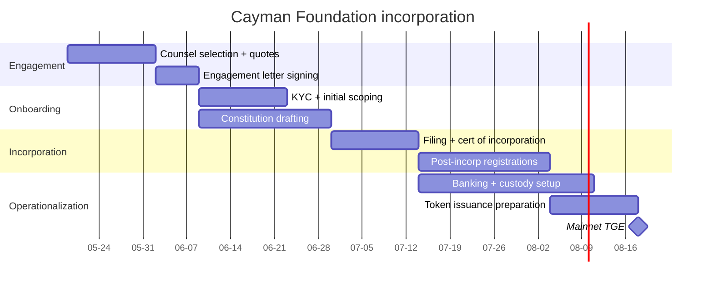

# Cayman Foundation Company setup — operational checklist

**Status:** Draft v0.1 — pre-counsel-review. Not legal advice. **This is an operational
checklist for the founder, not a substitute for engagement with qualified Cayman counsel.**

**Related issues:**
- [#103](https://github.com/iogrid/iogrid/issues/103) — Foundation jurisdiction selection
- [#122](https://github.com/iogrid/iogrid/issues/122) — Cayman Foundation incorporation

---

## Context

Per [`docs/BUSINESS-STRATEGY.md` §4 Currency model](../../docs/BUSINESS-STRATEGY.md#4-currency-model--grid--fiat-hybrid) §"Legal risk + mitigation strategy",
$GRID is intended to be issued by a non-profit Foundation, separately incorporated from
the iogrid operating entity (Dynolabs Inc.). Section 11 of the [whitepaper](../../docs/whitepaper.md)
elaborates the rationale and recommends a **Cayman Foundation Company** over BVI Limited,
Liechtenstein TVTG, or Wyoming DAO LLC.

This document is the operational checklist for incorporating that Foundation. It covers
counsel engagement, registered-agent selection, governance documents, banking setup,
timeline, and budget. **Every step requires Cayman-licensed counsel** — this document
does not replace counsel; it gets the founder organised before the first call.

---

## Cayman Foundation Company — primer

A Cayman Foundation Company is a legal entity created under the Foundation Companies Act
2017 (as amended). Key features:

- **Hybrid form**: corporation with foundation-like governance (no shareholders; trustees
  / directors govern according to constitution and rules).
- **No income tax**: Cayman has no corporate income tax, no capital gains tax, no
  withholding tax.
- **Limited liability**: members and directors are shielded from foundation debts
  (subject to standard exceptions for fraud and breach of duty).
- **Customisable governance**: the foundation's Articles + Rules can be drafted to suit
  the project (DAO-aligned, multisig-aligned, etc.).
- **CIMA registration**: foundations issuing tokens or holding regulated activities must
  register with the Cayman Islands Monetary Authority (CIMA). Standard utility-token
  issuance is typically NOT a VASP-licensed activity, but the test depends on the specific
  service offering (counsel to advise).
- **Solana ecosystem precedent**: Wormhole, Aptos, Pyth, Sui, Helium, Magic Eden, Jupiter
  Foundation — all Cayman Foundation Companies. Strong reusable counsel templates.

---

## Step 1 — Select Cayman counsel (registered agent + corporate counsel)

A Foundation requires a **Cayman-registered agent** (typically the law firm's office or
a designated corporate-services provider) AND **a Cayman-licensed corporate counsel** to
draft the constitution and shepherd the application.

The four "magic circle" Cayman firms have the most Solana / crypto Foundation precedent:

### Walkers (walkersglobal.com)

- **Crypto practice**: Yes (Aptos Foundation, Wormhole, Solana Foundation precedent).
- **Crypto partners**: Lucy Frew, Tim Buckley.
- **Strengths**: deepest crypto-foundation track record. Comfortable with token-issuance
  and DAO governance.
- **Fee range**: $30–80K for foundation setup; $5–15K annual maintenance + registered
  agent.
- **Engagement letter typical timeline**: 2–4 weeks from initial call.

### Maples Group (maples.com)

- **Crypto practice**: Yes (Sui Foundation, multiple Solana-ecosystem foundations).
- **Crypto partners**: Tim Frawley, Anya Russell.
- **Strengths**: largest Cayman law firm; broad regulatory coverage; in-house corporate-
  services arm streamlines registered-agent + accounting.
- **Fee range**: $30–80K setup; $5–15K annual.
- **Engagement timeline**: 2–4 weeks.

### Conyers (conyers.com)

- **Crypto practice**: Yes (Pyth Foundation, others).
- **Crypto partners**: Anton Goldstein, Robert Briant.
- **Strengths**: strong on regulatory + bank-relationship navigation.
- **Fee range**: $30–80K setup; $5–15K annual.
- **Engagement timeline**: 2–4 weeks.

### Ogier (ogier.com)

- **Crypto practice**: Yes (Helium Foundation, Magic Eden).
- **Crypto partners**: Bradley Kruger.
- **Strengths**: efficient template-driven incorporations; competitive on price.
- **Fee range**: $25–60K setup; $5–12K annual.
- **Engagement timeline**: 2–4 weeks.

### Recommendation

**Walkers as primary, Maples as fallback.** Walkers' crypto-foundation track record is
the deepest; Maples is the comparable choice if Walkers is queue-blocked or pricing
diverges materially from the envelope. Get quotes from 2 firms minimum before signing.

Also-rans (smaller boutiques): Mourant, Harneys, Carey Olsen, Appleby — all competent
but with thinner crypto-foundation books than the four above.

---

## Step 2 — Pre-engagement scoping

Before the first call with counsel, prepare:

### 2.1 Project summary

- Name of the project (`iogrid`), short description (1 paragraph).
- Token name + symbol (`$GRID`).
- Token utility (link to [whitepaper §4](../../docs/whitepaper.md#4-token-utility)).
- Total supply, decimals (1B, 9).
- Network (Solana, plus Base bridge post-TGE).
- Operating entity (Dynolabs Inc. — US Delaware C-corp).
- Anticipated TGE date (target Q3 2026 per [`docs/BUSINESS-STRATEGY.md` §4.10 Launch sequence](../../docs/BUSINESS-STRATEGY.md#410-launch-sequence--modern-dex-first-playbook)).
- Anticipated treasury size at TGE (10% of supply = 100M $GRID at $0.05 initial price = $5M nominal).
- Initial governance: 3-of-5 Squads multisig → DAO migration in Phase 3+.

### 2.2 Restricted-jurisdiction list

Counsel will ask which jurisdictions iogrid intends to restrict at TGE. Default starting
point (counsel to refine):
- United States (US persons under Reg S definition)
- All OFAC-sanctioned jurisdictions (Iran, North Korea, Syria, Cuba, Russia per current
  sanctions; updates as published)
- Any jurisdiction with active regulatory orders against $GRID at TGE (none expected; this
  is a placeholder for the "in case it happens" path)

### 2.3 Operating entity ↔ Foundation relationship

The Foundation will license technology from Dynolabs Inc. via a tech-license agreement.
Standard structure:

- Dynolabs licenses the iogrid technology stack (coordinator, daemon, web plane,
  Anchor contracts) to the Foundation for `$1/year + 0% royalty` (intended as a service
  contribution, not a profit centre).
- Foundation employs the coordinator-operator entity (or contracts with Dynolabs) to
  operate the network.
- Provider and customer payments flow to the Foundation; the Foundation pays Dynolabs an
  operating-services fee under separate agreement.

Counsel will need both companies' details:
- Dynolabs Inc. — Delaware C-corp, founders, equity structure
- iogrid Foundation — to be incorporated

### 2.4 Initial directors / supervisors

A Cayman Foundation requires:
- **Directors** (typically 1–3): the executive board responsible for day-to-day
  decisions, executing per the constitution.
- **Supervisor(s)** (1 minimum, recommended 2–3): the oversight body responsible for
  enforcing the constitution. Supervisors are an essential and unique-to-Foundation-
  Company feature; they can act if directors fail to perform.

Recommended composition for v1:
- **Director 1**: Founder (CEO of Dynolabs Inc.)
- **Director 2**: An independent director with crypto-foundation experience (often
  retained via the law firm; ~$10–25K/year retainer).
- **Supervisor 1**: A separate independent (different from Director 2). Often a fellow
  Solana-ecosystem foundation alum.
- **Supervisor 2 (optional)**: A second independent for redundancy.

The Foundation's Articles will specify the appointment, removal, and rotation procedures.
Counsel templates this.

### 2.5 Foundation purpose / objects clause

Cayman Foundations must have a stated purpose ("objects"). Draft:

> The purposes of iogrid Foundation are:
>
> 1. To promote and govern the development of the iogrid decentralized work-marketplace
>    protocol and the $GRID utility token, including the technical, economic, and
>    governance aspects thereof.
> 2. To issue, manage, and oversee the $GRID token in accordance with the Tokenomics
>    document published at https://github.com/iogrid/iogrid/blob/main/docs/TOKENOMICS.md
>    (as amended from time to time by the Foundation's governance processes).
> 3. To hold, manage, and disburse the Foundation's treasury for purposes consistent
>    with (1) and (2), including funding development grants, ecosystem incentives,
>    legal and audit retainers, and other operational expenses.
> 4. To engage with regulators, auditors, and counsel as required for the lawful
>    operation of the iogrid network.
> 5. To execute the Phase-3 DAO migration described in the Tokenomics document, at the
>    Foundation's discretion and on a timeline approved by the Foundation's supervisors.

Counsel will refine this language for Cayman regulatory compliance.

---

## Step 3 — Incorporation (counsel-driven, 8–12 weeks)

### 3.1 KYC and onboarding (Week 1–2)

Counsel will conduct KYC on:
- All initial directors and supervisors (passport, proof of address, biographies)
- Founder + significant beneficial owners of Dynolabs Inc.
- Source-of-wealth declarations

Standard pack: passport scan, utility bill, professional reference letter, criminal
record check. Most firms accept Sumsub / Onfido-grade KYC.

### 3.2 Constitution drafting (Week 2–4)

Counsel drafts:
- **Memorandum of Association** (the "founding document"): names, objects, registered
  office.
- **Articles of Association** (the "rulebook"): governance, director appointment,
  supervisor powers, meeting procedures, amendment procedures.
- **Foundation Rules** (optional but recommended): more detailed operational rules,
  amendable by the directors without changing the Articles. Examples:
  - Treasury investment policy
  - Conflict-of-interest policy
  - Director compensation policy
  - DAO migration mechanism

Templates for foundation rules: see [`./foundation-rules.md`](./foundation-rules.md).

### 3.3 Filing and incorporation (Week 4–6)

Counsel files with the Cayman Islands Registrar of Companies:
- Memorandum + Articles
- Form FCG1 (Foundation Companies)
- Initial director + supervisor consent forms
- Registered-office consent form (typically counsel's office)
- Government fees (~CI$700–1,500, ~$850–1,800 USD)

Certificate of Incorporation typically issues within 5–10 business days.

### 3.4 Post-incorporation (Week 6–10)

- **CIMA registration** (if required for the specific token activity). Counsel determines
  applicability. For a pure utility token NOT operating as a VASP (i.e., NOT custodying
  user funds), CIMA registration is typically NOT required. iogrid's design is non-
  custodial (providers hold their own keys), so CIMA exemption is likely. **Counsel
  confirms.**
- **Tax Information Authority (TIA) registration**: required for FATCA / CRS reporting.
- **Beneficial-ownership register filing**: foundation's beneficial owners (typically
  the directors, plus anyone with controlling influence) filed with the Cayman
  authorities.
- **Banking** (see Step 4).

### 3.5 Token issuance setup (Week 10–12)

- Foundation board resolution authorising the $GRID token mint on Solana.
- Tech-license agreement between Dynolabs Inc. and the Foundation (counsel drafts).
- Service agreement between Dynolabs Inc. and the Foundation for ongoing operations.
- Approval of the [whitepaper](../../docs/whitepaper.md) and [token disclaimer](../token-disclaimer.md).
- Squads multisig setup with initial signers (Foundation board members + key
  contributors per [whitepaper §11.3](../../docs/whitepaper.md#113-foundation-governance)).

---

## Step 4 — Banking and treasury setup

Cayman Foundations need:
- **Operating bank account** (USD/EUR fiat) — for paying counsel, audit firms, vendors.
- **Crypto custody** (on-chain treasury) — via Squads multisig + optional Anchorage /
  Fireblocks for institutional custody of the treasury allocation.

### 4.1 Operating bank

Cayman-friendly crypto banks:
- **Mercury** — startup-friendly, accepts crypto-adjacent entities. Easiest.
- **Brex** — similar. Good for early-stage.
- **Cayman National Bank** — local Cayman option; longer onboarding.
- **Silvergate / Signature** — N/A (defunct).

**Recommendation**: Mercury for operating account. ~2-4 weeks to open with proper docs.

### 4.2 Crypto custody

- **Squads Protocol** (Solana-native multisig) — primary on-chain treasury. Free
  protocol; iogrid pays only Solana tx fees.
- **Fireblocks / Anchorage** (optional institutional) — only if Foundation insurance /
  audit requirements demand. Adds $5–20K/year.

---

## Step 5 — Annual maintenance

Ongoing costs:
- Registered-agent fee: $3–8K/year (paid to counsel)
- Annual government fee: CI$700–1,500 (~$850–1,800 USD)
- Director compensation: $10–25K/year per independent director
- Supervisor compensation: $5–15K/year per supervisor
- Accounting / audit: $5–20K/year (depends on revenue scale)
- Legal retainer (ongoing): $10–25K/year
- CIMA fees (if registered): $5–25K/year
- Total annual: $40–120K (typical mid-range $60–80K)

---

## Step 6 — Timeline summary



**Total: 8–12 weeks from counsel engagement to operational Foundation.**

---

## Step 7 — Budget summary

| Item | Range | Notes |
|------|-------|-------|
| Counsel fees (setup) | $30–80K | Walkers / Maples / Conyers / Ogier |
| Government + registry fees | $1–3K | One-time |
| Independent directors / supervisors (signing fees) | $5–15K | One-time |
| Banking setup | $0–2K | Mercury free; Cayman National has fees |
| Crypto custody setup | $0–20K | Squads free; Fireblocks/Anchorage if used |
| First-year annual maintenance | $40–120K | Recurring |
| **Total Year-1** | **$76–240K** | **midpoint ~$155K** |

The [`docs/BUSINESS-STRATEGY.md` §4 Currency model](../../docs/BUSINESS-STRATEGY.md#4-currency-model--grid--fiat-hybrid) §"Mitigations — required before TGE"
budgets $30–80K for foundation structuring. The above range reflects the broader
all-in cost including governance fees and banking. Plan for $80–150K all-in for the
first year if iogrid is comfortable; $50–80K if budget is tighter (accept slower
director-recruitment + cheaper boutique firm choice).

---

## Step 8 — Decision points the founder owns

Counsel will not decide these for you:

1. **Director composition.** Recommended 1 founder + 1 independent. Independent director
   is a quality signal to regulators and token holders; cost vs. trust trade-off.
2. **Supervisor composition.** 2 supervisors recommended for redundancy. Foundation-
   Company-Act-specific role; do not under-resource.
3. **Foundation purpose / objects clause.** Draft above (§2.5); refine with counsel.
4. **DAO migration trigger.** Phase 3 per Tokenomics — what's the trigger condition?
   Suggest: "after 24 months of operational track record AND a Foundation supervisor vote
   to migrate, the Foundation transfers Squads multisig signers to elected community
   representatives." Counsel codifies into the rules.
5. **Tech-license terms.** $1/year is the symbolic structure; some jurisdictions prefer
   `fair-market-value` royalty to avoid "uncompensated transfer" concerns. Counsel will
   advise on the Delaware / Cayman tax interplay.
6. **Whether to engage MiCA-jurisdiction parallel counsel.** If iogrid plans to make $GRID
   available to EU residents, MiCA notification obligations attach. Cayman counsel can
   coordinate with EU counsel (Liechtenstein, Malta typical). Add $20–40K to budget.

---

## Step 9 — What this document does NOT cover

- **US securities law**: separate engagement with Cooley / Fenwick / Davis Polk / Latham
  (US crypto-securities counsel). Cayman counsel will NOT opine on Howey-test outcomes.
- **EU MiCA**: separate engagement with EU counsel.
- **UK FCA financial-promotions regime**: separate engagement with UK counsel.
- **Singapore / Hong Kong / Japan**: separate engagements per jurisdiction.
- **OFAC / sanctions**: ongoing compliance program; not a one-time setup item.

Cayman counsel handles the Foundation incorporation and Cayman regulatory aspects only.
Each non-Cayman jurisdiction with token activity needs its own counsel.

---

## Step 10 — Action items for the founder

In sequence:

1. **This week**: send outreach emails to Walkers + Maples (the two primary candidates).
   Use the template at the bottom of this document.
2. **Next 2 weeks**: take intro calls; collect engagement-letter quotes.
3. **Week 3**: sign engagement letter with primary firm (Walkers recommended).
4. **Weeks 4–7**: counsel-driven KYC + constitution drafting. Founder provides docs.
5. **Week 8**: Registrar filing.
6. **Weeks 9–12**: post-incorp registrations + banking + custody setup.
7. **Week 12+**: Foundation operational. Proceed to TGE preparation.

**Hard gate before TGE**: Foundation incorporated, board functional, Squads multisig
live, operating bank account funded, tech-license agreement signed.

---

## Counsel outreach template

```text
Subject: iogrid Foundation — Cayman Foundation Company incorporation engagement inquiry

Dear [Partner name],

We are iogrid Inc. (Dynolabs Inc. operating entity), a Delaware C-corp building a
decentralized work-marketplace with a native utility token ($GRID) on Solana. We are
preparing to incorporate a Cayman Foundation Company to issue and govern the token,
following the structural precedent set by Wormhole Foundation, Aptos Foundation, Sui
Foundation, Helium Foundation, and similar Solana-ecosystem projects.

Project background:
  * Tokenomics:     https://github.com/iogrid/iogrid/blob/main/docs/TOKENOMICS.md
  * Whitepaper:     https://github.com/iogrid/iogrid/blob/main/docs/whitepaper.md
  * Token disclaimer: https://github.com/iogrid/iogrid/blob/main/legal/token-disclaimer.md
  * Operational checklist: https://github.com/iogrid/iogrid/blob/main/legal/foundation/cayman-setup.md

Target TGE: late Q3 2026 (giving 12+ weeks from engagement to operational Foundation).

We would like to schedule an intro call to discuss:
  * Foundation Company setup scope + your firm's capacity
  * Engagement-letter quote (one-time + annual maintenance)
  * Director / supervisor recruitment assistance
  * CIMA registration applicability for utility-token issuance
  * Banking + crypto-custody introductions

We have a budget envelope of $30–80K for setup + ~$40–80K annual maintenance, in line
with industry norms for a Solana-ecosystem Foundation.

Please confirm availability for a 30-minute intro call in the next 2 weeks.

Best regards,
[Founder name]
[Title]
iogrid Inc. / Dynolabs Inc.
[email]
```

---

*End of Cayman Foundation Company operational checklist.*

*[COUNSEL: full review required by qualified Cayman corporate counsel before this
document is used for an actual engagement. The document is intended as a founder-side
operational primer; nothing herein constitutes legal advice. Key open items: Foundation
Companies Act 2017 specifics (verify any references to filing forms, fee amounts, and
timeline norms are current); CIMA applicability test for utility-token issuance under
the project's specific service offering; tech-license royalty terms ($1/year vs. FMV);
EU MiCA parallel counsel coordination if applicable.]*
