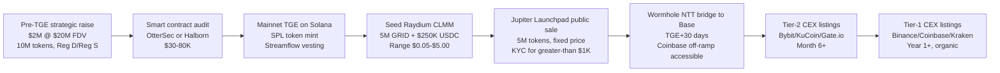

Most networks launch the way Hola launched. They build something in private, accumulate users on a vague Terms of Service, raise money on a confidential pitch deck, list a token on a centralized exchange, and only then — if ever — publish the source code. The user has no way to verify what is running on their hardware, no way to verify what the supply distribution actually is, and no way to verify that the people promising decentralization have any intention of delivering it.

We picked the opposite playbook. Every line of code, every architectural decision, every commercial decision, every governance rule, every smart-contract audit, every revenue-share parameter — all of it lives on a public GitHub repository from commit zero, with continuous-integration green checks on every pull request and a public issue tracker that anyone can search. The $GRID token will launch DEX-first on Raydium concentrated-liquidity pools rather than through a centralized-exchange gatekeeper. The Foundation holding the token treasury will be a Cayman non-profit with on-chain transparency for every disbursement.

This post is the playbook. It is the one document that ties together [docs/TOKENOMICS.md](https://github.com/iogrid/iogrid/blob/main/docs/TOKENOMICS.md), [docs/LEGAL.md](https://github.com/iogrid/iogrid/blob/main/docs/LEGAL.md), and the public roadmap, with the operational discipline that makes the whole thing actually work.

## Discipline one: public repo from commit zero

The iogrid GitHub repository was created on 2026-05-15 with the initial scaffold. Every commit since has been pushed to `main` through pull requests with CI checks. We have not maintained a private fork. We have not pushed force-overwrites that rewrite history. We have not added contributors to a hidden satellite repo.

The reason is simple: a token network that asks its providers to trust a daemon on their hardware cannot also ask them to trust an opaque codebase. Trust is verified, not promised. Anyone reading this post can, today, clone the repository, run the test suite, audit the daemon's filter rules, and verify that the version running on their Mac matches the version on GitHub by checking signed reproducible-build artifacts.

The cost of this discipline is real. We do not get to surprise the market with new features. We do not get to negotiate behind closed doors with a launch partner. Every founder mistake, every dead-end branch, every reverted commit is on the public record. That is fine. The discipline cost is much lower than the trust-rebuilding cost would be if we tried to do this the other way and got caught.

## Discipline two: free CI on every PR

Every pull request to `iogrid/iogrid` runs the full continuous-integration pipeline on GitHub Actions: typecheck, lint, build, static export, Lighthouse audit at score 95-plus across performance, accessibility, best-practices, and SEO. The marketing site, the documentation site, the daemon's Rust unit tests, the coordinator's Go integration tests, the protobuf lint, the legal-document markdown lint, the whitepaper LaTeX build, and the smart-contract audit run all run on every PR.

The total CI surface is roughly fourteen GitHub Actions workflows, all of them free because the repository is public. The build minutes do not come out of a paid budget. The artifacts retain for fourteen days and are downloadable by anyone with a GitHub account. The Lighthouse reports for every commit are uploaded as artifacts and accessible by URL.

We chose this stack deliberately. The market has GitLab Premium, CircleCI Performance, BuildKite, and various private-runner options. They all charge per build-minute on private repositories. They are all valid choices for proprietary work. iogrid is not proprietary work. The decision to ship every commit to a public repo means every commit gets free CI, which means we are not making per-build-minute trade-offs that would degrade the test surface as the codebase grows.

## Discipline three: Cayman Foundation, not a Delaware C-corp

The legal structure separates token governance from equity ownership. iogrid Inc., the operating company that holds the trademarks, the source-code copyrights, and the customer contracts, is incorporated in Delaware. iogrid Foundation, the non-profit that holds the $GRID treasury and the governance authority over token parameters, is incorporated in the Cayman Islands.

Cayman was picked for four reasons, none of them tax-driven. (Cayman has no income tax, but iogrid Inc. pays Delaware franchise tax and US federal income tax on operating revenue; the Foundation pays no tax because it has no operating revenue.)

**Foundation form is well-established for crypto governance.** The Cayman Foundation Companies Act of 2017 was written specifically for use cases like ours: a legal entity that exists to administer a public good, with no shareholders, no equity, and no profit motive. The Solana Foundation, the Polkadot Web3 Foundation, the Aptos Foundation, and the Mina Foundation all use variants of this structure. The legal precedent is dense.

**Multi-signature treasury control.** The Foundation's treasury is held in a Squads Protocol multisig (3-of-5 signers: the founder, two independent technical signers, two independent legal signers). No single party — including the founder — can move treasury funds unilaterally. The signers' identities and the multisig address are public; the on-chain transaction log is verifiable.

**Clean separation from US securities law.** A Cayman non-profit issuing a utility token to non-US persons under Regulation S has well-documented compliance precedent. The token is not equity in iogrid Inc., does not entitle the holder to revenue share, and does not promise price appreciation. The legal opinion is being drafted with one of the four crypto-specialist firms (Cooley, Fenwick, Davis Polk, Latham) and will be published pre-Token Generation Event.

**Geographic neutrality for governance votes.** A Foundation incorporated outside the US, the EU, and China can govern a global network without being subject to any single regulator's jurisdictional preferences. Providers in Turkey, Brazil, Indonesia, and Nigeria — all key target geographies for residential-IP supply — get equal governance weight per token without the Foundation having to navigate any single country's securities law preferences.

The full breakdown of mitigations against the SEC's Howey-test classification is in [docs/TOKENOMICS.md](https://github.com/iogrid/iogrid/blob/main/docs/TOKENOMICS.md). The short version: we comply with Regulation S geographic restrictions at launch, brand $GRID as a unit of work rather than an investment, separate the operating company from the Foundation, and obtain legal opinions in every jurisdiction where we have customer-facing presence.

## Discipline four: DEX-first, no IEO

The conventional crypto playbook for a new token is an Initial Exchange Offering (IEO): pay Binance Launchpad, Coinbase Pre-Launch, or Bybit Launchpool a five-to-ten-percent fee on the raise, in exchange for instant listing visibility and an exchange-curated whitelist of buyers. The exchange handles KYC, payment rails, geographic restrictions, and post-listing market-making.

We are not doing this. $GRID will launch on Raydium concentrated-liquidity pools as our primary trading venue. The mechanics:

The seed liquidity is structured as a Raydium CLMM (concentrated-liquidity market-maker, Solana's equivalent of Uniswap v3) with the liquidity-provider tokens locked in a four-year Streamflow vesting contract. The contract address is public. Anyone can verify on-chain that we cannot rug the pool. At the end of the four-year vest, the LP tokens are programmatically burned, permanently locking the seed liquidity.

The reason this matters is verifiability of the trading venue itself. A token whose primary trading venue is an opaque centralized exchange is functionally hostage to that exchange — the listing can be pulled, the pair can be delisted, the deposit and withdrawal rails can be paused. A token whose primary trading venue is an on-chain concentrated-liquidity pool with verifiable lock-up cannot be taken offline by any single party, including iogrid Inc. itself.

Tier-2 and tier-1 CEX listings will follow organically once trading volume and liquidity prove out. Bonk, Jupiter, Wormhole, Pyth, Helium, and roughly a dozen other Solana-ecosystem tokens have made this DEX-first model work in the last two years. We are not pioneering it. We are picking the better-trodden of two paths.

## Discipline five: vesting that aligns providers with the long-term network

The single largest design decision in the tokenomics is **mandatory provider-earnings lockup**. Every $GRID earned by a provider is auto-locked the moment it is distributed:

| Time since earned | Percent unlocked |
|---|---|
| Day 0–30 | 0 (cliff) |
| Day 30–90 | linear vest 0 to 100 |
| Day 90+ | 100 (provider can sell, transfer, withdraw) |

This is **rolling per payout**. Each weekly distribution starts its own 30/90-day clock. A provider who has been earning continuously will always have most of their balance somewhere on the vesting curve, with roughly one third of it sellable at any given moment.

The reason this design matters is the prevention of day-one dumps. Without the lockup, every provider would convert $GRID to USDC the second they receive it, and the price would crash to whatever the buy-side could absorb at retail throughput. With the lockup, only about a third of any week's emissions are sellable, which gives the market time to discover a price and gives long-term holders a structural advantage over short-term churners.

Providers can opt into longer lockup tiers at signup for a rewards multiplier: 90-day cliff + 180-day vest at 1.25× rewards (the "Loyalty" tier), 180-day cliff + 365-day vest at 1.5× ("Conviction"), 365-day cliff + 730-day vest at 2.0× ("Maximum"). A provider in the "Maximum" tier earns twice the $GRID per gigabyte but cannot touch it for a year. Skin-in-the-game expressed as a slope rather than a binary.

The full tokenomics layer-by-layer — emission halving every 24 months, 2 % revenue burn, customer-pays-in-$GRID 20 % discount, customer staking for volume discounts — is in [docs/TOKENOMICS.md](https://github.com/iogrid/iogrid/blob/main/docs/TOKENOMICS.md). The architectural integration into the coordinator's billing-svc is in [docs/TECH.md](https://github.com/iogrid/iogrid/blob/main/docs/TECH.md).

## The first customer is real and the metrics are public

Phase 0 has one paying customer: Dynolabs vCard, an iOS contacts app, using iogrid's bandwidth proxy to fetch LinkedIn profile pages for contact-enrichment. Before iogrid, Dynolabs vCard's LinkedIn import success rate was 0 percent — every request from a datacenter IP got blocked at LinkedIn's rate limiter. After iogrid, with requests routed through residential proxies, the import success rate is over 90 percent. The full walkthrough is in [docs/PHASE0_FIRST_CUSTOMER.md](https://github.com/iogrid/iogrid/blob/main/docs/PHASE0_FIRST_CUSTOMER.md).

The metrics from that integration are public. Latency p50 is roughly 430 milliseconds. Latency p95 is roughly 600 milliseconds. The cost per enriched profile is two cents instead of Proxycurl's forty-nine cents — a 24-times reduction in per-customer marginal cost. Those numbers come from the running production integration. They will be reproducible in the quarterly transparency report.

The reason we picked vCard specifically is that it is the iogrid founders' own product. Failure cases would be visible to us first. The use case (LinkedIn enrichment) is one of the largest categories of residential-proxy demand in the industry. The volume (single-digit profiles per minute) is small enough that risk is bounded. The validation is sharp: either the integration works and we can quote the success-rate improvement on the marketing site, or it does not and we go back to the architecture document.

## The next twelve months

Phase 1 closes when the network reaches 100 active providers and the second paying customer is signed. Phase 2 begins when we onboard 5,000 providers and reach $50,000 in monthly B2B revenue. Phase 3 begins at 50,000 providers and $500,000 monthly B2B revenue. Token Generation Event lands in Phase 2, after the smart-contract audit completes and the Foundation incorporation is finalized.

Every milestone is tracked publicly on the [project roadmap](https://github.com/iogrid/iogrid/blob/main/docs/ROADMAP.md). Every commit lands in the public repo. Every architectural decision is documented. Every audit report will be published. The first quarterly transparency report ships at the close of Phase 1.

This is what a credible launch looks like in 2026: transparent, slow, public, with every parameter visible and every economic mechanism reversible if it stops working. For why a mesh network can pull this off where a data center cannot, see [Why a mesh, not a data center](/blog/why-mesh-not-datacenter). For the security model that makes the transparency claim verifiable, see [Transparency, not trust](/blog/transparency-not-trust). For the technology choices on the daemon and coordinator, see [Why Rust for the edge](/blog/why-rust-for-the-edge).
