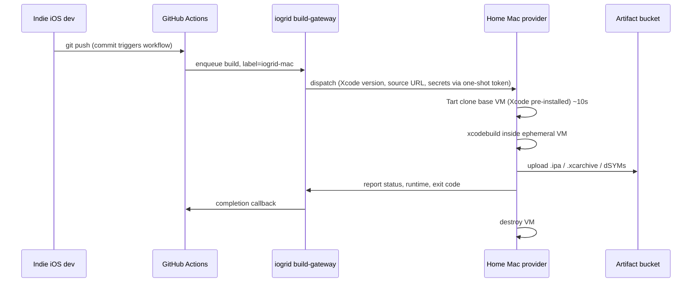

iOS build CI sits in one of the strangest corners of the developer-tools market. The economics are punishing on the customer side and absent on the provider side, all because of one quirk of Apple's licensing terms.

| Provider | Per Xcode-minute | Real-world floor |
|---|---|---|
| **iogrid** | **$0.04** | none, per-second after first minute |
| GitHub Actions Mac (Intel) | $0.08 | none |
| GitHub Actions Mac (M-series) | $0.16 | none |
| Bitrise (typical) | $0.10–$0.30 | monthly platform fee |
| Codemagic | $0.10–$0.20 | tier minimums |
| MacStadium | $0.05–$0.20 effective | monthly lease |
| AWS EC2 Mac | $0.018 effective | **$26 per 24-hour session** |

Every option above iogrid is constrained by **Apple's hardware licensing**: macOS only runs legally on Apple-branded silicon. So every CI vendor either rents Apple Silicon from Apple (Microsoft for GitHub Actions, AWS for EC2 Mac) or buys Mac minis themselves and racks them in a data center (MacStadium, Bitrise, Codemagic). The cheapest no-commit option (GitHub Actions Intel at $0.08 per minute) is still five times the marginal cost of running the same build on a developer's own Mac. The cheapest per-minute price (AWS EC2 Mac at $0.018) imposes a 24-hour lease floor that turns a 5-minute build into a $26 build. None of these vendors can move on price because their underlying cost basis is Apple's hardware sold at retail plus a margin.

There is a third supply that no one has scaled: **other people's idle Macs**. That is what iogrid mobilizes.

## The three trends that converged

Three independent things had to be true before this supply could be unlocked at scale. They all became true in the past four years.

**1. Apple Silicon is fast enough that home Macs run real iOS CI.** An M3 Max compiles a typical Swift project around thirty percent faster than a 2019 Mac Pro. An M4 Max is faster still. Indie developers already use their personal Macs for CI by accident — they just hit Build a hundred times a day during normal development. The performance ceiling is no longer the constraint.

**2. Tart enables real isolation.** [Tart](https://tart.run/) is an open-source macOS VM provisioning tool from Cirrus Labs, the same team behind Cirrus CI. It uses Apple's Virtualization framework to spawn a fresh macOS VM in about ten seconds. Each build runs in a hypervisor-isolated VM. The host Mac is untouchable from inside the VM: no filesystem access, no host network namespace, no shared keychain. Cirrus has been running Tart in production for years; the open-source implementation has been stable since 2023.

**3. Macs are idle the majority of every twenty-four-hour window.** Even a busy developer's Mac runs at under thirty percent utilization averaged across the day. Overnight, weekends, lunch, the gap between meetings — it sits there warm and ready. iogrid's iOS-build workload turns those idle hours into pay-per-minute CI capacity without affecting the owner's interactive experience. The daemon defaults to idle-only mode: it spawns Tart VMs only when the host has been idle for five minutes or more.

## How a build runs

The flow is short by design — every additional component would be a thing that breaks at 3 AM on a Saturday for a customer who is shipping a release.

The customer points their GitHub Actions workflow at a self-hosted runner labeled `iogrid-mac`. Five lines of YAML changed. The provider's Mac never touches the customer's source: the `git fetch` happens **inside** the Tart VM via a one-shot token that expires when the build finishes. The provider's own Xcode environment, signing keychain, simulator devices, and personal projects are completely untouched.

## The customer math

Take a representative indie iOS developer. They push 10 commits per day with an 8-minute CI build per commit, 22 working days per month. That is 1,760 build-minutes per month — a sober estimate for a one-person product team.

| Service | Per minute | Monthly cost |
|---|---|---|
| **iogrid** | **$0.04** | **$70** |
| GitHub Actions Mac (Intel) | $0.08 | $141 |
| GitHub Actions Mac (M-series) | $0.16 | $282 |
| Bitrise (typical) | $0.20 | $352 |

At one developer, the savings against GitHub Actions Mac are $71 per month — meaningful, roughly the cost of a JetBrains license. At an enterprise running 50 iOS engineers at the same volume, the customer ships 88,000 build-minutes per month and saves $3,500 versus GitHub Actions Intel. That savings pays one engineer's salary. Some teams will switch for that math alone.

The math gets even sharper when you compare to AWS EC2 Mac. AWS's per-minute price of $0.018 is genuinely cheaper on paper. But every AWS Mac session has a $26 minimum twenty-four-hour lease floor (Apple licensing terms again). For an indie developer doing one ten-minute build a day, that is $26 versus our $0.40. Sixty-five times more expensive in practice — and that is before AWS's $0.09-per-gigabyte network-egress charge for the resulting artifact downloads.

## The provider math

This is the part that makes the supply side work. A single Mac provider sharing four hours per day of Xcode CI capacity earns roughly $145 per month, against $9 per month for bandwidth-only programs like Honeygain. The fifteen-times multiplier is the whole reason iOS-build providers self-recruit through word of mouth.

The provider's actual workflow is unintrusive. Tart spawns its VM only when the host is idle. The daemon's CPU footprint is roughly fifty microseconds per minute when no build is running and a single-digit-percent overhead while a build runs (the build itself uses the rest). The provider can cap their Xcode CI capacity at a number of hours per day or a fraction of CPU, and can blocklist specific Xcode versions, customer organizations, or build labels they would rather not host.

## Failure modes, and how we handle each

We have thought hard about every way this can fall over. The five real failure modes:

**Provider Mac goes offline mid-build.** The build-gateway re-dispatches to another provider within seconds. The customer is charged only for completed Xcode-minutes; the partial build is not billed. Re-runs are deterministic because the source clone happens fresh inside the VM each time.

**Provider's Xcode version differs from the customer's requirement.** Builds are tagged with their required Xcode version and route only to providers running a matching base image. We maintain pre-baked Tart base images for the latest three Xcode releases (currently 16.0, 16.1, and 16.2) plus the previous major. Older versions are available with a 60-second cold-start penalty as Tart pulls the image.

**Provider tampers with the VM image.** Tart base images are content-addressed and signed. A modified VM image is rejected at boot. The provider cannot inject malware into the build environment because the build environment is a fresh disk image fetched from our signed registry every time.

**Provider sees customer source code.** They do not. The git fetch happens inside the VM via a one-shot token. The provider's host Mac never touches the source. The build artifact goes from the VM directly to S3 (with iogrid's signed URL) without traversing the host filesystem.

**Apple changes Tart's terms or deprecates Apple Silicon virtualization.** This is the single largest external risk and the reason iOS-build is one of four workloads on the daemon, not the only one. We maintain a fallback path to Anka (the commercial alternative VM driver) plus the ability to fall back to direct-on-host builds with sandbox enforcement for providers who opt in. Losing Tart hurts but does not kill the network.

## When you should NOT use us

We are honest about this. iogrid is best for build-and-test workflows where source code is committed to git, the build is deterministic, and the artifact is delivered via signed URL. That covers the overwhelming majority of indie and mid-market iOS development.

The cases where iogrid is less of a fit today:

- **Code-signing-then-upload workflows with hardware tokens.** TestFlight uploads work via API key. App Store Connect uploads via Fastlane work. But if your release pipeline requires a YubiKey or a developer's physical Mac to hold the signing certificate, you have to either move the certificate into the VM (with care) or run the final signing step elsewhere.
- **Builds that require an obscure pinned Xcode beta.** We carry latest-3 plus previous-major. If you are pinned to Xcode 14.3.0 exactly, you can request a custom base image but expect a 60-second cold start.
- **Hermetic CI for an audited industry.** Banking and healthcare customers who need SOC 2 with full audit trails on the build machine itself should evaluate whether our transparency dashboard suffices. Most can use it; some have compliance requirements that demand dedicated hardware. MacStadium is the right call for those.

## How to switch from GitHub Actions

The migration is genuinely five lines of YAML. Add a self-hosted runner labeled `iogrid-mac` to your GitHub Actions configuration, swap `runs-on: macos-latest` to `runs-on: [self-hosted, iogrid-mac]` in your workflow, set your iogrid API key as a repository secret, and push. The first build proves correctness; the second build proves cost. The full walkthrough is at [docs.iogrid.org/workloads/ios-build](https://docs.iogrid.org/workloads/ios-build).

There is no commitment, no minimum spend, no monthly platform fee. Per-Xcode-minute billing after the first minute is charged per second. A 90-second build costs six cents. A 7-minute build costs 28 cents. If iogrid is not faster and cheaper than your current vendor within the first month, you will not be on a contract you have to escape.

Half the cost, no lease, the same workflow, on the same hardware that compiled Swift in the first place. The line on the spreadsheet is unambiguous.
