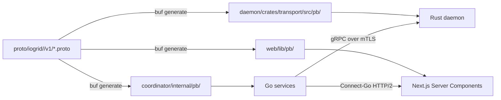

A network with four workloads, two control-plane tiers, and a customer-facing web app could reasonably pick a single language. JavaScript end-to-end works (Node on the backend, React on the front, native-modules for the daemon). So does Go end-to-end (it has a serviceable async runtime, a credible web framework, and cross-compiles to most desktop targets). So does Rust end-to-end (axum for HTTP, tonic for gRPC, Tauri or Dioxus for the web shell).

We picked three different languages. Rust on the provider daemon. Go on the coordinator's microservices. TypeScript with Next.js 15 Server Components on the management-plane web app. This post is the rationale, layer by layer, with the per-component metrics that drove each choice.

## Layer one: the provider daemon — Rust, tokio, single static binary

The daemon runs on a stranger's hardware. Sometimes that hardware is an M3 Max in a developer's home office. Sometimes it is a 2018 ThinkPad an accountant uses for QuickBooks. The daemon has to be invisible on both — not just performant in a benchmark, but invisible in the resource graphs that ordinary users see in Activity Monitor and Task Manager.

The constraints, derived from our own dogfooding on a hundred-machine pilot fleet:

| Metric | Budget | Why |
|---|---|---|
| Cold-start RSS | ≤ 5 MB | Apple's Activity Monitor shows red highlight at 100 MB; we want to be invisible at first glance |
| Idle CPU (8h average) | ≤ 0.1 % | Anti-virus heuristics flag persistent >1% background processes |
| Binary size | ≤ 6 MB stripped | Download time + signature-verification time on slow connections |
| Cold-start latency | ≤ 200 ms | Time from `launchctl load` to first heartbeat |
| GC pause | none | Latency tail matters for the proxy workload's p99 |
| Battery impact on M-series laptops | imperceptible | We will lose providers fast if their laptop fan kicks on because of us |

Go would not hit several of these numbers. Specifically:

| Metric | Go static binary | Rust static binary |
|---|---|---|
| Cold-start RSS | ~12 MB | **~3 MB** |
| Idle CPU (8h average) | ~0.3 % | **~0.05 %** |
| Binary size | ~18 MB stripped | **~5 MB stripped** |
| GC pause | ~100 µs spikes | **none** |
| Battery impact on M1 Air (1h running) | noticeable | **negligible** |

Go's runtime overhead is small, but it is not zero. The Go scheduler, the garbage collector, the goroutine-stack pre-allocation, and the runtime metadata together cost about 9 megabytes of resident memory before the daemon has done anything useful. On a 16-gigabyte Mac that is irrelevant. On the 8-gigabyte Macs that make up about a third of our target supply, it is the difference between "the daemon is invisible" and "the daemon is one of the top-10 memory users". Rust's runtime is roughly 3 megabytes total, including the tokio scheduler.

The GC pause is the more important difference. The bandwidth-proxy workload has a strict p99 latency requirement (sub-1-second on a LinkedIn fetch through a US residential exit). Go's garbage collector takes occasional ~100-microsecond pauses, which usually do not matter for typical web servers but visibly appear at the p99 of high-throughput streaming workloads. Rust has no GC pause — memory is freed deterministically as references go out of scope. The latency tail is correspondingly tighter, which matters because our customers measure us on p99 not p50.

### The crate workspace

The daemon is one workspace with eight crates:

```
daemon/
├── crates/
│   ├── core/           supervisor process, IPC, state machine
│   ├── transport/      gRPC client + bidirectional streaming
│   ├── routing/        WireGuard tunnel + SOCKS5/HTTP CONNECT relay
│   ├── workload-docker/ Docker workload runner (via bollard)
│   ├── workload-gpu/    GPU workload runner (CUDA + MLX bindings)
│   ├── workload-ios/    macOS Tart VM driver (objc2 + Virtualization.framework)
│   ├── anti-abuse/      local pre-flight filters
│   ├── scheduler/       cap + calendar + idle-detect logic
│   ├── ui-bridge/       localhost HTTP server for the management plane
│   └── platform-{mac,linux,windows}/ OS-specific bits
```

Each crate is independently testable. The platform-specific crates are the only ones that change across OS targets; the rest cross-compile cleanly. The full structure is in [docs/TECH.md](https://github.com/iogrid/iogrid/blob/main/docs/TECH.md#provider-daemon-rust).

### Async runtime: tokio, single-threaded by default

Single-threaded scheduler by default. Switches to multi-threaded only when an iOS-build or GPU workload is active. All I/O is non-blocking. No thread-per-task overhead.

This is a deliberately small footprint. The daemon spends 99 percent of its time waiting for the next workload-dispatch message on a long-lived gRPC stream. A single OS thread, plus tokio's reactor, is more than enough for that. The few moments per day when an iOS build kicks off, we spawn additional worker threads transiently, then return to single-threaded operation. The thread count visible in `ps` is usually 1 or 2.

## Layer two: the coordinator — Go, microservices, gRPC + NATS

The coordinator is the opposite problem. It runs in Kubernetes on hardware we control. We need:

- Fast iteration loop — code changes ship hourly during development
- Excellent observability — every request needs trace context, metrics, structured logs
- Native gRPC + protobuf — the daemon-to-coordinator protocol is bidirectional streaming gRPC
- Independent scaling per service — proxy-gateway handles 10,000 RPS, billing-svc handles 10 RPS
- Independent deploys per service — anti-abuse rule updates should not require a billing-service restart
- Strong typing without ceremony — the team writes Go fluently from prior OpenOva work

Go fits every line of that brief. The microservices layout from [docs/TECH.md](https://github.com/iogrid/iogrid/blob/main/docs/TECH.md#coordinator-go-microservices):

| Service | Responsibilities |
|---|---|
| identity-svc | Google OAuth, magic-link issuance, identity merging, JWT issuance |
| providers-svc | Registration, capability inventory, scheduling, transparency dashboard backend |
| workloads-svc | Customer workload submission, scheduling, dispatch, retry/failover |
| antiabuse-svc | Pre-flight filtering (CSAM, fraud, port restrictions, rate limits) |
| billing-svc | Stripe subscriptions, Stripe Connect, metering, invoicing, Solana hot wallet |
| telemetry-svc | Metric collection, log/trace ingestion, alerting rules, public status page |
| gateway-bff | Backend-for-frontend, aggregates services, real-time SSE/WebSocket |
| proxy-gateway | SOCKS5/HTTP CONNECT entry, TLS termination, provider dispatch |
| build-gateway | iOS-CI job intake, scheduling, S3 artifact bucket management |

Each service is a separate Go module deployed as a separate Kubernetes Deployment. Communication is gRPC over mTLS (via Cilium service-mesh policies, SPIFFE-style identities) inside the cluster, plus NATS JetStream for cross-service async events (`provider-came-online`, `workload-completed`, `abuse-flag-raised`, `payout-eligible`).

The reason we did not pick Rust for this tier is iteration speed. Rust's compile times are real — a coordinator-svc-sized Go program builds in 3 seconds; the equivalent Rust program builds in 60 seconds even with sccache warm. Multiply by hundreds of edit-test-edit cycles per day, and the team's iteration tax in Rust would be hours daily. On the coordinator's hardware, the runtime overhead of Go is irrelevant: we run on 16-core machines with 64 GB of RAM, and the per-service RSS is a few megabytes whether the language is Go or Rust.

The reason we did not pick Java/Kotlin or Python is the gRPC ergonomics. Go has the canonical implementation of gRPC and the canonical implementation of NATS. Java has both via excellent libraries but with much more ceremony. Python has both via competent libraries but with significantly worse type-safety guarantees against protobuf-defined contracts. Go wins for the brief.

### Buf for protobuf management

The protobuf schemas live in `proto/` and are processed by [Buf](https://buf.build/). Buf runs linting + breaking-change detection on every PR. Generated Go bindings go to `coordinator/internal/pb/`. Generated TypeScript bindings go to `web/lib/pb/`. Generated Rust bindings go to `daemon/crates/transport/src/pb/`.

The reason this matters: a single source of truth for the daemon-to-coordinator and web-to-coordinator wire contracts, lint-checked for breaking changes on every commit. We cannot ship a coordinator change that breaks the daemon protocol because Buf will fail the CI check. We cannot ship a coordinator change that breaks the web client because the TypeScript bindings will fail to compile. Three-language coordination at compile time, no runtime contract drift.

### Connect-Go over raw gRPC

We use [Connect-Go](https://connectrpc.com/docs/go/getting-started) instead of raw gRPC for customer-facing endpoints. Connect is HTTP/2-compatible, JSON-fallback-capable for easier debugging from `curl`, and single-binary code-gen. Customers can hit the API with `curl` and see JSON responses. Customers can also use the gRPC-compatible bindings if they prefer typed streams.

## Layer three: the management plane — Next.js 15, Server Components, TypeScript 5.x

The web app is a different problem again. It needs:

- Server-side rendering for SEO (the public marketing pages plus the providers' landing pages are search-indexed)
- Edge runtime for the latency-sensitive provider dashboard (transparency feed must update in less than a second)
- Strong type safety end-to-end (the daemon-to-coordinator-to-web pipeline is fully typed via Buf-generated bindings)
- Component library that supports accessibility from day one (Radix primitives, audited for WCAG 2.2 AA)
- Hot-module-reload during development (the team iterates on UI 10× faster than on Rust)
- Static-export support for the marketing site (deployed via plain Nginx, sub-100ms TTFB worldwide via Cloudflare)

Next.js 15 hits every line. Specifically, the App Router with React Server Components gives us server-rendered SEO without the legacy `getServerSideProps` ceremony. Server Actions remove the API-route boilerplate for mutations. The Edge runtime serves the dashboard from regional edge locations. The `output: "export"` mode produces a static bundle for the marketing site that Lighthouse audits at 95-plus across performance, accessibility, best-practices, and SEO.

### The stack

- **Next.js 15** with App Router, React Server Components by default
- **TypeScript 5.x** strict mode
- **shadcn/ui** (Radix primitives + Tailwind utilities), customized to iogrid design tokens
- **Tailwind 4** with CSS variables for theming
- **TanStack Query** for client-side real-time widgets (transparency feed, earnings counter)
- **Zustand** for client state (sparingly)
- **React Hook Form + Zod** for form validation
- **Server-Sent Events** for the transparency dashboard updates
- **Playwright** for E2E tests
- **Vitest** for unit tests
- **Storybook** for component library development

The reason we did not pick Remix or SvelteKit is ecosystem depth. The shadcn/ui component library is Next-first. The Server Components paradigm is React-first. The team's prior OpenOva work is React-first. Switching frameworks would buy us no measurable advantage at the cost of months of re-learning. Next.js 15 is the boring correct choice.

The reason we did not pick a pure-static generator (Astro, Eleventy, Hugo) is the dashboard requirement. The marketing site could be Hugo. The dashboard cannot — it needs server-rendered initial state plus client-side real-time updates plus authentication state plus Server Actions for mutations. Running two separate frameworks (Hugo for marketing, Next.js for dashboard) would mean maintaining two design systems, two deploy pipelines, two component libraries. One Next.js app, two output modes (`output: "export"` for marketing, default for dashboard), is the lower-overhead choice.

### Data fetching pattern

Server Components for initial page render (SEO plus fast first paint). Server Actions for mutations (no separate API-route boilerplate). TanStack Query only for real-time-updating widgets (transparency feed, earnings counter). All data flows through `gateway-bff`. The Next.js app never talks directly to a microservice — gateway-bff is the single backend-for-frontend that aggregates calls across services and exposes a stable API to the web layer.

This matters for the reason all backend-for-frontend patterns matter: the web app gets a stable contract, the microservices can refactor freely behind it, and the auth-token validation happens at exactly one point in the request path.

## The protobuf seam ties all three together

The wire-protocol seam between the three layers is one set of `.proto` files in the `proto/` directory of the public repo. Buf generates Go bindings for the coordinator, TypeScript bindings for the web app, and Rust bindings for the daemon. Every CI run lints the protos and detects breaking changes against `main`. A pull request that adds a new field to a message type must update the protos first; the language-specific generated code follows.

The flow is:



We do not have three teams maintaining three serialization layers. We have one team maintaining the protos and watching the generated code keep up. The compile-time contract enforcement means a daemon that talks v2 to a coordinator that only speaks v1 will fail to build, not fail at runtime in production.

## Three languages, one stack rationale

The pattern across all three layers is the same: pick the language whose runtime characteristics match the deployment environment.

- **Rust on the provider daemon** because the deployment environment is a stranger's laptop and the budget for resource overhead is 3 megabytes of RSS.
- **Go on the coordinator** because the deployment environment is iogrid-owned Kubernetes and the budget is iteration speed plus gRPC ergonomics.
- **TypeScript on the web app** because the deployment environment is a browser plus an edge runtime and the budget is SEO plus accessibility plus hot-reload during UI iteration.

A single-language stack would have forced compromises in at least two of the three layers. The protobuf seam ties them together at the wire-protocol level, which is the only level where coordination actually matters. The team writes idiomatic code in each language without contortions.

For the per-component deep dives, see [docs/TECH.md](https://github.com/iogrid/iogrid/blob/main/docs/TECH.md). For why a mesh network can run this stack at all where a hyperscaler structurally cannot, see [Why a mesh, not a data center](/blog/why-mesh-not-datacenter). For the architectural transparency layer the daemon enforces locally, see [Transparency, not trust](/blog/transparency-not-trust).
